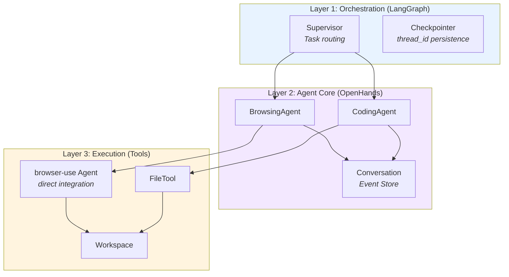
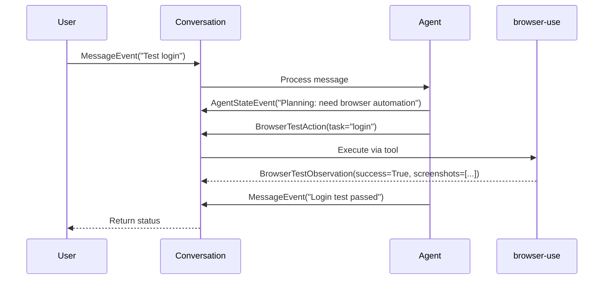
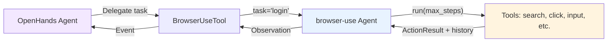
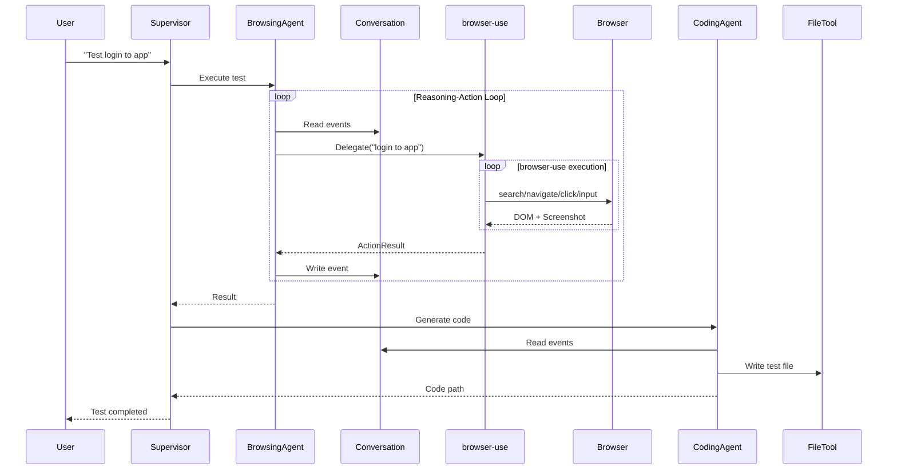

# Kite-Agent Architecture Reference

> **Version:** 0.0.1 | **Status:** Design Phase  
> **Built on:** OpenHands SDK (core) + LangGraph (orchestration) + Browser-use (browser tool)

**Kite-Agent** is an AI-Native Automation Testing platform that extends **OpenHands SDK** with testing-specific features.

**Core Philosophy:**
- **100% OpenHands Core**: No fork, only extend via Tools & Skills
- **LangGraph Orchestration**: Multi-agent coordination + memory
- **Frontend Agnostic**: Standard REST + WebSocket API

---

## 1. Architecture Overview

### 1.1. Three-Layer Design



| Layer | Responsibility | Technology |
|-------|---------------|------------|
| **Orchestration** | Multi-agent routing, memory | LangGraph StateGraph + Checkpointer |
| **Agent Core** | Reasoning-action loop, event store | OpenHands Agent + Conversation |
| **Execution** | Browser/file interactions | browser-use Agent (direct), FileTool |

### 1.2. Key Principles

**From OpenHands:**
1. **Event-Driven**: Every action is an immutable Event in Conversation
2. **Stateless Logic**: Agent doesn't hold state, only reads/writes Events
3. **Action-Observation**: Tool pattern: `ActionEvent → Tool → ObservationEvent`

**From LangGraph:**
4. **Graph Orchestration**: Supervisor routes workers via StateGraph
5. **Persistent Memory**: PostgresSaver stores conversation threads
6. **Subgraph Workers**: Each agent is a subgraph node, runs independently

**KiteAgent Extensions:**
7. **Testing Tools**: browser-use (direct), APITool, PerfTool
8. **Testing Skills**: Self-healing, visual regression, test generation
9. **Frontend Ready**: RemoteConversation + WebSocket streaming

### 1.3. Extension Strategy

KiteAgent achieves testing capabilities through **composition**, not forking:

| Component | Source | Integration Method |
|-----------|--------|-------------------|
| Agent, Conversation, Events | OpenHands SDK | **Direct import** - no modification |
| Tool registration, factory pattern | OpenHands SDK | **Use** - register browser-use via `register_tool()` |
| Skill, KeywordTrigger | OpenHands SDK | **Use** - define testing skills |
| StateGraph, Checkpointer | LangGraph | **Wrap** - agents as subgraph nodes |
| browser-use Agent, Tools | browser-use | **Direct use** - registered as OpenHands tool |

**Zero Modifications:** KiteAgent does not fork or patch any library. All extensions use standard APIs.

**Key Insight:** browser-use is treated as a **standalone tool** that OpenHands delegates to, not a component to wrap or customize.

---

## 2. Core Components (OpenHands SDK)

KiteAgent inherits 100% from OpenHands SDK, with no fork or core modifications.

**Testing Specialization:**

While OpenHands provides generic agent capabilities, KiteAgent adds testing-specific:

| Component | Generic (OpenHands) | Testing (KiteAgent) |
|-----------|-------------------|--------------------|
| **Tools** | File operations, bash | browser-use (UI testing), API clients (contract testing) |
| **Skills** | Coding standards | Self-healing selectors, visual regression, test generation |
| **Workspace** | Code repository | Test artifacts (screenshots, videos, HAR files, traces) |
| **Events** | Code changes | Test execution steps, assertions, failures |
| **Agents** | Generic tasks | BrowsingAgent (manual test execution), CodingAgent (test code generation) |

### 2.1. Agent (Reasoning-Action Loop)

```python
from openhands.sdk.agent import Agent
from openhands.sdk.tool import Tool

# BrowsingAgent - Execute manual tests
browsing_agent = Agent(
    tools=[Tool(name="BrowserUseTool")],  # browser-use registered as tool
    skills=[self_healing_skill],          # Auto-fix selectors
    llm=llm,
)

# CodingAgent - Generate test code
coding_agent = Agent(
    tools=[Tool(name="FileEditorTool")],  # Built-in OpenHands tool
    llm=llm,
)
```

**Key Features:**
- **Stateless**: Logic separated from state, reads from Conversation
- **Tool-equipped**: Tools injected via AgentContext
- **Skill-enhanced**: Skills triggered by keywords/tasks

### 2.2. Conversation (Event Store)

```python
from openhands.sdk.conversation import Conversation
from openhands.sdk.workspace import LocalWorkspace

# Testing workspace with artifacts
with LocalWorkspace("/workspace/tests") as workspace:
    conversation = Conversation(
        agent=browsing_agent,
        workspace=workspace
    )
    
    # Send test task and execute
    conversation.send_message("Test login flow at https://example.com")
    conversation.run()
    
    # Access test execution history
    for event in conversation.state.events:
        if event.event_type == 'observation':
            print(f"Test step result: {event.content}")
```

**Role:**
- **Single Source of Truth**: Complete test execution history
- **Time-travel Debugging**: Replay events to reproduce bugs
- **Immutable Log**: Append-only, events cannot be modified

### 2.3. Events (Testing Execution History)

Events provide immutable audit trail of test execution:

```python
from openhands.sdk.event import (
    MessageEvent,      # User test request
    ActionEvent,       # Agent action (tool call)
    ObservationEvent,  # Tool result
    AgentStateEvent,   # Agent thinking/planning
)

# Example: Test execution events
class BrowserTestAction(ActionEvent):
    """OpenHands delegates browser test to browser-use"""
    tool: Literal["browser_automation"]
    task: str                    # "Login with user@test.com"
    params: dict[str, Any]       # Additional test parameters
    
class BrowserTestObservation(ObservationEvent):
    """browser-use test results"""
    success: bool
    result: str                  # Test outcome description
    history: list[dict]          # browser-use action history
    screenshots: list[str]       # Base64 screenshots
    errors: list[str] | None     # Any errors encountered
```

**Test Event Flow:**



**Event Properties:**

| Property | Purpose | Testing Use |
|----------|---------|-------------|
| `id` | Unique identifier | Correlate test steps |
| `timestamp` | When event occurred | Performance analysis, timeouts |
| `source` | Who created (user/agent) | Distinguish manual vs automated |
| `content` | Event data | Test results, errors, screenshots |

**Accessing Test History:**

```python
conversation.send_message("Test checkout flow")
conversation.run()

# Get all test actions
actions = [e for e in conversation.state.events if isinstance(e, ActionEvent)]
print(f"Test performed {len(actions)} actions")

# Get screenshots
screenshots = []
for event in conversation.state.events:
    if isinstance(event, ObservationEvent) and hasattr(event, 'screenshots'):
        screenshots.extend(event.screenshots)

# Check for failures  
failures = [e for e in conversation.state.events 
            if isinstance(e, ObservationEvent) and not e.success]
if failures:
    print(f"Test failed at step: {failures[0].content}")
```

**Why Events Matter for Testing:**
- **Reproducibility**: Replay exact test execution
- **Debugging**: Pinpoint failure step with context
- **Reporting**: Generate detailed test reports from events
- **Audit**: Compliance tracking for test execution

### 2.4. Tools (Testing-Specific Tools)

#### Browser Automation (browser-use)

KiteAgent integrates **browser-use directly** as an OpenHands tool:

```python
from openhands.sdk.tool import ToolDefinition, register_tool
from browser_use import Agent as BrowserUseAgent, Tools
import asyncio

class BrowserUseTool(ToolDefinition):
    """Wrapper that delegates to browser-use for browser automation"""
    
    @classmethod
    def create(cls, conv_state, **params):
        """Factory method required by OpenHands"""
        from browser_use import Tools
        
        # Create browser-use tools (20+ built-in actions)
        tools = Tools()
        
        # Custom test-specific actions can be added here
        @tools.action(description='Extract test data from page')
        async def extract_test_data(prompt: str, browser_session):
            page = await browser_session.must_get_current_page()
            return await page.extract_content(prompt, llm=conv_state.agent.llm)
        
        # Return tool instance
        return [cls(
            name="browser_automation",
            description="Execute browser automation tasks using natural language",
            llm=conv_state.agent.llm,
            tools=tools,  # Pass browser-use tools
        )]

# Register for use in agents
register_tool("BrowserAutomation", BrowserUseTool)

# Use in testing agent
browsing_agent = Agent(
    llm=llm,
    tools=[Tool(name="BrowserAutomation")],
    skills=[self_healing_skill],
)
```

**Key Benefits:**

| Benefit | Description |
|---------|-------------|
| **Zero Maintenance** | browser-use updates automatically without code changes |
| **Full Feature Access** | All 20+ browser-use actions: `search`, `navigate`, `click`, `input`, `extract`, `screenshot`, `evaluate`, `upload_file`, `scroll`, `wait`, etc. |
| **Up-to-date** | Always uses latest browser-use features and bug fixes |
| **Native Extensibility** | Add custom test actions via `@tools.action()` decorator |
| **Async Support** | browser-use handles browser async internally |

**Integration Flow:**



1. **OpenHands Agent** decides to use browser automation
2. **BrowserUseTool** delegates task to browser-use Agent  
3. **browser-use Agent** executes via its own reasoning loop
4. **browser-use Tools** perform actual browser actions
5. **Result flows back** through the stack as Observation

**Why This Works:**
- OpenHands: High-level reasoning ("need to test login")
- browser-use: Browser-specific reasoning ("click Submit button at index 3")
- Separation of concerns: Each library does what it's best at

**Integration Pattern:**
1. **Register**: Use OpenHands `register_tool()` to add browser-use
2. **Factory**: Return browser-use Agent instance from factory function
3. **Execute**: OpenHands Agent delegates browser tasks to browser-use Agent
4. **Extend**: Add custom browser actions via `@tools.action()` decorator

**Example: Custom Browser Action**
```python
from browser_use import Tools, ActionResult

tools = Tools()

@tools.action(description='Extract product prices from e-commerce page')
def extract_prices(browser_session) -> ActionResult:
    # Direct access to browser-use capabilities
    page = await browser_session.must_get_current_page()
    prices = await page.get_elements_by_css_selector('.product-price')
    return ActionResult(extracted_content=[p.text for p in prices])

# Pass custom tools to browser-use agent
browser_agent = BrowserUseAgent(task="", llm=llm, tools=tools)
```

**Why This Approach:**
- ✅ **Reuse, not rebuild**: browser-use is production-ready with 20+ browser tools
- ✅ **Community updates**: Bug fixes and features flow automatically
- ✅ **No duplication**: OpenHands handles reasoning, browser-use handles browser
- ✅ **Extensible**: Add custom browser actions via browser-use's native API

### 2.5. Skills (Testing Knowledge)

Skills inject testing expertise into agents via keyword triggers:

```python
from openhands.sdk.context.skills import Skill, KeywordTrigger

# Self-healing: Auto-fix broken selectors
self_healing_skill = Skill(
    name="self_healing",
    trigger=KeywordTrigger(keywords=[
        "ElementNotFoundException", 
        "selector failed",
        "element not found"
    ]),
    content="""
    When selector fails:
    1. Take screenshot for visual analysis
    2. Use browser-use extract action to find similar elements
    3. Generate new robust selector (prefer test IDs > aria labels > CSS)
    4. Log selector change to Conversation for reporting
    5. Continue test execution with new selector
    """
)

# Visual regression: Detect UI changes
visual_regression_skill = Skill(
    name="visual_regression",
    trigger=KeywordTrigger(keywords=["screenshot", "visual check", "UI changed"]),
    content="""
    For visual verification:
    1. Take screenshot of target element/page
    2. Save to workspace: artifacts/screenshots/{test_name}_{timestamp}.png
    3. If baseline exists, compare using image diff
    4. Report differences > 5% as potential regression
    5. Store baseline in workspace: test-data/baselines/
    """
)

# Test generation: Create test code from manual execution
test_gen_skill = Skill(
    name="test_generation", 
    trigger=KeywordTrigger(keywords=["generate test", "create test code"]),
    content="""
    Generate test code from conversation history:
    1. Extract browser-use actions from events (navigate, click, input, extract)
    2. Convert to Playwright/Selenium code with:
       - Page Object Model pattern
       - Assertions from extract results
       - Wait conditions from timing
    3. Save to workspace: generated/{test_name}_test.py
    4. Include setup/teardown, fixtures
    """
)

# Pass skills to agent
browsing_agent = Agent(
    llm=llm,
    tools=[Tool(name="BrowserAutomation")],
    skills=[self_healing_skill, visual_regression_skill, test_gen_skill],
)
```

**Skill Types in Testing:**

| Type | Activation | Use Case | Example |
|------|-----------|----------|---------|
| **Repository** | Always active | Test conventions | "Use Page Object Model", "Add retry logic" |
| **Knowledge** | Keyword-triggered | Domain expertise | Self-healing, visual regression (shown above) |
| **Task** | User provides inputs | Parameterized tests | "Run smoke tests for {env}", "Test API with {auth_token}" |

### 2.6. Workspace (Testing Sandbox)

```python
from openhands.sdk.workspace import LocalWorkspace, RemoteWorkspace
import os

# Local development - direct file access
test_workspace = LocalWorkspace("/workspace/kite-tests")
with test_workspace as ws:
    conversation = Conversation(agent, ws)
    conversation.send_message("Test checkout flow")
    conversation.run()
    
    # Access test artifacts
    screenshot_path = os.path.join(ws.working_dir, "artifacts/screenshots/checkout.png")

# Production - isolated containers
with RemoteWorkspace(container_url="http://test-runner:8000") as ws:
    conversation = Conversation(agent, ws)
    # Same API, runs in isolated Docker container
```

**Testing Workspace Structure:**
```
/workspace/kite-tests/
├── test-data/           # Input: test fixtures, mock data
├── config/              # Test configuration files
├── artifacts/           # Output: test results
│   ├── screenshots/     # Visual evidence
│   ├── videos/          # Session recordings  
│   ├── har/             # Network logs
│   └── traces/          # browser-use execution traces
├── generated/           # Generated test code
└── reports/             # Test reports (HTML, JSON)
```

---

## 3. Multi-Agent Orchestration (LangGraph)

LangGraph manages the workflow between OpenHands Agents.

### 3.1. StateGraph Setup

```python
from langgraph.graph import StateGraph, END
from langgraph.checkpoint.postgres import PostgresSaver
from typing import TypedDict, Annotated
from langgraph.graph import add_messages

class KiteGraphState(TypedDict):
    messages: Annotated[list, add_messages]  # User conversation
    test_plan: dict                          # Generated plan
    browsing_result: dict | None             # Test execution result
    code_path: str | None                    # Generated code path

# Define graph
workflow = StateGraph(KiteGraphState)

# Add nodes (each wraps OpenHands Agent)
workflow.add_node("supervisor", supervisor_node)
workflow.add_node("browsing_agent", browsing_subgraph)
workflow.add_node("coding_agent", coding_subgraph)

# Add routing
workflow.add_conditional_edges("supervisor", route_to_worker)
workflow.add_edge("browsing_agent", "coding_agent")
workflow.add_edge("coding_agent", END)

# Compile with memory
checkpointer = PostgresSaver.from_conn_string(DB_URI)
graph = workflow.compile(checkpointer=checkpointer)
```

### 3.2. Worker as Subgraph

```python
def browsing_subgraph(state: KiteGraphState):
    """Wrap OpenHands BrowsingAgent as LangGraph node"""
    
    # Get test task from LangGraph state
    user_msg = state["messages"][-1]["content"] if state["messages"] else ""
    
    # Create OpenHands Conversation with test workspace
    with LocalWorkspace("/workspace/tests") as workspace:
        conversation = Conversation(
            agent=browsing_agent,
            workspace=workspace
        )
        
        # Send message and execute (per OpenHands API)
        conversation.send_message(user_msg)
        conversation.run()
        
        # Extract test results for LangGraph
        test_status = conversation.state.status.value
        test_events = [e.to_dict() for e in conversation.state.events]
        
        # Find screenshots/artifacts
        artifacts = []
        for event in conversation.state.events:
            if hasattr(event, 'screenshot'):
                artifacts.append(event.screenshot)
        
        # Return result to LangGraph State
        return {
            "browsing_result": {
                "status": test_status,
                "events": test_events,
                "artifacts": artifacts
            }
        }
```

### 3.3. Memory Management

```python
# Execute with thread_id for persistence
config = {"configurable": {"thread_id": "test-session-123"}}

# First run
result = graph.invoke({"messages": [{"role": "user", "content": "Test login"}]}, config)

# Continue later (auto-resume from checkpoint)
result = graph.invoke({"messages": [{"role": "user", "content": "Generate code"}]}, config)
```

**Two-Layer Memory:**
- **LangGraph Checkpointer**: Persists graph state between invocations (thread_id)
- **OpenHands Conversation**: Stores agent execution history as immutable events (conversation_id)

**Note:** These are independent - LangGraph manages workflow state (messages, test_plan, results), while Conversation manages detailed agent steps (actions, observations).

---

## 4. Testing Workflow

### 4.1. Complete Flow



### 4.2. Execution Example

```python
from openhands.sdk import Agent, Conversation, LLM
from openhands.sdk.workspace import LocalWorkspace
from openhands.sdk.tool import Tool, register_tool
from langgraph.graph import StateGraph
from langgraph.checkpoint.postgres import PostgresSaver

# 1. Setup browser-use tool (see section 2.4)
register_tool("BrowserAutomation", BrowserUseTool)

# 2. Create testing agent
browsing_agent = Agent(
    llm=LLM(model="anthropic/claude-sonnet-4"),
    tools=[Tool(name="BrowserAutomation")],
    skills=[self_healing_skill],
)

# 3. Create test workflow with LangGraph
workflow = StateGraph(KiteGraphState)
workflow.add_node("browsing_agent", browsing_subgraph)
workflow.set_entry_point("browsing_agent")

# 4. Add persistence
checkpointer = PostgresSaver.from_conn_string("postgresql://localhost/kite")
graph = workflow.compile(checkpointer=checkpointer)

# 5. Execute test
result = graph.invoke(
    {
        "messages": [{
            "role": "user", 
            "content": "Test login flow at https://example.com with user@test.com"
        }]
    },
    config={"configurable": {"thread_id": "test-login-001"}}
)

# 6. Access results
print(f"Test Status: {result['browsing_result']['status']}")
print(f"Screenshots: {len(result['browsing_result']['artifacts'])}")

# 7. Continue testing session
result2 = graph.invoke(
    {
        "messages": [{
            "role": "user",
            "content": "Now test checkout with 2 items"
        }]
    },
    config={"configurable": {"thread_id": "test-login-001"}}  # Same thread
)
```

**Key Testing Features:**

| Feature | Implementation | Benefit |
|---------|---------------|---------|
| **Session Persistence** | LangGraph thread_id | Resume tests, debug failures |
| **Visual Evidence** | Screenshots in artifacts | Test verification, reporting |
| **Test History** | Conversation events | Replay, audit trail |
| **Multi-step Tests** | Sequential messages | Complex user journeys |
| **Parallel Execution** | Multiple thread_ids | Scale testing |

---

## 5. Frontend Integration

KiteAgent SDK supports any frontend framework via standard REST + WebSocket API.

### 5.1. API Contract

```typescript
// REST Endpoints
POST   /conversation/create          // Create new test session
POST   /conversation/:id/message     // Send user message
GET    /conversation/:id/state       // Get current state

// WebSocket
WS     /ws/conversation/:id          // Stream real-time events
```

### 5.2. Frontend Example (React)

```typescript
function useKiteAgent(backendUrl: string) {
  const [messages, setMessages] = useState<Message[]>([]);
  const [conversationId, setConversationId] = useState<string | null>(null);
  
  useEffect(() => {
    if (!conversationId) return;
    
    const ws = new WebSocket(`${backendUrl}/ws/conversation/${conversationId}`);
    
    ws.onmessage = (event) => {
      const { type, data } = JSON.parse(event.data);
      
      if (type === 'event' && data.event_type === 'message') {
        setMessages(prev => [...prev, {
          role: data.source === 'agent' ? 'assistant' : 'user',
          content: data.content
        }]);
      }
    };
    
    return () => ws.close();
  }, [conversationId]);
  
  const createSession = async () => {
    const res = await fetch(`${backendUrl}/conversation/create`, {
      method: 'POST',
      body: JSON.stringify({ agent: 'browsing_agent', workspace: { type: 'local' } })
    });
    const { conversation_id } = await res.json();
    setConversationId(conversation_id);
  };
  
  const sendMessage = async (content: string) => {
    await fetch(`${backendUrl}/conversation/${conversationId}/message`, {
      method: 'POST',
      body: JSON.stringify({ content, role: 'user' })
    });
  };
  
  return { messages, createSession, sendMessage };
}
```

### 5.3. Backend Example (FastAPI)

```python
from fastapi import FastAPI, WebSocket
from openhands.sdk.conversation import Conversation
import uuid, asyncio

app = FastAPI()

@app.post("/conversation/create")
def create_conversation(request: dict):
    """Create new conversation and return ID"""
    conv_id = str(uuid.uuid4())
    # Store conversation in your persistence layer
    return {"conversation_id": conv_id}

@app.websocket("/ws/conversation/{conversation_id}")
async def stream_events(websocket: WebSocket, conversation_id: str):
    """Stream real-time events via WebSocket"""
    await websocket.accept()
    conversation = get_conversation(conversation_id)  # Your retrieval logic
    
    # Attach callback to stream events
    def on_event(event):
        asyncio.create_task(
            websocket.send_json({"type": "event", "data": event.to_dict()})
        )
    
    conversation.add_callback(on_event)
    await keep_connection_alive(websocket)
```

**Key Benefits:**
- **Framework Agnostic**: Works with any frontend (React, Vue, Svelte, etc.)
- **Real-time Streaming**: WebSocket pushes events as they occur
- **OpenHands Native**: Uses Conversation callbacks for event streaming
- **Stateless API**: Reconnect with conversation_id to resume

---

## 6. Extensibility

Architecture designed for easy horizontal scaling.

### Future Extensions

**Phase 1 (Current): UI Testing**
- browser-use Agent (direct integration)
- DOMCondenser
- Frontend Integration

**Phase 2: API Testing**
- requests/httpx via custom tool registration
- APIAgent (OpenAPI spec reader)
- API Skills (auth, retry)

**Phase 3: Performance Testing**
- k6/Locust via custom tool registration
- PerformanceAgent
- Load test skills

**Phase 4: Multi-Modal**
- Appium via custom tool registration
- VisualRegressionTool
- Video streaming support

### Extension Points

1. **New Tools**: Register via `register_tool()` - can be any Python library
2. **New Skills**: Define Skill with KeywordTrigger
3. **New Agents**: Extend OpenHands `Agent` class
4. **New Workflows**: Add nodes to LangGraph StateGraph

**Philosophy:** Prefer registering battle-tested libraries (browser-use, requests, k6) over building custom implementations. OpenHands provides the glue, specialized libraries provide the power.

---

_This document serves as the architectural backbone for KiteAgent. All implementations must follow these defined patterns._
