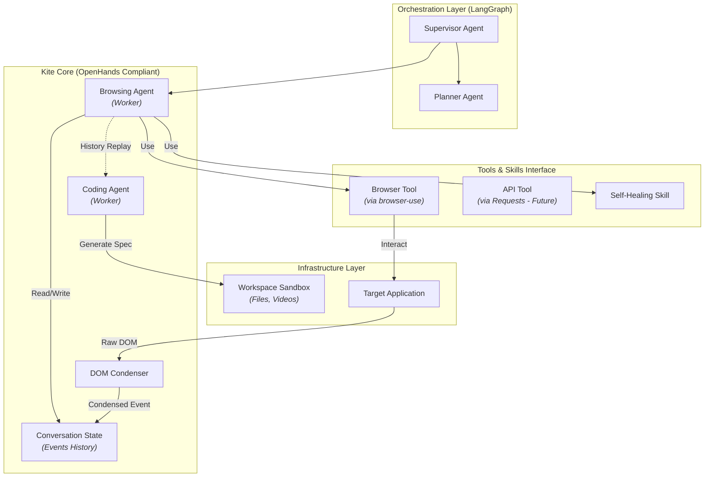

Dưới đây là tài liệu kiến trúc kỹ thuật (Technical Architecture Document) cho **Kite-Agent**, được viết theo chuẩn documentation của các dự án Open Source lớn.

Tài liệu này giữ nguyên các thuật ngữ cốt lõi (Core Concepts) của **OpenHands SDK** nhưng định nghĩa lại nội hàm để chuyên biệt hóa cho lĩnh vực **Automation Testing**.

---

# Kite-Agent Architecture Reference

> **Phiên bản:** 0.0.1
> **Trạng thái:** Design Phase
> **Dựa trên:** OpenHands SDK v1 & Browser-use and Langgraph

**Kite-Agent** là một nền tảng AI-Native Automation Testing, được thiết kế để tự động hóa quy trình kiểm thử từ End-to-End (E2E). Hệ thống kết hợp khả năng điều phối của **LangGraph**, sức mạnh tương tác của **Browser-use**, và tuân thủ chặt chẽ kiến trúc hướng sự kiện (Event-driven) của **OpenHands**.

---

## 1. Design Principles (Nguyên lý thiết kế)

Kite-Agent thừa hưởng các nguyên lý thiết kế của OpenHands V1 để đảm bảo tính ổn định và khả năng mở rộng:

1. **Stateless Agents (Agent không lưu trạng thái):** Logic của Agent (Planner, Executor) hoàn toàn tách biệt với dữ liệu. Mọi trạng thái phiên kiểm thử được lưu trữ duy nhất trong `Conversation`.
2. **One Source of Truth (Nguồn chân lý duy nhất):** `Conversation` là nơi duy nhất chứa lịch sử kiểm thử. Việc replay lại một Conversation đảm bảo tái hiện chính xác lỗi (Bug Reproduction).
3. **Event-Driven & Immutable (Hướng sự kiện & Bất biến):** Mọi hành động (Click, Type, Assert) đều là `Event`. Khi đã ghi vào lịch sử, Event không thể bị thay đổi.
4. **Extensible via Tools (Mở rộng qua công cụ):** Agent không giới hạn ở UI Testing. Khả năng mới (API, Performance, Security) được thêm vào thông qua hệ thống `Tool` và `Skill` mà không cần sửa đổi lõi Agent.

---

## 2. High-Level Architecture (Kiến trúc tổng quan)

Hệ thống được chia thành các tầng (Layers) rõ ràng:

---

## 3. Core Components (Thành phần cốt lõi)

Mỗi component dưới đây là một sự chuyên biệt hóa từ OpenHands để phục vụ Automation Testing.

### 3.1. Agent (Testing Agents)

Trong Kite-Agent, "Agent" là các thực thể AI đảm nhận các vai trò QA cụ thể.

- **Supervisor Agent:** Đóng vai trò QA Lead. Phân tích yêu cầu user, điều phối task cho các agent con (Worker).
- **Browsing Agent (Executor):**
- _Nhiệm vụ:_ Thực thi test thủ công (Manual Test simulation).
- _Đặc điểm:_ Được trang bị `BrowserTool`. Có khả năng "nhìn" màn hình và tự sửa lỗi.

- **Coding Agent (Reporter):**
- _Nhiệm vụ:_ Chuyển đổi lịch sử hành động của Browsing Agent thành mã nguồn (Playwright/Selenium) chuẩn chỉnh.
- _Đặc điểm:_ Không tương tác với trình duyệt, chỉ tương tác với `Conversation` và `Workspace`.

### 3.2. Conversation (Test Session State)

Là đối tượng lưu trữ toàn bộ vòng đời của một Test Case.

- **Cấu trúc:** Chứa danh sách tuần tự các `Events`.
- **Vai trò:** Cho phép tính năng "Time-travel debugging" (quay ngược lại thời điểm xảy ra lỗi để xem DOM/Screenshot lúc đó).

### 3.3. Events (Testing Artifacts)

Hệ thống mở rộng `Event` cơ bản thành các loại sự kiện testing chuyên sâu:

| Loại Event      | Tên Class             | Mô tả                  | Dữ liệu kèm theo                                  |
| --------------- | --------------------- | ---------------------- | ------------------------------------------------- |
| **Instruction** | `TestRequestEvent`    | Yêu cầu test từ User   | `{"url": "...", "scenario": "login"}`             |
| **Action**      | `BrowserActionEvent`  | Lệnh tương tác         | `{"action": "click", "selector": "#btn"}`         |
| **Observation** | `DOMObservationEvent` | Kết quả từ trình duyệt | `{"dom_tree": "...", "screenshot_b64": "..."}`    |
| **Assertion**   | `AssertionEvent`      | Điểm kiểm tra kết quả  | `{"expected": "Success", "actual": "Fail"}`       |
| **Error**       | `TestFailureEvent`    | Lỗi hệ thống/Assert    | `{"traceback": "...", "healing_attempted": true}` |

### 3.4. Tools & MCP (Interaction Layer)

Đây là lớp giao tiếp với thế giới bên ngoài, tuân thủ giao thức MCP (Model Context Protocol).

- **BrowserTool:** Wrapper của thư viện `browser-use`.
- Cung cấp API: `Maps()`, `click()`, `type()`, `scroll()`, `extract_content()`.

- **APITool (Future):** Wrapper của `requests`/`curl` để test API.
- **PerformanceTool (Future):** Wrapper của `k6` hoặc `Locust`.

### 3.5. Condenser (DOM Compression Engine)

- **Vấn đề:** DOM HTML thô rất lớn (hàng chục nghìn token), làm tràn bộ nhớ LLM.
- **Giải pháp:** `DOMCondenser`.
- **Cơ chế:**

1. Nhận `ObservationEvent` chứa Raw HTML.
2. Loại bỏ các thẻ `div`, `span` lồng nhau không có ngữ nghĩa.
3. Giữ lại các Interactive Elements (button, input, a) và Text Nodes quan trọng.
4. Tạo ra một `CondensedEvent` thay thế để lưu vào Conversation.

### 3.6. Workspace (Sandbox & Artifacts)

Là thư mục làm việc an toàn của Agent.

- **Input:** File cấu hình test (`kite.config.json`), Test Data (`users.csv`).
- **Output:**
- Video quay màn hình quá trình test.
- File code sinh ra: `tests/generated_login_test.spec.ts`.
- Báo cáo: `report.html`, `report.json`.

### 3.7. Skill (Reusable Behaviors)

Các kỹ năng cao cấp được đóng gói để tái sử dụng giữa các Agent.

- **Self-Healing Skill:**
- _Trigger:_ Khi gặp `ElementNotFoundException`.
- _Logic:_ Phân tích Screenshot hiện tại -> So sánh với Screenshot tham chiếu -> Tìm Element tương đồng nhất -> Cập nhật Selector.

- **Visual Check Skill:** Sử dụng Vision Model để so sánh UI (Pixel-perfect testing).

---

## 4. Automation Workflow (Quy trình hoạt động)

Dưới đây là vòng đời xử lý một yêu cầu test:

1. **Initialization:**

- User gửi yêu cầu qua UI.
- `Conversation` được khởi tạo.

2. **Planning:**

- `Supervisor Agent` phân tích, tạo ra Test Plan (Steps).

3. **Execution Loop (Browsing Agent):**

- **Think:** Đọc `Conversation`, quyết định gọi `BrowserTool`.
- **Act:** `BrowserTool` thực thi trên trình duyệt thật (Local/Cloud).
- **Observe:** Kết quả trả về (DOM/Screenshot).
- **Condense:** `DOMCondenser` nén dữ liệu và ghi `Event` vào `Conversation`.
- **Heal (Optional):** Nếu lỗi, kích hoạt `Self-Healing Skill`.

4. **Codegen & Report:**

- Sau khi xong, `Coding Agent` đọc lại toàn bộ `Conversation`.
- Map các `Event` thành code Playwright.
- Lưu file vào `Workspace`.

---

## 5. Extensibility Roadmap (Khả năng mở rộng)

Kiến trúc này được thiết kế để mở rộng (Scale) theo chiều ngang các capability:

### Giai đoạn 1: UI Testing Focus (Hiện tại)

- Component: `BrowserAgent`, `BrowserTool`, `DOMCondenser`.
- Target: Web Apps.

### Giai đoạn 2: API Testing Integration

- **Thêm mới:**
- `APITool`: Cho phép gửi HTTP Request.
- `APIAgent`: Agent chuyên đọc Swagger/OpenAPI spec và gọi `APITool`.

- **Không đổi:** Cấu trúc `Conversation`, `Workspace`, `Event` system.

### Giai đoạn 3: Performance Testing

- **Thêm mới:**
- `PerfTool`: Cho phép chạy script k6.
- `LoadTestSkill`: Kỹ năng phân tích biểu đồ latency/throughput.

- **Workflow:** `BrowserAgent` record user flow -> `CodingAgent` convert sang k6 script -> `PerfTool` execute.

---

_Tài liệu này đóng vai trò là xương sống (backbone) cho đội ngũ phát triển Kite-Agent. Mọi đóng góp code (PR) cần tuân thủ các Concept đã định nghĩa ở trên._
