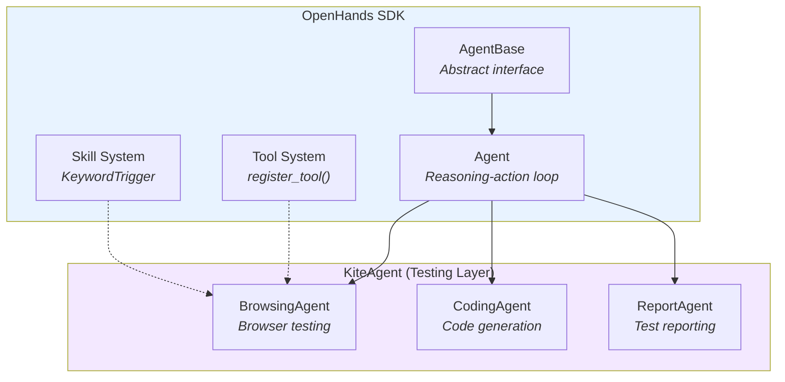
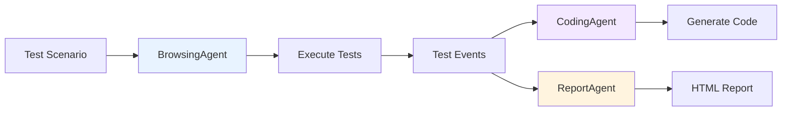

# Agents

KiteAgent provides **pre-configured agent classes** specialized for testing - all extending **OpenHands SDK Agent** with testing-specific tools and skills.

## Architecture

KiteAgent agents are **OpenHands Agents at their core**, inheriting the stateless, event-driven architecture:



**Key Principles:**
- ✅ **100% OpenHands Core** - All agents extend `openhands.sdk.Agent`
- ✅ **Stateless Design** - Agents read from Conversation, don't hold state
- ✅ **Event-Driven** - All actions/observations are Events
- ✅ **Factory Pattern** - Tools registered via `register_tool()`
- ✅ **Full Customization** - Override `__init__` to add your tools/skills

## Agent Classes

KiteAgent defines three core agent classes for complete UI testing workflow:

```python
from kiteagent import BrowsingAgent, CodingAgent, ReportAgent
from openhands.sdk import LLM

# These are OpenHands Agents with pre-configured testing capabilities
browser_agent = BrowsingAgent(llm=llm)      # Extends openhands.sdk.Agent
code_agent = CodingAgent(llm=llm)           # Extends openhands.sdk.Agent
report_agent = ReportAgent(llm=llm)         # Extends openhands.sdk.Agent

# All OpenHands features available
from openhands.sdk import Conversation
from openhands.sdk.workspace import LocalWorkspace

with LocalWorkspace("/workspace") as ws:
    conv = Conversation(agent=browser_agent, workspace=ws)
    conv.send_message("Test login flow")
    conv.run()
```

## BrowsingAgent

Executes manual tests in browser with self-healing capabilities.

### Basic Usage

```python
from kiteagent import BrowsingAgent
from openhands.sdk import LLM, Conversation
from openhands.sdk.workspace import LocalWorkspace

# Create agent - tools & skills pre-configured
agent = BrowsingAgent(
    llm=LLM(model="anthropic/claude-sonnet-4")
)

# Execute test
with LocalWorkspace("/workspace/tests") as workspace:
    conversation = Conversation(agent=agent, workspace=workspace)
    conversation.send_message("Test login at https://example.com with user@test.com")
    conversation.run()
    
    print(f"Status: \{conversation.state.status.value\}")
```

### Pre-configured Features

**Tools:**
- `BrowserAutomation` - browser-use integration (20+ actions)

**Skills:**
- `self_healing` - Auto-fix broken selectors
- `screenshot_capture` - Visual evidence collection
- `wait_handling` - Smart wait strategies

### Customization

```python
from openhands.sdk.context.skills import Skill, KeywordTrigger

# Add custom skill
custom_skill = Skill(
    name="api_setup",
    trigger=KeywordTrigger(keywords=["setup test data", "create user"]),
    content="""
    Before browser testing:
    1. Create test user via API POST /api/users
    2. Get auth token from response
    3. Save to workspace: test-data/auth.json
    4. Use token in browser cookies
    """
)

# Customize BrowsingAgent
agent = BrowsingAgent(
    llm=llm,
    custom_skills=[custom_skill],  # Add your skills
    enable_self_healing=True,       # Toggle built-in features
    screenshot_on_error=True,
)
```

### Implementation

**Full OpenHands Pattern Implementation:**

```python
# kiteagent/agents/browsing.py
from openhands.sdk import Agent
from openhands.sdk.tool import Tool, register_tool, ToolDefinition
from openhands.sdk.context.skills import Skill, KeywordTrigger

class BrowsingAgent(Agent):
    """Pre-configured agent for browser testing.
    
    Extends openhands.sdk.Agent with testing-specific tools and skills.
    Follows OpenHands factory pattern for tool registration.
    """
    
    def __init__(
        self,
        llm,
        custom_tools=None,
        custom_skills=None,
        enable_self_healing=True,
        screenshot_on_error=True,
    ):
        # Build skills list
        skills = []
        
        if enable_self_healing:
            skills.append(self._create_self_healing_skill())
        
        if screenshot_on_error:
            skills.append(self._create_screenshot_skill())
        
        # Add custom skills
        if custom_skills:
            skills.extend(custom_skills)
        
        # Build tools list (using Tool names, not instances)
        # Tools are registered separately via register_tool()
        tools = [Tool(name="BrowserAutomation")]
        if custom_tools:
            tools.extend(custom_tools)
        
        # Initialize OpenHands Agent - this is the key inheritance
        super().__init__(llm=llm, tools=tools, skills=skills)
    
    @staticmethod
    def _create_self_healing_skill():
        """Built-in skill for selector auto-recovery."""
        return Skill(
            name="self_healing",
            trigger=KeywordTrigger(keywords=["ElementNotFoundException", "selector failed"]),
            content="""
            When selector fails:
            1. Take screenshot for visual analysis
            2. Use browser-use extract to find similar elements
            3. Generate new robust selector (prefer test IDs > aria > CSS)
            4. Log selector change to Conversation
            5. Continue test execution
            """
        )
    
    @staticmethod
    def _create_screenshot_skill():
        """Built-in skill for error documentation."""
        return Skill(
            name="screenshot_capture",
            trigger=KeywordTrigger(keywords=["error", "failed", "exception"]),
            content="""
            On test failure:
            1. Capture full page screenshot
            2. Save to: artifacts/screenshots/error_\{timestamp\}.png
            3. Capture DOM snapshot
            4. Save console logs
            5. Include all in error report
            """
        )

# Tool Registration (OpenHands Factory Pattern)
# This follows the same pattern as OpenHands built-in tools

def _browser_tool_factory(conv_state, **params):
    """Factory function that creates browser tools with workspace context.
    
    This is the OpenHands way - tools are created with access to
    conversation state (workspace, etc.)
    """
    from browser_use import Agent as BrowserUseAgent, Tools
    
    tools = Tools()  # browser-use provides 20+ actions
    
    # Return ToolDefinition instance
    return [BrowserToolDefinition(
        name="browser_automation",
        description="Execute browser automation tasks",
        llm=conv_state.agent.llm,
        tools=tools,
    )]

register_tool("BrowserAutomation", _browser_tool_factory)
```

**Why This Pattern?**

| Pattern | Purpose | Benefit |
|---------|---------|----------|
| `Agent.__init__()` override | Pre-configure tools/skills | User gets ready-to-use agent |
| `super().__init__()` call | Inherit OpenHands behavior | Full Conversation/Event support |
| Factory function | Tool creation with context | Access to workspace, state |
| `register_tool()` | Global tool registry | Tools reusable across agents |

**This is exactly how OpenHands implements BashTool, FileEditorTool, etc.** See [OpenHands tools source](https://github.com/OpenHands/software-agent-sdk/tree/main/openhands-sdk/openhands/tools).
```

## CodingAgent

Generates test code from manual test execution history.

### Basic Usage

```python
from kiteagent import CodingAgent

# Create agent - pre-configured for code generation
agent = CodingAgent(
    llm=LLM(model="anthropic/claude-sonnet-4"),
    default_framework="playwright"  # or "selenium", "cypress"
)

# Generate code from manual test
with LocalWorkspace("/workspace/tests") as workspace:
    conversation = Conversation(agent=agent, workspace=workspace)
    conversation.send_message("""
        Generate Playwright test code from the manual test execution.
        Use Page Object Model pattern with explicit waits.
    """)
    conversation.run()
    
    # Read generated code
    code = workspace.read_file("generated/login_test.py")
```

### Pre-configured Features

**Tools:**
- `FileEditorTool` - Create/edit test files
- `CodeAnalyzer` - Analyze existing test patterns

**Skills:**
- `test_generation` - Convert manual tests to code
- `page_object_pattern` - Generate POM structure
- `best_practices` - Add waits, assertions, error handling

### Customization

```python
from openhands.sdk.tool import Tool

# Add custom code formatter tool
prettier_tool = Tool(name="PrettierFormatter")

agent = CodingAgent(
    llm=llm,
    default_framework="playwright",
    custom_tools=[prettier_tool],
    include_fixtures=True,          # Generate pytest fixtures
    include_page_objects=True,      # Use POM pattern
    add_error_handling=True,        # Wrap in try/catch
)
```

### Implementation

```python
# kiteagent/agents/coding.py
class CodingAgent(Agent):
    """Pre-configured agent for test code generation"""
    
    def __init__(
        self,
        llm,
        default_framework="playwright",
        custom_tools=None,
        custom_skills=None,
        include_fixtures=True,
        include_page_objects=True,
    ):
        # Build skills
        skills = [
            self._create_test_generation_skill(default_framework),
            self._create_code_quality_skill(),
        ]
        
        if custom_skills:
            skills.extend(custom_skills)
        
        # Build tools
        tools = [Tool(name="FileEditorTool")]
        if custom_tools:
            tools.extend(custom_tools)
        
        super().__init__(llm=llm, tools=tools, skills=skills)
        
        self.default_framework = default_framework
        self.include_fixtures = include_fixtures
        self.include_page_objects = include_page_objects
    
    @staticmethod
    def _create_test_generation_skill(framework):
        return Skill(
            name="test_generation",
            trigger=KeywordTrigger(keywords=["generate test", "create test code"]),
            content=f"""
            Generate \{framework\} test code from conversation history:
            
            1. **Extract Actions**: Read BrowserTestObservation events
               - navigate(url) → page.goto(url)
               - click(selector) → page.click(selector)
               - input_text(selector, text) → page.fill(selector, text)
               - extract_content(prompt) → assertion
            
            2. **Structure Code**:
               - Page Object Model classes
               - Test functions with explicit waits
               - Setup/teardown fixtures
               - Assertions from extract results
            
            3. **Best Practices**:
               - Use explicit waits (not sleep)
               - Robust selectors (test IDs > aria > CSS)
               - Error handling with retry
               - Clear test names and comments
            
            4. **Save**: generated/\{test_name\}_test.py
            """
        )
```

## ReportAgent

Generates comprehensive test reports from test execution history.

### Basic Usage

```python
from kiteagent import ReportAgent

# Create agent - pre-configured for report generation
agent = ReportAgent(
    llm=LLM(model="anthropic/claude-sonnet-4"),
    output_format="html"  # or "json", "markdown", "allure"
)

# Generate report from test results
with LocalWorkspace("/workspace/tests") as workspace:
    conversation = Conversation(agent=agent, workspace=workspace)
    conversation.send_message("""
        Generate test report from recent test execution.
        Include: pass/fail status, screenshots, execution time, errors
    """)
    conversation.run()
    
    # Report saved to: reports/test-report.html
```

### Pre-configured Features

**Tools:**
- `FileReaderTool` - Read test artifacts and events
- `TemplateRenderer` - Render HTML/Markdown reports
- `ChartGenerator` - Create test metrics visualizations

**Skills:**
- `report_generation` - Convert events to structured report
- `metrics_calculation` - Calculate pass rate, duration, etc.
- `screenshot_embedding` - Include visual evidence
- `error_analysis` - Categorize and summarize failures

### Customization

```python
from openhands.sdk.context.skills import Skill, KeywordTrigger

# Add custom report section
ci_integration_skill = Skill(
    name="ci_integration",
    trigger=KeywordTrigger(keywords=["publish report", "ci upload"]),
    content="""
    After generating report:
    1. Upload HTML report to S3/Azure Storage
    2. Post summary to Slack/Teams
    3. Update test dashboard
    4. Trigger downstream jobs if passed
    """
)

agent = ReportAgent(
    llm=llm,
    output_format="html",
    custom_skills=[ci_integration_skill],
    include_screenshots=True,      # Embed screenshots in report
    include_videos=False,           # Skip video embedding (large files)
    include_har=True,               # Include network logs
    theme="dark",                   # Report theme
)
```

### Report Formats

**HTML Report (Default)**
```python
agent = ReportAgent(llm=llm, output_format="html")
# Generates: reports/test-report-\{timestamp\}.html
# - Interactive UI with tabs
# - Embedded screenshots
# - Collapsible error logs
# - Test metrics dashboard
```

**JSON Report**
```python
agent = ReportAgent(llm=llm, output_format="json")
# Generates: reports/test-results.json
# - Machine-readable format
# - For CI/CD integration
# - Compatible with test dashboards
```

**Allure Report**
```python
agent = ReportAgent(llm=llm, output_format="allure")
# Generates: allure-results/*.json
# - Allure Framework compatible
# - Trend analysis support
# - History tracking
```

### Implementation

```python
# kiteagent/agents/report.py
class ReportAgent(Agent):
    """Pre-configured agent for test report generation"""
    
    def __init__(
        self,
        llm,
        output_format="html",
        custom_tools=None,
        custom_skills=None,
        include_screenshots=True,
        include_videos=False,
        theme="light",
    ):
        # Build skills
        skills = [
            self._create_report_generation_skill(output_format),
            self._create_metrics_skill(),
        ]
        
        if include_screenshots:
            skills.append(self._create_screenshot_skill())
        
        if custom_skills:
            skills.extend(custom_skills)
        
        # Build tools
        tools = [
            Tool(name="FileReaderTool"),
            Tool(name="TemplateRenderer"),
        ]
        
        if custom_tools:
            tools.extend(custom_tools)
        
        super().__init__(llm=llm, tools=tools, skills=skills)
        
        self.output_format = output_format
        self.include_screenshots = include_screenshots
        self.theme = theme
    
    @staticmethod
    def _create_report_generation_skill(format_type):
        return Skill(
            name="report_generation",
            trigger=KeywordTrigger(keywords=["generate report", "create report"]),
            content=f"""
            Generate \{format_type\} test report:
            
            1. **Read Test Data**:
               - Read all events from conversation history
               - Find test artifacts: screenshots, videos, HAR files
               - Read test-data/results/*.json
            
            2. **Calculate Metrics**:
               - Total tests: count unique test scenarios
               - Pass rate: (passed / total) * 100
               - Duration: sum of all test execution times
               - Failure categories: element not found, timeout, assertion
            
            3. **Structure Report**:
               - Executive summary (pass/fail counts, duration)
               - Test details table (name, status, duration)
               - Screenshots for failed tests
               - Error logs with stack traces
               - Environment info (browser, OS, versions)
            
            4. **Format Output**:
               - HTML: Use template from templates/report.html
               - JSON: Structure as \{summary, tests[], artifacts[]\}
               - Allure: Generate one JSON per test
            
            5. **Save**: reports/test-report-\{timestamp\}.\{ext\}
            """
        )
    
    @staticmethod
    def _create_metrics_skill():
        return Skill(
            name="metrics_calculation",
            trigger=KeywordTrigger(keywords=["metrics", "statistics", "summary"]),
            content="""
            Calculate test metrics:
            
            **Basic Metrics**:
            - Total tests executed
            - Passed: count of success status
            - Failed: count of failure status
            - Skipped: count of skipped tests
            - Pass rate: (passed / total) * 100%
            
            **Time Metrics**:
            - Total duration: sum of all test times
            - Average duration: total / test count
            - Slowest test: max duration
            - Fastest test: min duration
            
            **Failure Analysis**:
            - Group errors by type:
              * ElementNotFoundException → Selector issues
              * TimeoutError → Performance/wait issues
              * AssertionError → Logic failures
            - Top 3 most common errors
            
            **Trend (if history exists)**:
            - Compare with previous run
            - Pass rate trend (↑ ↓ →)
            - New failures introduced
            """
        )
```

## Complete Testing Workflow

Combine all agents for end-to-end testing automation.

### Full Workflow Example

```python
from kiteagent import BrowsingAgent, CodingAgent, ReportAgent
from langgraph.graph import StateGraph
from typing import TypedDict

class TestingWorkflowState(TypedDict):
    messages: list
    test_scenario: str
    test_result: dict
    generated_code: str
    report_path: str

# Create all agents
browser_agent = BrowsingAgent(llm=llm, enable_self_healing=True)
code_agent = CodingAgent(llm=llm, default_framework="playwright")
report_agent = ReportAgent(llm=llm, output_format="html")

# 1. Execute test
def execute_test_node(state):
    with LocalWorkspace("/workspace") as ws:
        conv = Conversation(browser_agent, ws)
        conv.send_message(state["test_scenario"])
        conv.run()
        
        return \{
            "test_result": \{
                "status": conv.state.status.value,
                "events": [e.to_dict() for e in conv.state.events],
                "duration": conv.state.metrics.get("duration", 0)
            \}
        \}

# 2. Generate code
def generate_code_node(state):
    with LocalWorkspace("/workspace") as ws:
        conv = Conversation(code_agent, ws)
        conv.send_message(f"Generate Playwright code from: \{state['test_result']\}")
        conv.run()
        
        code = ws.read_file("generated/test_code.py")
        return \{"generated_code": code\}

# 3. Generate report
def generate_report_node(state):
    with LocalWorkspace("/workspace") as ws:
        conv = Conversation(report_agent, ws)
        conv.send_message(f"""
            Generate HTML report for test execution.
            Test scenario: \{state['test_scenario']\}
            Test result: \{state['test_result']\}
        """)
        conv.run()
        
        return \{"report_path": "reports/test-report.html"\}

# Build workflow
workflow = StateGraph(TestingWorkflowState)
workflow.add_node("execute_test", execute_test_node)
workflow.add_node("generate_code", generate_code_node)
workflow.add_node("generate_report", generate_report_node)

workflow.add_edge("execute_test", "generate_code")
workflow.add_edge("generate_code", "generate_report")
workflow.set_entry_point("execute_test")

# Execute complete workflow
graph = workflow.compile()
result = graph.invoke(\{
    "test_scenario": "Test user login and dashboard navigation"
\})

print(f"Test Status: \{result['test_result']['status']\}")
print(f"Generated Code: \{result['generated_code'][:100]\}...")
print(f"Report: \{result['report_path']\}")
```

### Parallel Execution Pattern

```python
# Execute multiple tests in parallel, generate single report
from concurrent.futures import ThreadPoolExecutor

browser_agent = BrowsingAgent(llm=llm)
report_agent = ReportAgent(llm=llm)

test_scenarios = [
    "Test login flow",
    "Test product search",
    "Test checkout process",
    "Test user profile update"
]

# Run tests in parallel
def run_test(scenario):
    with LocalWorkspace(f"/workspace/test-\{hash(scenario)\}") as ws:
        conv = Conversation(browser_agent, ws)
        conv.send_message(scenario)
        conv.run()
        return \{
            "scenario": scenario,
            "status": conv.state.status.value,
            "events": conv.state.events
        \}

with ThreadPoolExecutor(max_workers=4) as executor:
    results = list(executor.map(run_test, test_scenarios))

# Generate consolidated report
with LocalWorkspace("/workspace/reports") as ws:
    conv = Conversation(report_agent, ws)
    conv.send_message(f"""
        Generate consolidated test report for \{len(results)\} tests.
        Results: \{results\}
    """)
    conv.run()
```

## VisualRegressionAgent

Performs visual testing with baseline comparison.

### Basic Usage

```python
from kiteagent import VisualRegressionAgent

# Create agent
agent = VisualRegressionAgent(
    llm=llm,
    diff_threshold=0.05  # 5% difference triggers failure
)

# Run visual test
with LocalWorkspace("/workspace/tests") as workspace:
    conversation = Conversation(agent=agent, workspace=workspace)
    conversation.send_message("""
        Navigate to https://example.com/product/123
        Take screenshot of product card
        Compare with baseline
    """)
    conversation.run()
```

### Pre-configured Features

**Tools:**
- `BrowserAutomation` - Navigate and capture screenshots
- `ImageComparison` - Pixel-level diff analysis

**Skills:**
- `visual_regression` - Baseline comparison
- `responsive_testing` - Multiple viewports
- `element_screenshot` - Specific component capture

### Customization

```python
agent = VisualRegressionAgent(
    llm=llm,
    diff_threshold=0.03,           # Stricter comparison
    ignore_antialiasing=True,      # Ignore minor rendering differences
    viewports=[                     # Test multiple screen sizes
        \{"width": 1920, "height": 1080\},
        \{"width": 375, "height": 667\},
    ],
    custom_skills=[mobile_nav_skill],
)
```

### Implementation

```python
# kiteagent/agents/visual.py
class VisualRegressionAgent(Agent):
    """Pre-configured agent for visual testing"""
    
    def __init__(
        self,
        llm,
        diff_threshold=0.05,
        custom_tools=None,
        custom_skills=None,
        ignore_antialiasing=False,
    ):
        skills = [
            self._create_visual_regression_skill(diff_threshold),
            self._create_baseline_management_skill(),
        ]
        
        if custom_skills:
            skills.extend(custom_skills)
        
        tools = [
            Tool(name="BrowserAutomation"),
            Tool(name="ImageComparison"),
        ]
        
        if custom_tools:
            tools.extend(custom_tools)
        
        super().__init__(llm=llm, tools=tools, skills=skills)
        
        self.diff_threshold = diff_threshold
        self.ignore_antialiasing = ignore_antialiasing
    
    @staticmethod
    def _create_visual_regression_skill(threshold):
        return Skill(
            name="visual_regression",
            trigger=KeywordTrigger(keywords=["screenshot", "visual check", "compare"]),
            content=f"""
            Visual regression workflow:
            
            1. **Capture Screenshot**:
               - Navigate to target page
               - Wait for page load and animations
               - Take screenshot: artifacts/screenshots/\{name\}_current.png
            
            2. **Check Baseline**:
               - Look for: test-data/baselines/\{name\}_baseline.png
               - If missing: Save current as baseline, report "New baseline"
            
            3. **Compare** (if baseline exists):
               - Pixel-by-pixel diff
               - Calculate difference percentage
               - If diff > \{threshold * 100\}%: FAIL with diff image
               - If diff ≤ \{threshold * 100\}%: PASS
            
            4. **Report**:
               - Save diff image: artifacts/diffs/\{name\}_diff.png
               - Include in test report with side-by-side comparison
            """
        )
```

## Multi-Agent Workflows

Combine agents using LangGraph for complex testing scenarios.

### Pattern: Test Execution → Code Generation

```python
from kiteagent import BrowsingAgent, CodingAgent
from langgraph.graph import StateGraph
from typing import TypedDict

class TestWorkflowState(TypedDict):
    messages: list
    browsing_result: dict
    code_path: str

# Create agents
browser_agent = BrowsingAgent(llm=llm)
code_agent = CodingAgent(llm=llm, default_framework="playwright")

# Define workflow nodes
def browsing_node(state):
    with LocalWorkspace("/workspace") as ws:
        conv = Conversation(browser_agent, ws)
        conv.send_message(state["messages"][-1]["content"])
        conv.run()
        
        return \{
            "browsing_result": \{
                "status": conv.state.status.value,
                "events": [e.to_dict() for e in conv.state.events]
            \}
        \}

def coding_node(state):
    with LocalWorkspace("/workspace") as ws:
        conv = Conversation(code_agent, ws)
        conv.send_message(f"Generate code from: \{state['browsing_result']\}")
        conv.run()
        
        return \{"code_path": "generated/login_test.py"\}

# Build graph
workflow = StateGraph(TestWorkflowState)
workflow.add_node("browsing", browsing_node)
workflow.add_node("coding", coding_node)
workflow.add_edge("browsing", "coding")
workflow.set_entry_point("browsing")

# Execute
graph = workflow.compile()
result = graph.invoke(\{
    "messages": [\{"role": "user", "content": "Test login and generate Playwright code"\}]
\})
```

### Pattern: Browser + Visual Testing

```python
from kiteagent import BrowsingAgent, VisualRegressionAgent

browser_agent = BrowsingAgent(llm=llm)
visual_agent = VisualRegressionAgent(llm=llm, diff_threshold=0.03)

def combined_test():
    # Execute functional test
    with LocalWorkspace("/workspace") as ws:
        conv1 = Conversation(browser_agent, ws)
        conv1.send_message("Test product purchase flow")
        conv1.run()
    
    # Run visual regression
    with LocalWorkspace("/workspace") as ws:
        conv2 = Conversation(visual_agent, ws)
        conv2.send_message("Capture screenshots of checkout pages")
        conv2.run()
```

## How to Custom Agents

KiteAgent agents follow **OpenHands SDK customization patterns**. There are three ways to customize:

### Method 1: Extend KiteAgent Classes (Easiest)

Extend pre-configured agents and add your own skills/tools:

```python
from kiteagent import BrowsingAgent
from openhands.sdk.context.skills import Skill, KeywordTrigger
from openhands.sdk.tool import Tool

class APITestingAgent(BrowsingAgent):
    """Custom agent combining browser + API testing.
    
    Extends BrowsingAgent (which extends openhands.sdk.Agent)
    """
    
    def __init__(self, llm, api_base_url):
        # Create custom skill
        api_skill = Skill(
            name="api_setup",
            trigger=KeywordTrigger(keywords=["setup", "create test data"]),
            content=f"""
            API test data setup:
            1. POST \{api_base_url\}/api/users to create test user
            2. Store response in workspace: test-data/user.json
            3. Extract auth token
            4. Use token for browser session
            """
        )
        
        # Initialize parent with custom skill
        super().__init__(
            llm=llm,
            custom_skills=[api_skill],
            enable_self_healing=True
        )
        
        self.api_base_url = api_base_url

# Usage - just like any OpenHands Agent
from openhands.sdk import Conversation
from openhands.sdk.workspace import LocalWorkspace

agent = APITestingAgent(llm=llm, api_base_url="https://api.example.com")

with LocalWorkspace("/workspace") as ws:
    conv = Conversation(agent=agent, workspace=ws)
    conv.send_message("Setup test user and test login")
    conv.run()
```

### Method 2: Create from Scratch (Full Control)

Extend `openhands.sdk.Agent` directly for complete control:

```python
from openhands.sdk import Agent
from openhands.sdk.tool import Tool
from openhands.sdk.context.skills import Skill, KeywordTrigger

class PerformanceTestingAgent(Agent):
    """Custom agent for performance testing.
    
    Built from OpenHands Agent - full control over everything.
    """
    
    def __init__(
        self,
        llm,
        target_url,
        performance_threshold=2.0,
    ):
        # Define custom skills
        perf_skill = Skill(
            name="performance_monitoring",
            trigger=KeywordTrigger(keywords=["measure", "performance", "speed"]),
            content=f"""
            Performance testing workflow:
            1. Navigate to \{target_url\}
            2. Measure page load time (target: < \{performance_threshold\}s)
            3. Capture network waterfall
            4. Analyze render-blocking resources
            5. Report performance metrics
            """
        )
        
        # Define tools (register custom tools if needed)
        tools = [
            Tool(name="BrowserAutomation"),
            Tool(name="PerformanceMonitor"),
        ]
        
        # Initialize OpenHands Agent
        super().__init__(
            llm=llm,
            tools=tools,
            skills=[perf_skill],
        )
        
        self.target_url = target_url
        self.performance_threshold = performance_threshold
```

### Method 3: Compose Multiple Agents (LangGraph)

Use LangGraph to orchestrate multiple specialized agents:

```python
from kiteagent import BrowsingAgent, CodingAgent
from langgraph.graph import StateGraph
from typing import TypedDict

class CustomWorkflowState(TypedDict):
    messages: list
    test_result: dict
    code: str

# Create specialized agents
browser_agent = BrowsingAgent(llm=llm)
code_agent = CodingAgent(llm=llm)

# Define workflow nodes
def test_node(state):
    with LocalWorkspace("/workspace") as ws:
        conv = Conversation(browser_agent, ws)
        conv.send_message(state["messages"][-1]["content"])
        conv.run()
        return \{"test_result": conv.state.to_dict()\}

def code_node(state):
    with LocalWorkspace("/workspace") as ws:
        conv = Conversation(code_agent, ws)
        conv.send_message(f"Generate code from: \{state['test_result']\}")
        conv.run()
        return \{"code": "generated code path"\}

# Build workflow
workflow = StateGraph(CustomWorkflowState)
workflow.add_node("test", test_node)
workflow.add_node("code", code_node)
workflow.add_edge("test", "code")
workflow.set_entry_point("test")

graph = workflow.compile()
```

### Best Practices for Custom Agents

**DO:**
- ✅ Always extend from `openhands.sdk.Agent` or KiteAgent classes
- ✅ Use `super().__init__()` to preserve OpenHands behavior
- ✅ Register tools via `register_tool()` with factory functions
- ✅ Use `Skill` + `KeywordTrigger` for domain knowledge
- ✅ Access workspace via `conv_state.workspace` in tool factories

**DON'T:**
- ❌ Don't store mutable state in agent (use Conversation events)
- ❌ Don't bypass OpenHands tool registration (breaks factory pattern)
- ❌ Don't directly instantiate ToolDefinition in `__init__` (use Tool names)
- ❌ Don't override `step()` method (breaks OpenHands reasoning loop)

### Advanced: Custom Tool Registration

For complex custom tools, follow OpenHands factory pattern:

```python
from openhands.sdk.tool import ToolDefinition, register_tool
from openhands.sdk.event import Action, Observation

# 1. Define Action/Observation
class MyCustomAction(Action):
    param1: str
    param2: int

class MyCustomObservation(Observation):
    result: str

# 2. Define Tool
class MyCustomTool(ToolDefinition[MyCustomAction, MyCustomObservation]):
    @classmethod
    def create(cls, conv_state, **params):
        # Access workspace from conv_state
        workspace = conv_state.workspace
        return [cls(
            name="my_custom_tool",
            description="Does something custom",
            # ... executor, etc.
        )]

# 3. Register tool
register_tool("MyCustomTool", MyCustomTool)

# 4. Use in custom agent
class MyAgent(Agent):
    def __init__(self, llm):
        tools = [Tool(name="MyCustomTool")]
        super().__init__(llm=llm, tools=tools)
```

**See OpenHands examples:**
- [Custom Tools Example](https://github.com/OpenHands/software-agent-sdk/blob/main/examples/01_standalone_sdk/02_custom_tools.py)
- [Browser Use Integration](https://github.com/OpenHands/software-agent-sdk/blob/main/examples/01_standalone_sdk/15_browser_use.py)

## Configuration Options

### LLM Selection

```python
from openhands.sdk import LLM

# Production: High accuracy
agent = BrowsingAgent(
    llm=LLM(
        model="anthropic/claude-sonnet-4",
        temperature=0.0,
        max_tokens=8000
    )
)

# Development: Fast iteration
agent = BrowsingAgent(
    llm=LLM(
        model="anthropic/claude-haiku-3-5",
        temperature=0.3,
        max_tokens=4000
    )
)
```

### Workspace Configuration

```python
# Local development
with LocalWorkspace("/workspace/tests") as ws:
    conv = Conversation(agent, ws)

# Production: Isolated containers
from openhands.sdk.workspace import RemoteWorkspace

with RemoteWorkspace(container_url="http://test-runner:8000") as ws:
    conv = Conversation(agent, ws)
```

## Custom Agent Creation

Create your own specialized agent by extending base classes.

```python
from kiteagent import BrowsingAgent
from openhands.sdk.context.skills import Skill, KeywordTrigger

class APITestingAgent(BrowsingAgent):
    """Custom agent for API + browser testing"""
    
    def __init__(self, llm, api_base_url):
        # API setup skill
        api_skill = Skill(
            name="api_setup",
            trigger=KeywordTrigger(keywords=["setup", "create test data"]),
            content=f"""
            API test data setup:
            1. POST \{api_base_url\}/api/users to create test user
            2. Store response in workspace: test-data/user.json
            3. Extract auth token
            4. Use token for browser session
            """
        )
        
        # Initialize with custom skill
        super().__init__(
            llm=llm,
            custom_skills=[api_skill],
            enable_self_healing=True
        )
        
        self.api_base_url = api_base_url

# Usage
agent = APITestingAgent(
    llm=llm,
    api_base_url="https://api.example.com"
)
```

## Agent Comparison

| Agent | Use Case | Pre-configured Tools | Pre-configured Skills | Output |
|-------|----------|---------------------|----------------------|--------|
| **BrowsingAgent** | Manual test execution | browser-use | Self-healing, screenshots | Test events, artifacts |
| **CodingAgent** | Test code generation | FileEditor | Test generation, POM, best practices | Python/TypeScript test files |
| **ReportAgent** | Test reporting | FileReader, TemplateRenderer | Report generation, metrics | HTML/JSON/Allure reports |
| **VisualRegressionAgent** | Visual testing | browser-use, ImageComparison | Visual regression, baseline mgmt | Screenshot diffs |

## MVP Testing Workflow

Complete UI testing workflow using all agents:



**Complete MVP Example:**

```python
from kiteagent import BrowsingAgent, CodingAgent, ReportAgent

# 1. Execute test
browser_agent = BrowsingAgent(llm=llm)
with LocalWorkspace("/workspace") as ws:
    conv = Conversation(browser_agent, ws)
    conv.send_message("Test e-commerce checkout flow")
    conv.run()

# 2. Generate test code
code_agent = CodingAgent(llm=llm, default_framework="playwright")
with LocalWorkspace("/workspace") as ws:
    conv = Conversation(code_agent, ws)
    conv.send_message("Generate Playwright test from last execution")
    conv.run()

# 3. Generate report
report_agent = ReportAgent(llm=llm, output_format="html")
with LocalWorkspace("/workspace") as ws:
    conv = Conversation(report_agent, ws)
    conv.send_message("Generate test report with screenshots")
    conv.run()
    
# Output:
# - generated/checkout_test.py (Playwright test)
# - reports/test-report.html (Interactive report)
```

## Next Steps

- **[Conversation](/docs/core-concepts/conversation)** - Managing test sessions with agents
- **[Tools & Skills](/docs/core-concepts/tools-and-skills)** - Extending agent capabilities
- **[Guides: Agents](/docs/guides/agents)** - Practical usage examples
