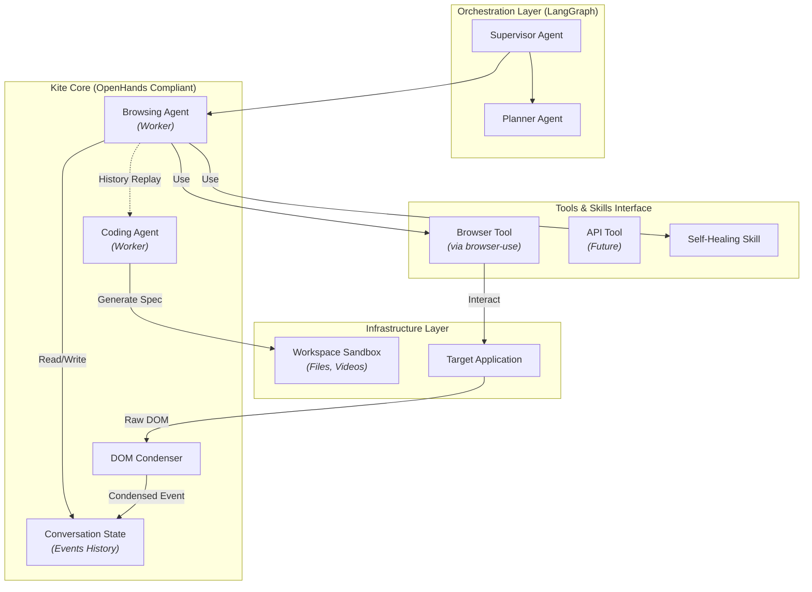
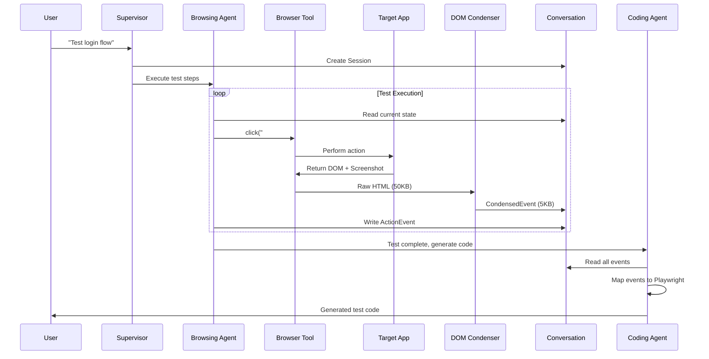

# Architecture

KiteAgent extends OpenHands with testing-specific capabilities.

## System Overview

```
┌──────────────────────────────────────┐
│   LangGraph (Orchestration)         │  ← Multi-agent coordination
├──────────────────────────────────────┤
│   KiteAgent (OpenHands Core)        │  ← Event-driven, stateless
│   • Agents                           │
│   • Conversation                     │
│   • Events                           │
├──────────────────────────────────────┤
│   Browser-use (Capabilities)         │  ← Browser automation
│   • BrowserTool                      │
│   • Self-Healing                     │
└──────────────────────────────────────┘
```

## Key Components

### From OpenHands

**Conversation** - Single source of truth

```python
conversation = Conversation()
conversation = conversation.with_event(event)  # Immutable
state = conversation.get_current_state()
```

**Events** - Immutable action history

```python
@dataclass(frozen=True)
class BrowserActionEvent:
    action: str
    selector: str
    timestamp: datetime
```

**Stateless Agents** - No internal state

```python
class BrowsingAgent:
    def execute(self, conversation, instruction):
        # Read from conversation
        state = conversation.get_current_state()
        # Write back to conversation
        return conversation.with_event(new_event)
```

### KiteAgent Extensions

**Testing-Specific Events**

- `TestRequestEvent` - Test scenario
- `BrowserActionEvent` - UI interaction
- `DOMObservationEvent` - Page state
- `AssertionEvent` - Verification
- `TestFailureEvent` - Error info

**DOM Condenser**

```python
# Raw: 50KB → Condensed: 5KB
condensed_dom = condenser.condense(raw_html)
# Keeps: interactive elements, text content
# Removes: styling, scripts, empty divs
```

**Testing Agents**

- `Browsing Agent` - Execute tests (uses Browser-use)
- `Coding Agent` - Generate code
- `Supervisor Agent` - Coordinate (uses LangGraph)

## Data Flow

```
User Request
    ↓
Supervisor (LangGraph)
    ↓
Browsing Agent
    ↓
Browser Tool (Browser-use)
    ↓
Target App
    ↓
DOM Condenser → Conversation (Events)
    ↓
Coding Agent
    ↓
Generated Test Code
```

## Design Principles (from OpenHands)

1. **Stateless** - All state in Conversation
2. **Event-driven** - Immutable events
3. **One source of truth** - Conversation only
4. **Extensible** - Via Tools & Skills

## Next Steps

- **[Design Principles](./design-principles)** - Deep dive
- **[Agents](./agents)** - Agent types
- **[Events](./events)** - Event system



### 1. Orchestration Layer

The orchestration layer uses **LangGraph** to coordinate multiple agents:

- **Supervisor Agent**: Acts as the QA Lead, analyzing user requirements and delegating tasks
- **Planner Agent**: Creates detailed test execution plans with clear steps

**Why LangGraph?**

- Native support for multi-agent workflows
- Built-in state management
- Conditional routing between agents
- Easy integration with LLMs

### 2. Core Layer

The core layer implements KiteAgent's primary logic:

#### Agents

- **Browsing Agent**: Executes tests by interacting with browsers
- **Coding Agent**: Converts test sessions into production code

#### State Management

- **Conversation**: The single source of truth for test sessions
- Contains an immutable sequence of Events
- Enables time-travel debugging and perfect replay

#### DOM Processing

- **DOM Condenser**: Compresses raw HTML to reduce LLM token usage
- Removes nested divs/spans without semantic meaning
- Preserves interactive elements (buttons, inputs, links)
- Reduces DOM size by 80-90% while maintaining functionality

### 3. Capabilities Layer

This layer provides tools and skills that agents can use:

#### Tools

Tools enable interaction with external systems:

- **BrowserTool**: Wraps `browser-use` library for browser automation
  - Methods: `click()`, `type()`, `scroll()`, `extract_content()`
- **APITool** (Future): HTTP request capabilities via `requests`
- **PerformanceTool** (Future): Load testing via `k6` or `Locust`

#### Skills

Skills are reusable high-level behaviors:

- **Self-Healing Skill**: Automatic element recovery when selectors fail
- **Visual Check Skill**: Pixel-perfect UI comparison using vision models

### 4. Infrastructure Layer

Provides runtime environment and storage:

- **Workspace**: Isolated sandbox for test artifacts
  - Input: Config files, test data
  - Output: Generated code, videos, reports
- **Target Application**: The application under test

## Data Flow

Here's how a typical test request flows through the system:



### Step-by-Step Breakdown

1. **Request Initiation**: User sends natural language test requirement
2. **Session Creation**: Supervisor creates new Conversation
3. **Planning**: Supervisor breaks requirement into actionable steps
4. **Execution Loop**:
   - Browsing Agent reads current Conversation state
   - Decides next action based on context
   - Calls Browser Tool to execute action
   - Browser Tool interacts with target application
   - DOM and screenshot captured
5. **Compression**: DOM Condenser reduces data size
6. **Event Recording**: All actions and observations saved as Events
7. **Self-Healing** (if needed): When selector fails, Self-Healing Skill activates
8. **Code Generation**: Coding Agent converts event history to code
9. **Artifact Storage**: Generated code saved to Workspace

## Design Principles

### 1. Stateless Agents

Agents contain no internal state. All session data lives in `Conversation`.

**Benefits:**

- Agents are interchangeable and scalable
- Easy to debug - just inspect Conversation
- Simple deployment - agents are pure functions

**Example:**

```python
# ❌ Stateful (Bad)
class BrowsingAgent:
    def __init__(self):
        self.history = []  # Internal state

    def execute(self, action):
        self.history.append(action)

# ✅ Stateless (Good)
class BrowsingAgent:
    def execute(self, conversation, action):
        new_event = ActionEvent(action)
        conversation.add_event(new_event)
        return conversation
```

### 2. One Source of Truth

The `Conversation` object is the only source of test state.

**Benefits:**

- Bug reproduction is perfect - just replay the Conversation
- No state synchronization issues
- Easy to implement features like undo/redo
- Test sessions are portable

### 3. Event-Driven & Immutable

Every action is an Event. Events are never modified after creation.

**Benefits:**

- Complete audit trail of test execution
- Time-travel debugging - inspect any past state
- Easy to implement features like test playback
- No race conditions or inconsistent state

**Event Types:**

- `TestRequestEvent`: User's test requirement
- `BrowserActionEvent`: Actions like click, type
- `DOMObservationEvent`: Browser state snapshots
- `AssertionEvent`: Test verification points
- `TestFailureEvent`: Error information

### 4. Extensible via Tools

New capabilities are added through the Tool/Skill system, not by modifying core agents.

**Benefits:**

- Core architecture remains stable
- Third-party integrations are simple
- Testing capabilities can grow horizontally

**Example Extension:**

```python
# Add API testing without changing core
class APITool(Tool):
    def send_request(self, method, url, data):
        response = requests.request(method, url, json=data)
        return APIResponseEvent(response)

# Browsing Agent can now use it
agent = BrowsingAgent(tools=[BrowserTool(), APITool()])
```

## Comparison with Traditional Testing Frameworks

| Aspect               | Traditional (Selenium/Playwright) | KiteAgent                    |
| -------------------- | --------------------------------- | ---------------------------- |
| **Test Creation**    | Manual script writing             | Natural language description |
| **State Management** | Implicit in code                  | Explicit Conversation object |
| **Debugging**        | Console logs, breakpoints         | Time-travel event replay     |
| **Maintenance**      | Manual selector updates           | Self-healing automation      |
| **Extensibility**    | Framework-dependent               | Tool-based plugins           |
| **LLM Integration**  | External, manual                  | Native, automatic            |

## Performance Characteristics

### Token Efficiency

- **Raw DOM**: ~50,000 tokens per page
- **Condensed DOM**: ~5,000 tokens per page
- **Reduction**: 90% token savings
- **Cost Impact**: 10x cheaper LLM calls

### Execution Speed

- **Planning**: ~2-5 seconds (LLM call)
- **Browser Action**: ~0.5-2 seconds (network + render)
- **DOM Condensing**: ~0.1-0.3 seconds (local processing)
- **Self-Healing**: ~3-7 seconds (vision model + retry)

### Scalability

- **Horizontal**: Add more agent instances (stateless design)
- **Vertical**: Process multiple Conversations in parallel
- **Cloud**: Deploy agents in serverless functions

## Next Steps

Now that you understand the architecture, explore:

- **[Design Principles](./design-principles)**: Deep dive into design decisions
- **[Agents](./agents)**: Learn about each agent type
- **[Events](./events)**: Understanding the event system
- **[Tools & Skills](./tools-and-skills)**: Extending capabilities
