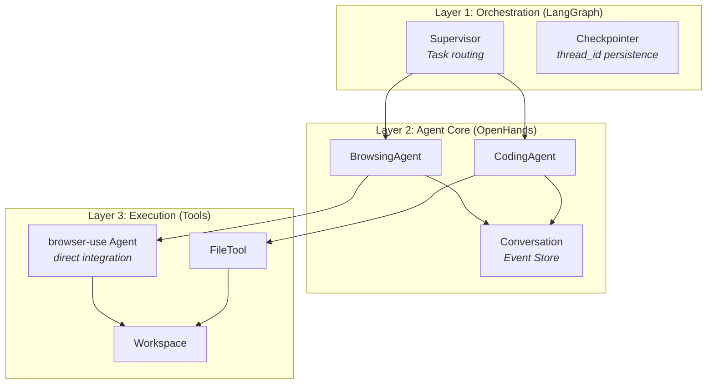

# Architecture

KiteAgent follows a **three-layer architecture** built on OpenHands, LangGraph, and browser-use.

## Three-Layer Design



| Layer | Responsibility | Technology |
|-------|---------------|------------|
| **Orchestration** | Multi-agent routing, memory | LangGraph StateGraph + Checkpointer |
| **Agent Core** | Reasoning-action loop, event store | OpenHands Agent + Conversation |
| **Execution** | Browser/file interactions | browser-use Agent (direct), FileTool |

## Key Principles

### From OpenHands

1. **Event-Driven**: Every action is an immutable Event in Conversation
2. **Stateless Logic**: Agent doesn't hold state, only reads/writes Events
3. **Action-Observation**: Tool pattern: `ActionEvent → Tool → ObservationEvent`

```python
# Agent reads from Conversation
state = conversation.state

# Agent executes action
conversation.send_message("Test login")
conversation.run()

# New events appended (immutable)
for event in conversation.state.events:
    print(event)  # MessageEvent, ActionEvent, ObservationEvent
```

### From LangGraph

4. **Graph Orchestration**: Supervisor routes workers via StateGraph
5. **Persistent Memory**: PostgresSaver stores conversation threads
6. **Subgraph Workers**: Each agent is a subgraph node, runs independently

```python
workflow = StateGraph(KiteGraphState)
workflow.add_node("browsing_agent", browsing_subgraph)
workflow.add_node("coding_agent", coding_subgraph)

checkpointer = PostgresSaver.from_conn_string(DB_URI)
graph = workflow.compile(checkpointer=checkpointer)
```

### KiteAgent Extensions

7. **Testing Tools**: browser-use (direct), APITool, PerfTool
8. **Testing Skills**: Self-healing, visual regression, test generation
9. **Frontend Ready**: RemoteConversation + WebSocket streaming

## Extension Strategy

KiteAgent achieves testing capabilities through **composition**, not forking:

| Component | Source | Integration Method |
|-----------|--------|-------------------|
| Agent, Conversation, Events | OpenHands SDK | **Direct import** - no modification |
| Tool registration, factory pattern | OpenHands SDK | **Use** - register browser-use via `register_tool()` |
| Skill, KeywordTrigger | OpenHands SDK | **Use** - define testing skills |
| StateGraph, Checkpointer | LangGraph | **Wrap** - agents as subgraph nodes |
| browser-use Agent, Tools | browser-use | **Direct use** - registered as OpenHands tool |

**Zero Modifications:** KiteAgent does not fork or patch any library. All extensions use standard APIs.

## Testing Specialization

While OpenHands provides generic agent capabilities, KiteAgent adds testing-specific features:

| Component | Generic (OpenHands) | Testing (KiteAgent) |
|-----------|---------------------|---------------------|
| **Tools** | File operations, bash | browser-use (UI testing), API clients |
| **Skills** | Coding standards | Self-healing selectors, visual regression |
| **Workspace** | Code repository | Test artifacts (screenshots, videos, traces) |
| **Events** | Code changes | Test execution steps, assertions, failures |
| **Agents** | Generic tasks | BrowsingAgent, CodingAgent (testing-specialized) |

## Workspace Structure

```
/workspace/kite-tests/
├── test-data/           # Input: test fixtures, mock data
├── config/              # Test configuration files
├── artifacts/           # Output: test results
│   ├── screenshots/     # Visual evidence
│   ├── videos/          # Session recordings  
│   ├── har/             # Network logs
│   └── traces/          # browser-use execution traces
├── generated/           # Generated test code
└── reports/             # Test reports (HTML, JSON)
```

## Next Steps

- [Design Principles](/docs/core-concepts/design-principles) - Core concepts
- [Agents](/docs/core-concepts/agents) - Agent architecture
- [Conversation](/docs/core-concepts/conversation) - State management
- [Events](/docs/core-concepts/events) - Event system
