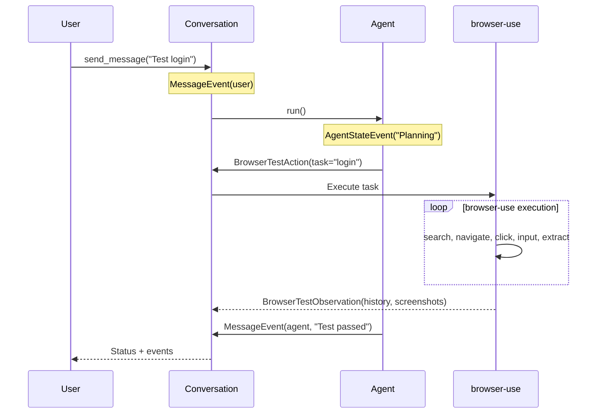

# Events

**OpenHands Events** are immutable records of everything that happens during test execution. KiteAgent extends with testing-specific event types.

## Event Architecture

```python
from openhands.sdk.event import (
    Event,             # Base class
    MessageEvent,      # User/agent messages
    ActionEvent,       # Tool calls
    ObservationEvent,  # Tool results
    AgentStateEvent,   # Agent thinking/planning
)
```

**Properties:**
- **Immutable**: Cannot be modified after creation
- **Timestamped**: Exact execution order
- **Typed**: Different event types for different actions
- **Complete**: Full audit trail of test execution

## Base Event Structure

```python
class Event:
    id: str              # Unique identifier
    timestamp: float     # When event occurred
    source: str          # "user" or "agent"
    event_type: str      # Type identifier
    content: Any         # Event data
```

## Core Event Types

### MessageEvent

User requests or agent responses:

```python
from openhands.sdk.event import MessageEvent

# User message
user_msg = MessageEvent(
    content="Test login at https://example.com with user@test.com",
    source="user"
)

# Agent response
agent_msg = MessageEvent(
    content="Login test completed successfully. User is now on dashboard.",
    source="agent"
)
```

**When Created:**
- User calls `conversation.send_message()`
- Agent completes task and responds

### ActionEvent

Tool invocations by agent:

```python
from openhands.sdk.event import ActionEvent

# Browser automation action
browser_action = ActionEvent(
    tool="browser_automation",
    args=\{
        "task": "Login with provided credentials",
        "params": \{"url": "https://example.com"\}
    \}
)

# File operation action
file_action = ActionEvent(
    tool="file_editor",
    args=\{
        "operation": "write",
        "path": "generated/login_test.py",
        "content": "..."
    \}
)
```

**When Created:**
- Agent decides to use a tool
- Before tool execution

### ObservationEvent

Tool execution results:

```python
from openhands.sdk.event import ObservationEvent

# Successful browser test
observation = ObservationEvent(
    tool="browser_automation",
    content="Successfully logged in. Dashboard page loaded.",
    success=True,
    result=\{
        "status": "success",
        "screenshots": ["base64_screenshot_data"],
        "history": [
            \{"action": "navigate", "url": "https://example.com"\},
            \{"action": "click", "selector": "#login-button"\},
            \{"action": "input", "selector": "#username", "text": "user@test.com"\}
        ]
    \}
)

# Failed browser test
failure_observation = ObservationEvent(
    tool="browser_automation",
    content="Element not found: #old-submit-button",
    success=False,
    error="ElementNotFoundException"
)
```

**When Created:**
- After tool execution
- Contains tool output

### AgentStateEvent

Agent reasoning and planning:

```python
from openhands.sdk.event import AgentStateEvent

# Agent thinking
thinking = AgentStateEvent(
    content="Planning: Need to interact with browser to test login flow. Will use browser_automation tool.",
    state="thinking"
)

# Agent planning
planning = AgentStateEvent(
    content="Plan: 1) Navigate to URL, 2) Find login form, 3) Fill credentials, 4) Submit, 5) Verify dashboard",
    state="planning"
)
```

**When Created:**
- During agent reasoning loop
- Before deciding on actions

## Testing-Specific Events

### BrowserTestAction

Browser automation delegation to browser-use:

```python
class BrowserTestAction(ActionEvent):
    """OpenHands delegates browser test to browser-use"""
    tool: Literal["browser_automation"]
    task: str                    # Natural language task
    params: dict[str, Any]       # Additional parameters

# Example
action = BrowserTestAction(
    tool="browser_automation",
    task="Login with user@test.com and verify dashboard appears",
    params=\{
        "url": "https://example.com",
        "timeout": 30000
    \}
)
```

### BrowserTestObservation

browser-use execution results:

```python
class BrowserTestObservation(ObservationEvent):
    """browser-use test results"""
    tool: Literal["browser_automation"]
    success: bool
    result: str                  # Test outcome description
    history: list[dict]          # browser-use action history
    screenshots: list[str]       # Base64 encoded screenshots
    errors: list[str] | None     # Any errors encountered

# Example
observation = BrowserTestObservation(
    tool="browser_automation",
    success=True,
    result="Login successful. User redirected to dashboard.",
    history=[
        \{
            "action": "search_google",
            "query": "example.com login",
            "result": "Found login page"
        \},
        \{
            "action": "navigate",
            "url": "https://example.com/login",
            "result": "Navigated successfully"
        \},
        \{
            "action": "click",
            "selector": "#username",
            "result": "Clicked input field"
        \},
        \{
            "action": "input_text",
            "selector": "#username",
            "text": "user@test.com",
            "result": "Entered text"
        \},
        \{
            "action": "click",
            "selector": "#submit",
            "result": "Clicked submit button"
        \},
        \{
            "action": "extract_content",
            "prompt": "What is the main heading?",
            "result": "Dashboard"
        \}
    ],
    screenshots=[
        "iVBORw0KGgoAAAANSUhEUgA...",  # Login page
        "iVBORw0KGgoAAAANSUhEUgA...",  # Dashboard
    ],
    errors=None
)
```

## Event Flow

### Complete Test Execution Flow

```python
# User sends test request
conversation.send_message("Test login with user@test.com")
# → Creates MessageEvent(source="user")

# Agent processes request
conversation.run()

# Internal flow creates these events:

# 1. Agent thinking
# → AgentStateEvent("Planning: need browser automation")

# 2. Agent decides to use tool
# → BrowserTestAction(task="login", tool="browser_automation")

# 3. Tool executes (browser-use runs)
# → browser-use performs: search → navigate → click → input → extract

# 4. Tool returns result
# → BrowserTestObservation(success=True, history=[...], screenshots=[...])

# 5. Agent responds to user
# → MessageEvent(source="agent", content="Login test passed")
```

### Sequence Diagram



## Working with Events

### Accessing Events

```python
# Get all events
all_events = conversation.state.events

# Filter by type
actions = [e for e in conversation.state.events 
           if isinstance(e, ActionEvent)]

observations = [e for e in conversation.state.events 
                if isinstance(e, ObservationEvent)]

messages = [e for e in conversation.state.events 
            if isinstance(e, MessageEvent)]
```

### Analyzing Test Results

```python
def analyze_test_results(conversation):
    """Extract test execution details from events"""
    
    results = \{
        'status': conversation.state.status.value,
        'total_steps': len(conversation.state.events),
        'actions': 0,
        'observations': 0,
        'screenshots': [],
        'failures': [],
        'browser_actions': []
    \}
    
    for event in conversation.state.events:
        if isinstance(event, ActionEvent):
            results['actions'] += 1
            
        elif isinstance(event, ObservationEvent):
            results['observations'] += 1
            
            # Extract screenshots
            if hasattr(event, 'screenshots'):
                results['screenshots'].extend(event.screenshots)
            
            # Track failures
            if not event.success:
                results['failures'].append(\{
                    'tool': event.tool,
                    'error': event.error if hasattr(event, 'error') else event.content
                \})
            
            # Extract browser-use history
            if hasattr(event, 'history'):
                results['browser_actions'].extend(event.history)
    
    return results

# Use
results = analyze_test_results(conversation)
print(f"Test executed \{results['actions']\} actions")
print(f"Captured \{len(results['screenshots'])\} screenshots")
print(f"browser-use performed \{len(results['browser_actions'])\} browser actions")
```

### Debugging with Events

```python
def debug_test_failure(conversation):
    """Find and analyze test failure"""
    
    # Find first failure
    for i, event in enumerate(conversation.state.events):
        if isinstance(event, ObservationEvent) and not event.success:
            print(f"Test failed at step \{i\}")
            print(f"Error: \{event.content\}")
            
            # Get preceding actions for context
            preceding_actions = [
                e for e in conversation.state.events[:i]
                if isinstance(e, ActionEvent)
            ]
            
            print(f"\nPreceding actions:")
            for action in preceding_actions[-3:]:
                print(f"  - \{action.tool\}: \{action.args\}")
            
            # Get screenshots before failure
            screenshots = [
                e.screenshots for e in conversation.state.events[:i]
                if hasattr(e, 'screenshots')
            ]
            
            if screenshots:
                print(f"\nCaption: \{len(screenshots[-1])\} screenshots before failure")
                # Save for debugging
                import base64
                with open(f'debug_step_\{i\}.png', 'wb') as f:
                    f.write(base64.b64decode(screenshots[-1][0]))
            
            break

# Use
debug_test_failure(conversation)
```

### Event Replay

```python
def replay_test_execution(conversation):
    """Replay test execution step by step"""
    
    print("Test Execution Replay:")
    print("=" * 50)
    
    for i, event in enumerate(conversation.state.events):
        print(f"\nStep \{i\}: \{event.event_type\}")
        
        if isinstance(event, MessageEvent):
            print(f"  [\{event.source\}] \{event.content\}")
            
        elif isinstance(event, AgentStateEvent):
            print(f"  Agent: \{event.content\}")
            
        elif isinstance(event, ActionEvent):
            print(f"  Action: \{event.tool\}")
            print(f"  Args: \{event.args\}")
            
        elif isinstance(event, ObservationEvent):
            print(f"  Result: \{'✓' if event.success else '✗'\}")
            print(f"  Output: \{event.content\}")
            
            if hasattr(event, 'history'):
                print(f"  browser-use actions: \{len(event.history)\}")

# Use
replay_test_execution(conversation)
```

## Event Patterns

### Pattern 1: Action-Observation

Every tool call produces an action-observation pair:

```python
# Action
ActionEvent(tool="browser_automation", args=\{"task": "click button"\})

# Observation
ObservationEvent(tool="browser_automation", success=True, result="Clicked")
```

### Pattern 2: Multi-Step Actions

Complex tasks generate multiple action-observation pairs:

```python
# Task: "Test checkout flow"

# Action 1: Navigate
ActionEvent(tool="browser_automation", args=\{"task": "go to /cart"\})
ObservationEvent(success=True, result="Navigated to cart")

# Action 2: Interact
ActionEvent(tool="browser_automation", args=\{"task": "click checkout"\})
ObservationEvent(success=True, result="Checkout page loaded")

# Action 3: Fill form
ActionEvent(tool="browser_automation", args=\{"task": "fill shipping form"\})
ObservationEvent(success=True, result="Form filled")

# Action 4: Submit
ActionEvent(tool="browser_automation", args=\{"task": "complete purchase"\})
ObservationEvent(success=True, result="Order confirmed")
```

### Pattern 3: Self-Healing

When selector fails, skill triggers recovery:

```python
# Initial attempt fails
ActionEvent(tool="browser_automation", args=\{"task": "click #old-button"\})
ObservationEvent(success=False, error="ElementNotFoundException")

# Agent invokes self-healing skill
AgentStateEvent(content="Self-healing: finding alternative selector")

# Retry with new selector
ActionEvent(tool="browser_automation", args=\{"task": "click button with 'Submit' text"\})
ObservationEvent(success=True, result="Clicked submit button")
```

## Event Storage

Events are stored in **Conversation** and optionally persisted:

```python
# Access from conversation
events = conversation.state.events

# Export for reporting
import json

event_data = [e.to_dict() for e in events]

with open('test_execution.json', 'w') as f:
    json.dump(event_data, f, indent=2)

# LangGraph persistence (thread-based)
from langgraph.checkpoint.postgres import PostgresSaver

checkpointer = PostgresSaver.from_conn_string(DB_URI)
# Events automatically persisted per thread_id
```

## Next Steps

- **[Conversation](/docs/core-concepts/conversation)** - Managing events
- **[Agents](/docs/core-concepts/agents)** - Creating events through actions
- **[Guides: Events](/docs/guides/events)** - Practical event handling
