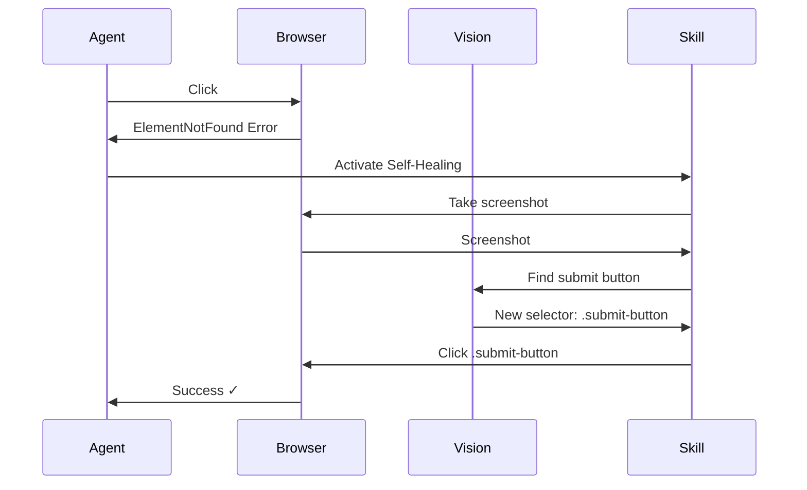

# Self-Healing Test Example

See how KiteAgent automatically recovers from selector failures.

## Scenario

Test a form where the button selector changes between test runs.

## Without Self-Healing

Traditional test would fail:

```typescript
// ❌ This fails when selector changes
await page.click("#submit-btn"); // Selector changed to '.submit-button'
// Error: Element not found
```

## With Self-Healing

KiteAgent automatically recovers:

```python
from kite_agent import BrowsingAgent, BrowserTool, SelfHealingSkill, Conversation

def test_with_self_healing():
    agent = BrowsingAgent(
        tools=[BrowserTool()],
        skills=[
            SelfHealingSkill(
                vision_model="gpt-4-vision",
                max_retries=3
            )
        ]
    )

    conversation = Conversation()

    # This will succeed even if selector changes
    conversation = agent.execute(conversation, "Click the submit button")

    # Behind the scenes:
    # 1. Tries original selector: #submit-btn ❌
    # 2. Self-healing activates
    # 3. Takes screenshot
    # 4. Uses vision model to find button
    # 5. Finds new selector: .submit-button ✓
    # 6. Retries with new selector ✓

    print("✓ Test passed with self-healing!")

    return conversation
```

## How It Works



## Configuration Options

```python
skill = SelfHealingSkill(
    # Vision model to use
    vision_model="gpt-4-vision",

    # Maximum retry attempts
    max_retries=3,

    # Similarity threshold (0-1)
    similarity_threshold=0.85,

    # Enable caching of healed selectors
    cache_healed_selectors=True
)
```

## Next Steps

- **[Code Generation Example](./code-generation)**: Generate production code
- **[Core Concepts: Skills](../core-concepts/tools-and-skills)**: Learn about skills
