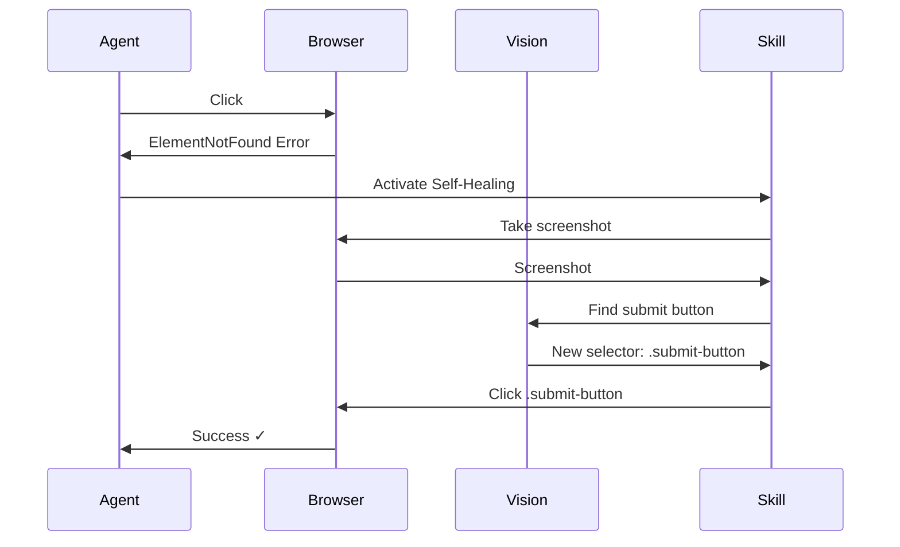

# Self-Healing Test Example

See how KiteAgent automatically recovers from selector failures.

## Scenario

Test a form where the button selector changes between test runs.

## Without Self-Healing

Traditional test would fail:

```typescript
// ❌ This fails when selector changes
await page.click("#submit-btn"); // Selector changed to '.submit-button'
// Error: Element not found
```

## With Self-Healing

KiteAgent automatically recovers:

```typescript
import { BrowsingAgent, BrowserTool, SelfHealingSkill } from "@kite-agent/core";

async function testWithSelfHealing() {
  const agent = new BrowsingAgent({
    tools: [new BrowserTool()],
    skills: [
      new SelfHealingSkill({
        visionModel: "gpt-4-vision",
        maxRetries: 3,
      }),
    ],
  });

  let conversation = new Conversation();

  // This will succeed even if selector changes
  conversation = await agent.execute(conversation, "Click the submit button");

  // Behind the scenes:
  // 1. Tries original selector: #submit-btn ❌
  // 2. Self-healing activates
  // 3. Takes screenshot
  // 4. Uses vision model to find button
  // 5. Finds new selector: .submit-button ✓
  // 6. Retries with new selector ✓

  console.log("✓ Test passed with self-healing!");

  return conversation;
}
```

## How It Works



## Configuration Options

```typescript
const skill = new SelfHealingSkill({
  // Vision model to use
  visionModel: "gpt-4-vision",

  // Maximum retry attempts
  maxRetries: 3,

  // Similarity threshold (0-1)
  similarityThreshold: 0.85,

  // Enable caching of healed selectors
  cacheHealedSelectors: true,
});
```

## Next Steps

- **[Code Generation Example](./code-generation)**: Generate production code
- **[Core Concepts: Skills](../core-concepts/tools-and-skills)**: Learn about skills
