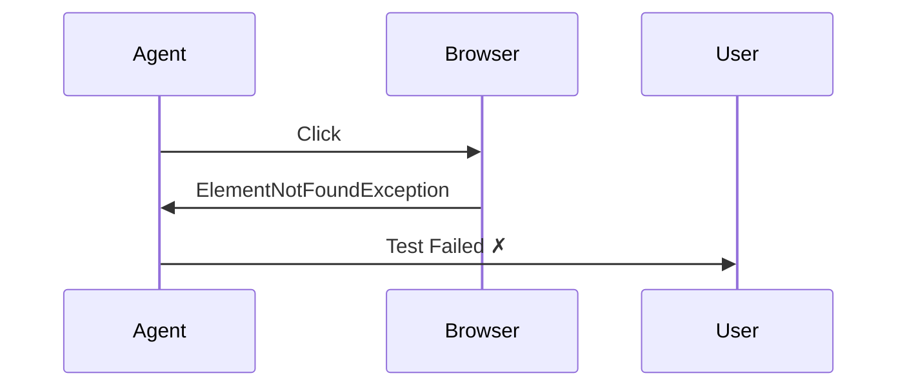
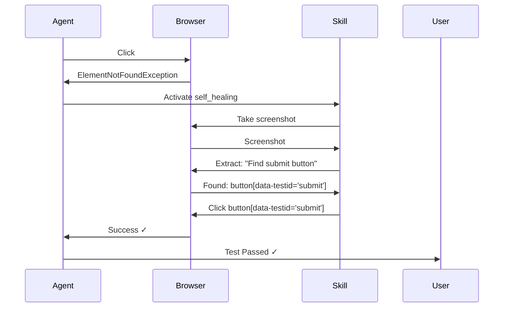

# Self-Healing Test Example

Automatic recovery from selector failures using Skills.

## Problem

Traditional tests break when selectors change:

```python
# ❌ Fails when selector changes
page.click("#submit-btn")  # Selector changed to ".submit-button"
# Error: ElementNotFoundException
```

## Solution: Self-Healing Skill

KiteAgent Skills automatically recover from failures:

```python
from openhands.sdk import Agent, Conversation, LLM
from openhands.sdk.workspace import LocalWorkspace
from openhands.sdk.tool import Tool
from openhands.sdk.context.skills import Skill, KeywordTrigger

# Self-healing skill
self_healing = Skill(
    name="self_healing",
    trigger=KeywordTrigger(keywords=[
        "ElementNotFoundException",
        "selector failed",
        "element not found",
        "StaleElementReferenceException"
    ]),
    content="""
    Self-Healing Selector Recovery:
    
    When a selector fails:
    
    1. **Capture Context**
       - Take screenshot of current page
       - Extract page structure using browser-use extract
       - Log failed selector and error
    
    2. **Find Alternative**
       - Use browser-use extract: "Find element similar to: \{selector\}"
       - Prefer in order:
         a) data-testid attributes
         b) aria-label attributes  
         c) text content matching
         d) CSS selector with visible text
         e) XPath as last resort
    
    3. **Validate New Selector**
       - Verify finds exactly 1 element
       - Check element is visible and interactable
       - If multiple matches, refine selector
    
    4. **Log Change**
       - Record: old_selector → new_selector
       - Add to Conversation events
       - Include screenshot of found element
    
    5. **Continue Execution**
       - Retry with new selector
       - Max 3 attempts before failure
    
    Example:
    Failed: "#submit-button-old"
    Found: "button[data-testid='submit']"
    """
)

# Create agent with self-healing
agent = Agent(
    llm=LLM(model="anthropic/claude-sonnet-4"),
    tools=[Tool(name="BrowserAutomation")],
    skills=[self_healing],  # Skill activates automatically
)
```

## Complete Example

```python
#!/usr/bin/env python3
"""
Self-healing test example
"""
from openhands.sdk import Agent, Conversation, LLM
from openhands.sdk.workspace import LocalWorkspace
from openhands.sdk.tool import Tool, register_tool
from openhands.sdk.context.skills import Skill, KeywordTrigger
from openhands.sdk.event import ObservationEvent, AgentStateEvent
from browser_use import Tools

# Register browser-use
class BrowserUseTool:
    @classmethod
    def create(cls, conv_state, **params):
        return [\{
            'name': 'browser_automation',
            'description': 'Execute browser automation',
            'tools': Tools(),
        \}]

register_tool("BrowserAutomation", BrowserUseTool)

# Self-healing skill
self_healing = Skill(
    name="self_healing",
    trigger=KeywordTrigger(keywords=[
        "ElementNotFoundException",
        "selector failed",
        "element not found"
    ]),
    content="""
    When selector fails:
    1. Take screenshot for visual analysis
    2. Use browser-use extract to find similar elements
    3. Generate new robust selector (test ID > aria > CSS > XPath)
    4. Log selector change to Conversation
    5. Retry with new selector (max 3 attempts)
    
    Prefer selectors: data-testid > aria-label > text content > CSS
    """
)

# Create agent with self-healing
agent = Agent(
    llm=LLM(model="anthropic/claude-sonnet-4", temperature=0.0),
    tools=[Tool(name="BrowserAutomation")],
    skills=[self_healing],
)

def test_with_self_healing():
    """Test that recovers from selector changes"""
    
    print("Testing with self-healing...")
    
    with LocalWorkspace("/workspace/tests") as workspace:
        conversation = Conversation(agent=agent, workspace=workspace)
        
        # This test will succeed even if selectors change
        conversation.send_message("""
            Test form submission at https://example.com/form:
            1. Navigate to form page
            2. Fill in name field with "Test User"
            3. Fill in email field with "test@example.com"
            4. Click the submit button
            5. Verify confirmation message appears
        """)
        
        conversation.run()
        
        # Analyze execution
        healing_events = []
        for i, event in enumerate(conversation.state.events):
            # Look for self-healing activation
            if isinstance(event, AgentStateEvent):
                if "self_healing" in event.content.lower() or "selector" in event.content.lower():
                    healing_events.append(\{
                        'step': i,
                        'content': event.content
                    \})
        
        # Results
        status = conversation.state.status.value
        print(f"\nTest Status: \{status\}")
        
        if healing_events:
            print(f"\n✓ Self-healing activated \{len(healing_events)\} time(s):")
            for event in healing_events:
                print(f"  Step \{event['step']\}: \{event['content']\}")
        else:
            print("\n✓ No healing needed - all selectors worked")
        
        return status == "success"

if __name__ == "__main__":
    import sys
    success = test_with_self_healing()
    sys.exit(0 if success else 1)
```

## How It Works

### Without Self-Healing



### With Self-Healing



## Example Output

```
Testing with self-healing...

Test Status: success

✓ Self-healing activated 1 time(s):
  Step 8: Self-healing: Original selector '#submit-btn-old' failed. 
          Found alternative: button[data-testid='submit']
          Retrying with new selector...
```

## Testing Self-Healing

Simulate selector changes:

```python
def test_selector_evolution():
    """Test handles multiple selector changes"""
    
    test_cases = [
        \{
            "name": "Original selector works",
            "page": "v1",  # Has #submit-btn
            "expect_healing": False
        \},
        \{
            "name": "Selector changed to class",
            "page": "v2",  # Changed to .submit-button
            "expect_healing": True
        \},
        \{
            "name": "Selector changed to data attribute",
            "page": "v3",  # Changed to [data-testid='submit']
            "expect_healing": True
        \}
    ]
    
    for case in test_cases:
        print(f"\nTesting: \{case['name']\}")
        
        with LocalWorkspace("/workspace/tests") as workspace:
            conversation = Conversation(agent=agent, workspace=workspace)
            
            conversation.send_message(f"""
                Test form at https://example.com/\{case['page']\}:
                1. Navigate to page
                2. Fill form fields
                3. Click submit button
                4. Verify success
            """)
            
            conversation.run()
            
            # Check if healing occurred
            healed = any(
                "self_healing" in str(e.content).lower()
                for e in conversation.state.events
                if isinstance(e, AgentStateEvent)
            )
            
            if healed == case['expect_healing']:
                print(f"✓ \{case['name']\} - passed")
            else:
                print(f"✗ \{case['name']\} - unexpected healing behavior")

test_selector_evolution()
```

## Advanced Self-Healing

### Visual Recognition

```python
visual_healing = Skill(
    name="visual_self_healing",
    trigger=KeywordTrigger(keywords=["ElementNotFoundException"]),
    content="""
    Visual Self-Healing:
    
    1. **Take Screenshot**
       - Capture full page
       - Save to artifacts/healing/
    
    2. **Visual Analysis**
       - Use browser-use extract with visual prompt:
         "Find the button that looks like a submit/login/save button"
       - Look for visual cues:
         * Button shape and color
         * Icon (arrow, checkmark, etc.)
         * Position (bottom right, center, etc.)
         * Text content
    
    3. **Generate Selector**
       - Prefer test IDs first
       - Fall back to visual matching
       - Use XPath with contains() for text
    
    4. **Confidence Check**
       - Only proceed if > 85% confident
       - If uncertain, ask for human verification
       - Log confidence score
    """
)

visual_agent = Agent(
    llm=LLM(model="anthropic/claude-sonnet-4"),
    tools=[Tool(name="BrowserAutomation")],
    skills=[visual_healing],
)
```

### Caching Healed Selectors

```python
caching_healing = Skill(
    name="caching_self_healing",
    trigger=KeywordTrigger(keywords=["ElementNotFoundException"]),
    content="""
    Self-Healing with Caching:
    
    1. **Check Cache**
       - Look in workspace: healing-cache.json
       - Key: page_url + original_selector
       - If found, use cached selector directly
    
    2. **Find New Selector** (if not cached)
       - Use browser-use extract
       - Generate robust alternative
    
    3. **Validate & Cache**
       - Test new selector works
       - Save to cache:
         \{
           "url": "https://example.com/form",
           "old_selector": "#submit-btn-old",
           "new_selector": "button[data-testid='submit']",
           "confidence": 0.95,
           "timestamp": "2024-01-07T10:00:00Z"
         \}
    
    4. **Use Cached Selector**
       - On next failure, check cache first
       - Skip extraction if cached
       - Update cache timestamp (LRU)
    
    Cache expires after: 7 days
    """
)
```

## Real-World Scenarios

### Scenario 1: Button Text Changed

```python
# Before: <button id="login">Log In</button>
# After:  <button id="login">Sign In</button>

# Self-healing finds it by:
# 1. data-testid (if exists)
# 2. button with "sign" or "login" text
# 3. button near email/password inputs
```

### Scenario 2: ID Changed

```python
# Before: <input id="email" />
# After:  <input id="user-email" />

# Self-healing finds it by:
# 1. name="email"
# 2. type="email"
# 3. placeholder="Enter email"
# 4. input near "Email:" label
```

### Scenario 3: Complete Redesign

```python
# Before: <div id="form"><button>Submit</button></div>
# After:  <form><button class="btn-primary">Save</button></form>

# Self-healing finds it by:
# 1. Visual analysis: "Find the main action button"
# 2. Position: Bottom of form
# 3. Style: Primary button styling
# 4. Text similarity: "submit" vs "save"
```

## Monitoring Healing Events

```python
def analyze_healing_stats(conversation):
    """Extract self-healing statistics"""
    
    stats = \{
        'total_healings': 0,
        'selectors_changed': [],
        'success_rate': 0
    \}
    
    for event in conversation.state.events:
        if isinstance(event, AgentStateEvent):
            content = event.content.lower()
            
            if "self_healing" in content or "selector" in content:
                stats['total_healings'] += 1
                
                # Extract selector change (simple parsing)
                if "->" in content or "→" in content:
                    stats['selectors_changed'].append(content)
    
    # Calculate success rate
    if stats['total_healings'] > 0:
        success = conversation.state.status.value == "success"
        stats['success_rate'] = 100.0 if success else 0.0
    
    return stats

# Use
stats = analyze_healing_stats(conversation)
print(f"Healings: \{stats['total_healings']\}")
print(f"Success Rate: \{stats['success_rate']\}%")
```

## Next Steps

- **[Code Generation Example](/docs/examples/code-generation)** - Generate tests from execution
- **[Core Concepts: Skills](/docs/core-concepts/tools-and-skills)** - Learn more about Skills
- **[Guides: Agents](/docs/guides/agents)** - Configure agents with skills
