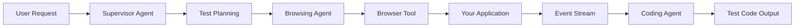

# Welcome to KiteAgent

**KiteAgent** is an AI-native automation testing platform that revolutionizes how you approach end-to-end testing. By combining intelligent agents, event-driven architecture, and self-healing capabilities, KiteAgent makes testing smarter, faster, and more reliable.

## What is KiteAgent?

KiteAgent is built on three powerful foundations:

- **LangGraph Orchestration**: Intelligent multi-agent coordination for complex testing workflows
- **Browser-use Integration**: Seamless browser interaction capabilities
- **OpenHands Architecture**: Event-driven, stateless design for reproducible testing

## Key Features

### 🤖 AI-Powered Agents

KiteAgent uses specialized AI agents for different testing roles:

- **Supervisor Agent**: Acts as a QA lead, analyzing requirements and coordinating tasks
- **Browsing Agent**: Executes tests by interacting with your application
- **Coding Agent**: Generates production-ready test code from recorded sessions

### 🔄 Event-Driven Architecture

Every action in KiteAgent is an immutable event:

- Complete test history in a single `Conversation` object
- Time-travel debugging - replay any point in test execution
- Perfect bug reproduction with exact state restoration

### 🔧 Self-Healing Tests

No more brittle tests that break with UI changes:

- Automatic element detection when selectors fail
- Visual comparison for intelligent recovery
- Continuous test maintenance without manual intervention

### 📊 DOM Intelligence

Efficient handling of large web pages:

- Smart DOM compression reduces token usage
- Keeps only interactive elements and meaningful content
- Optimized for LLM processing

## Quick Start

### Installation

```bash
npm install @kite-agent/core
# or
yarn add @kite-agent/core
```

### Your First Test

```typescript
import { KiteAgent } from "@kite-agent/core";

const agent = new KiteAgent({
  model: "gpt-4",
  capabilities: ["browser", "self-healing"],
});

// Natural language test description
await agent.test({
  url: "https://example.com",
  scenario: "User should be able to login with valid credentials",
});

// Generate Playwright code
const code = await agent.generateCode("playwright");
console.log(code);
```

### What Happens Behind the Scenes

1. **Planning**: Supervisor Agent analyzes your test scenario
2. **Execution**: Browsing Agent interacts with your application
3. **Observation**: DOM state and screenshots are captured as events
4. **Adaptation**: If selectors fail, self-healing kicks in
5. **Code Generation**: Coding Agent converts events to production code

## Architecture Overview



## Why Choose KiteAgent?

| Traditional Testing        | KiteAgent                          |
| -------------------------- | ---------------------------------- |
| Manual test script writing | Natural language test descriptions |
| Brittle selectors          | Self-healing automation            |
| Difficult debugging        | Time-travel event replay           |
| Limited to one capability  | Extensible multi-capability design |
| Static test code           | AI-generated, optimized code       |

## Next Steps

Ready to dive deeper? Explore our documentation:

- **[Core Concepts](./core-concepts/architecture)**: Understand KiteAgent's architecture
- **[Guides](./guides/agents)**: Learn how to use agents, events, and tools
- **[API Reference](./api/agents)**: Detailed API documentation
- **[Examples](./examples/basic-test)**: Practical code examples

## Community & Support

- **GitHub**: [github.com/kite-agent/kite-agent](https://github.com/kite-agent/kite-agent)
- **Discord**: Join our community for help and discussions
- **Documentation**: You're already here! 📚

---

**Ready to transform your testing workflow?** Let's get started! 🚀
