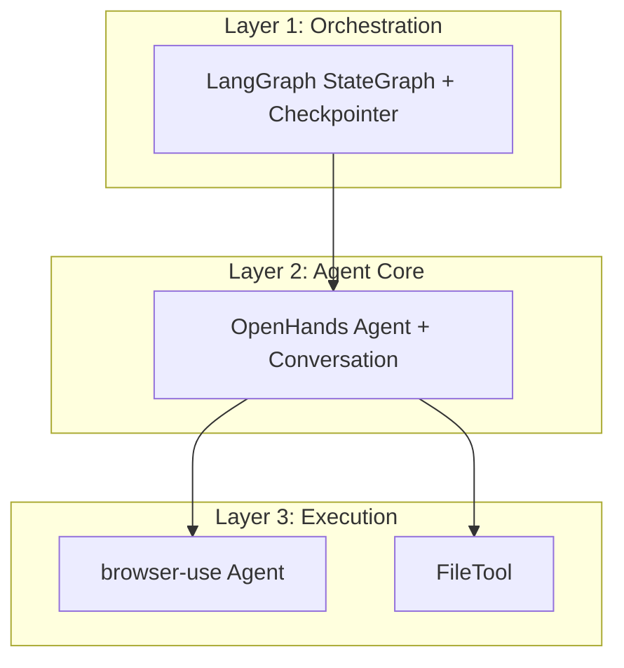

# Get Started

**AI-Native Automation Testing Platform**

KiteAgent is an automation testing platform built on **OpenHands SDK** (core), **LangGraph** (orchestration), and **browser-use** (browser automation).

## What is KiteAgent?

KiteAgent extends OpenHands with testing-specific capabilities through **composition, not forking**:

```
Layer 1: LangGraph          → Multi-agent orchestration + memory
Layer 2: OpenHands SDK      → Event-driven agents + conversation
Layer 3: browser-use        → Browser automation (20+ actions)
```

**Core Philosophy:**
- **100% OpenHands Core**: No fork, only extend via Tools & Skills
- **Direct Integration**: browser-use registered as OpenHands tool
- **Testing Specialized**: Custom skills, workspace, events for testing

## Key Features

- 🤖 **Natural Language Tests** - Describe tests, agent executes
- 🔧 **Self-Healing** - Auto-fix broken selectors
- 📸 **Visual Regression** - Screenshot comparison
- 🧪 **Test Generation** - Convert manual tests to code
- 🔄 **Session Persistence** - Resume tests, debug failures
- 📊 **Test Artifacts** - Screenshots, videos, HAR files, traces

## Quick Start

### Installation

```bash
pip install kite-agent
```

### Your First Test

```python
from openhands.sdk import Agent, Conversation, LLM
from openhands.sdk.workspace import LocalWorkspace
from openhands.sdk.tool import Tool
from kite_agent.tools import register_browser_tool
from kite_agent.skills import self_healing_skill

# Register browser-use tool
register_browser_tool()

# Create testing agent
agent = Agent(
    llm=LLM(model="anthropic/claude-sonnet-4", api_key="your-key"),
    tools=[Tool(name="BrowserAutomation")],
    skills=[self_healing_skill]
)

# Execute test
with LocalWorkspace("/workspace/tests") as workspace:
    conversation = Conversation(agent=agent, workspace=workspace)
    
    conversation.send_message(
        "Test login at https://example.com with user@test.com"
    )
    conversation.run()
    
    # Check results
    for event in conversation.state.events:
        print(event)
```

### Multi-Agent Workflow (with LangGraph)

```python
from langgraph.graph import StateGraph
from langgraph.checkpoint.postgres import PostgresSaver

# Create workflow
workflow = StateGraph(KiteGraphState)
workflow.add_node("browsing_agent", browsing_subgraph)
workflow.add_node("coding_agent", coding_subgraph)

# Add persistence
checkpointer = PostgresSaver.from_conn_string("postgresql://localhost/kite")
graph = workflow.compile(checkpointer=checkpointer)

# Execute test with session persistence
result = graph.invoke(
    \{"messages": [\{"role": "user", "content": "Test checkout flow"\}]\},
    config=\{"configurable": \{"thread_id": "test-123"\}\}
)
```

## Key Differences from Generic Automation

| Component | Generic (OpenHands) | Testing (KiteAgent) |
|-----------|---------------------|---------------------|
| **Tools** | File operations, bash | browser-use (UI testing), API clients |
| **Skills** | Coding standards | Self-healing selectors, visual regression |
| **Workspace** | Code repository | Test artifacts (screenshots, videos, traces) |
| **Events** | Code changes | Test execution steps, assertions, failures |
| **Agents** | Generic tasks | BrowsingAgent, CodingAgent (testing-specialized) |

## Architecture



## Next Steps

- [Core Concepts](/docs/core-concepts/architecture) - Understand the three-layer architecture
- [Getting Started Guide](/docs/guides/getting-started) - Detailed tutorial
- [Examples](/docs/examples/basic-test) - Sample test scenarios
└─────────────────────────────────────────┘
```

## Documentation Structure

- **[Core Concepts](/docs/core-concepts/architecture)** - OpenHands principles + testing extensions
- **[Guides](/docs/guides/getting-started)** - Practical usage
- **[API Reference](/docs/api/agents)** - Complete API
- **[Examples](/docs/examples/basic-test)** - Real-world code

## Learn More

- **OpenHands**: [docs.all-hands.dev](https://docs.all-hands.dev)
- **Browser-use**: [browser-use.com](https://browser-use.com)
- **LangGraph**: [langchain-ai.github.io/langgraph](https://langchain-ai.github.io/langgraph)

## Community & Support

- **GitHub**: [github.com/kite-agent/kite-agent](https://github.com/kite-agent/kite-agent)
- **Discord**: Join our community for help and discussions
- **Documentation**: You're already here! 📚

---

**Ready to transform your testing workflow?** Let's get started! 🚀
