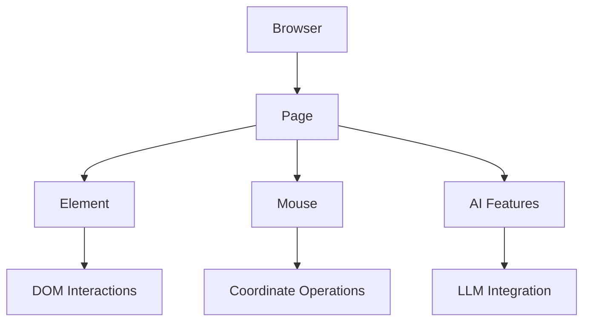

# Basics

> Low-level Playwright-like browser automation with direct and full CDP control and precise element interactions

## Core Architecture



### Core Classes

* **Browser** (alias: **BrowserSession**): Main session manager
* **Page**: Represents a browser tab/iframe
* **Element**: Individual DOM element operations
* **Mouse**: Coordinate-based mouse operations

## Basic Usage

```python  theme={null}
from browser_use import Browser, Agent
from browser_use.llm.openai.chat import ChatOpenAI

async def main():
    llm = ChatOpenAI(api_key="your-api-key")
    browser = Browser()
    await browser.start()

    # 1. Actor: Precise navigation and element interactions
    page = await browser.new_page("https://github.com/login")
    email_input = await page.must_get_element_by_prompt("username field", llm=llm)
    await email_input.fill("your-username")

    # 2. Agent: AI-driven complex tasks
    agent = Agent(browser=browser, llm=llm)
    await agent.run("Complete login and navigate to my repositories")

    await browser.stop()
```

## Important Notes

* **Not Playwright**: Actor is built on CDP, not Playwright. The API resembles Playwright as much as possible for easy migration, but is sorta subset.
* **Immediate Returns**: `get_elements_by_css_selector()` doesn't wait for visibility
* **Manual Timing**: You handle navigation timing and waiting
* **JavaScript Format**: `evaluate()` requires arrow function format: `() => {}`


---

> To find navigation and other pages in this documentation, fetch the llms.txt file at: https://docs.browser-use.com/llms.txt

# Examples

> Comprehensive examples for Browser Actor automation tasks including forms, JavaScript, mouse operations, and AI features

## Page Management

```python  theme={null}
from browser_use import Browser

browser = Browser()
await browser.start()

# Create pages
page = await browser.new_page()  # Blank tab
page = await browser.new_page("https://example.com")  # With URL

# Get all pages
pages = await browser.get_pages()
current = await browser.get_current_page()

# Close page
await browser.close_page(page)
await browser.stop()
```

## Element Finding & Interactions

```python  theme={null}
page = await browser.new_page('https://github.com')

# CSS selectors (immediate return)
elements = await page.get_elements_by_css_selector("input[type='text']")
buttons = await page.get_elements_by_css_selector("button.submit")

# Element actions
await elements[0].click()
await elements[0].fill("Hello World")
await elements[0].hover()

# Page actions
await page.press("Enter")
screenshot = await page.screenshot()
```

## LLM-Powered Features

```python  theme={null}
from browser_use.llm.openai.chat import ChatOpenAI
from pydantic import BaseModel

llm = ChatOpenAI(api_key="your-api-key")

# Find elements using natural language
button = await page.get_element_by_prompt("login button", llm=llm)
await button.click()

# Extract structured data
class ProductInfo(BaseModel):
    name: str
    price: float

product = await page.extract_content(
    "Extract product name and price",
    ProductInfo,
    llm=llm
)
```

## JavaScript Execution

```python  theme={null}
# Simple JavaScript evaluation
title = await page.evaluate('() => document.title')

# JavaScript with arguments
result = await page.evaluate('(x, y) => x + y', 10, 20)

# Complex operations
stats = await page.evaluate('''() => ({
    url: location.href,
    links: document.querySelectorAll('a').length
})''')
```

## Mouse Operations

```python  theme={null}
mouse = await page.mouse

# Click at coordinates
await mouse.click(x=100, y=200)

# Drag and drop
await mouse.down()
await mouse.move(x=500, y=600)
await mouse.up()

# Scroll
await mouse.scroll(x=0, y=100, delta_y=-500)
```

## Best Practices

* Use `asyncio.sleep()` after actions that trigger navigation
* Check URL/title changes to verify state transitions
* Always check if elements exist before interaction
* Implement retry logic for flaky elements
* Call `browser.stop()` to clean up resources


---

> To find navigation and other pages in this documentation, fetch the llms.txt file at: https://docs.browser-use.com/llms.txt


# All Parameters

> Complete API reference for Browser Actor classes, methods, and parameters including BrowserSession, Page, Element, and Mouse

## Browser (BrowserSession)

Main browser session manager.

### Key Methods

```python  theme={null}
from browser_use import Browser

browser = Browser()
await browser.start()

# Page management
page = await browser.new_page("https://example.com")
pages = await browser.get_pages()
current = await browser.get_current_page()
await browser.close_page(page)

# To stop the browser session
await browser.stop()
```

### Constructor Parameters

See [Browser Parameters](../browser/all-parameters) for complete configuration options.

## Page

Browser tab/iframe for page-level operations.

### Navigation

* `goto(url: str)` - Navigate to URL
* `go_back()`, `go_forward()`, `reload()` - History navigation

### Element Finding

* `get_elements_by_css_selector(selector: str) -> list[Element]` - CSS selector
* `get_element(backend_node_id: int) -> Element` - By CDP node ID
* `get_element_by_prompt(prompt: str, llm) -> Element | None` - AI-powered
* `must_get_element_by_prompt(prompt: str, llm) -> Element` - AI (raises if not found)

### JavaScript & Controls

* `evaluate(page_function: str, *args) -> str` - Execute JS (arrow function format)
* `press(key: str)` - Send keyboard input ("Enter", "Control+A")
* `set_viewport_size(width: int, height: int)` - Set viewport
* `screenshot(format='jpeg', quality=None) -> str` - Take screenshot

### Information

* `get_url() -> str`, `get_title() -> str` - Page info
* `mouse -> Mouse` - Get mouse interface

### AI Features

* `extract_content(prompt: str, structured_output: type[T], llm) -> T` - Extract data

## Element

Individual DOM element interactions.

### Interactions

* `click(button='left', click_count=1, modifiers=None)` - Click element
* `fill(text: str, clear=True)` - Fill input
* `hover()`, `focus()` - Mouse/focus actions
* `check()` - Toggle checkbox/radio
* `select_option(values: str | list[str])` - Select dropdown options
* `drag_to(target: Element | Position)` - Drag and drop

### Properties

* `get_attribute(name: str) -> str | None` - Get attribute
* `get_bounding_box() -> BoundingBox | None` - Position/size
* `get_basic_info() -> ElementInfo` - Complete element info
* `screenshot(format='jpeg') -> str` - Element screenshot

## Mouse

Coordinate-based mouse operations.

### Operations

* `click(x: int, y: int, button='left', click_count=1)` - Click at coordinates
* `move(x: int, y: int, steps=1)` - Move mouse
* `down(button='left')`, `up(button='left')` - Press/release buttons
* `scroll(x=0, y=0, delta_x=None, delta_y=None)` - Scroll at coordinates


---

> To find navigation and other pages in this documentation, fetch the llms.txt file at: https://docs.browser-use.com/llms.txt