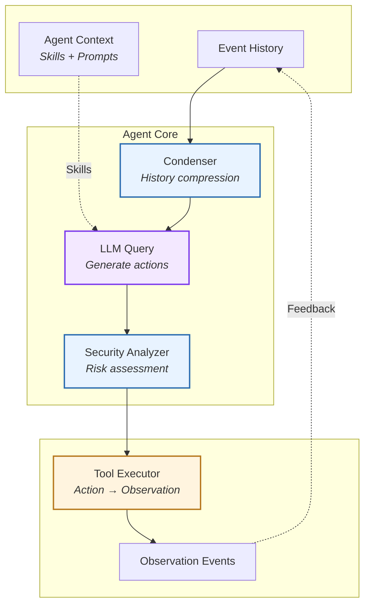
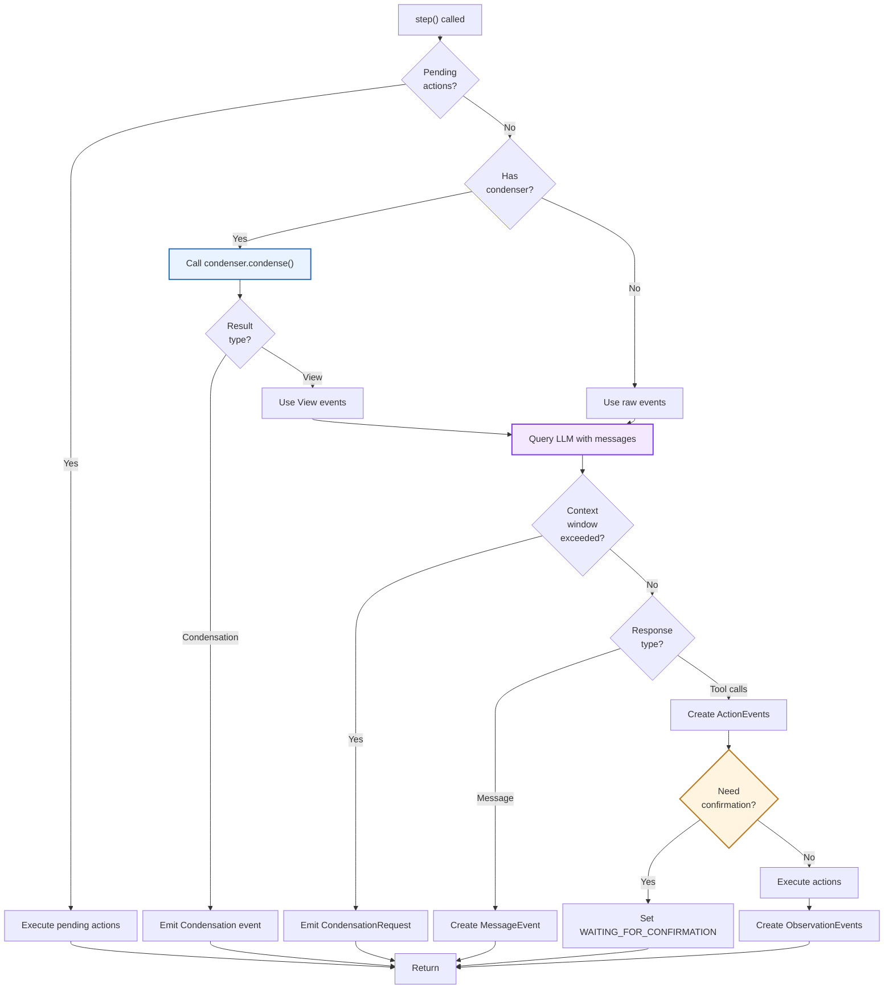
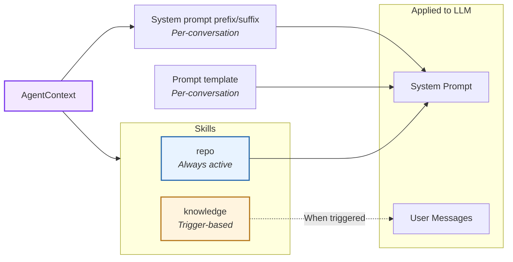
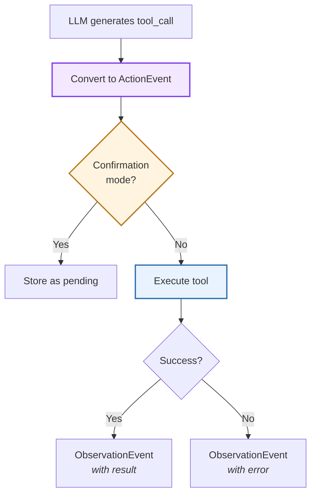
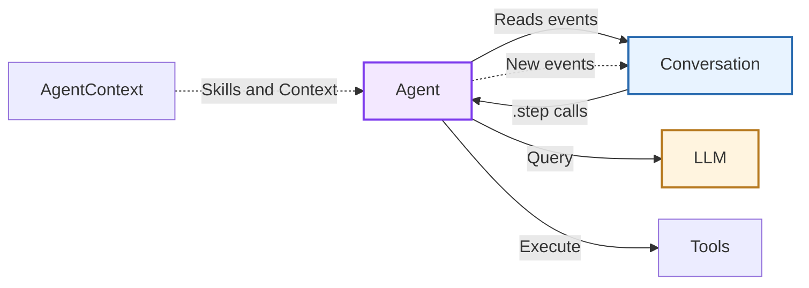

# Agent

> High-level architecture of the reasoning-action loop

The **Agent** component implements the core reasoning-action loop that drives autonomous task execution. It orchestrates LLM queries, tool execution, and context management through a stateless, event-driven architecture.

**Source:** [`openhands-sdk/openhands/sdk/agent/`](https://github.com/OpenHands/software-agent-sdk/tree/main/openhands-sdk/openhands/sdk/agent)

## Core Responsibilities

The Agent system has four primary responsibilities:

1. **Reasoning-Action Loop** - Query LLM to generate next actions based on conversation history
2. **Tool Orchestration** - Select and execute tools, handle results and errors
3. **Context Management** - Apply [skills](/sdk/guides/skill), manage conversation history via [condensers](/sdk/guides/context-condenser)
4. **Security Validation** - Analyze proposed actions for safety before execution via [security analyzer](/sdk/guides/security)

## Architecture



### Key Components

| Component                                                                                                                            | Purpose             | Design                                       |
| ------------------------------------------------------------------------------------------------------------------------------------ | ------------------- | -------------------------------------------- |
| **[`Agent`](https://github.com/OpenHands/software-agent-sdk/blob/main/openhands-sdk/openhands/sdk/agent/agent.py)**                  | Main implementation | Stateless reasoning-action loop executor     |
| **[`AgentBase`](https://github.com/OpenHands/software-agent-sdk/blob/main/openhands-sdk/openhands/sdk/agent/base.py)**               | Abstract base class | Defines agent interface and initialization   |
| **[`AgentContext`](https://github.com/OpenHands/software-agent-sdk/blob/main/openhands-sdk/openhands/sdk/context/agent_context.py)** | Context container   | Manages skills, prompts, and metadata        |
| **[`Condenser`](https://github.com/OpenHands/software-agent-sdk/blob/main/openhands-sdk/openhands/sdk/context/condenser/)**          | History compression | Reduces context when token limits approached |
| **[`SecurityAnalyzer`](https://github.com/OpenHands/software-agent-sdk/blob/main/openhands-sdk/openhands/sdk/security/)**            | Safety validation   | Evaluates action risk before execution       |

## Reasoning-Action Loop

The agent operates through a **single-step execution model** where each `step()` call processes one reasoning cycle:



**Step Execution Flow:**

1. **Pending Actions:** If actions awaiting confirmation exist, execute them and return
2. **Condensation:** If condenser exists:
   * Call `condenser.condense()` with current event view
   * If returns `View`: use condensed events for LLM query (continue in same step)
   * If returns `Condensation`: emit event and return (will be processed next step)
3. **LLM Query:** Query LLM with messages from event history
   * If context window exceeded: emit `CondensationRequest` and return
4. **Response Parsing:** Parse LLM response into events
   * Tool calls → create `ActionEvent`(s)
   * Text message → create `MessageEvent` and return
5. **Confirmation Check:** If actions need user approval:
   * Set conversation status to `WAITING_FOR_CONFIRMATION` and return
6. **Action Execution:** Execute tools and create `ObservationEvent`(s)

**Key Characteristics:**

* **Stateless:** Agent holds no mutable state between steps
* **Event-Driven:** Reads from event history, writes new events
* **Interruptible:** Each step is atomic and can be paused/resumed

## Agent Context

The agent applies `AgentContext` which includes **skills** and **prompts** to shape LLM behavior:



| Skill Type    | Activation             | Use Case                              |
| ------------- | ---------------------- | ------------------------------------- |
| **repo**      | Always included        | Project-specific context, conventions |
| **knowledge** | Trigger words/patterns | Domain knowledge, special behaviors   |

Review [this guide](/sdk/guides/skill) for details on creating and applying agent context and skills.

## Tool Execution

Tools follow a **strict action-observation pattern**:



**Execution Modes:**

| Mode             | Behavior                                 | Use Case                          |
| ---------------- | ---------------------------------------- | --------------------------------- |
| **Direct**       | Execute immediately                      | Development, trusted environments |
| **Confirmation** | Store as pending, wait for user approval | High-risk actions, production     |

**Security Integration:**

Before execution, the security analyzer evaluates each action:

* **Low Risk:** Execute immediately
* **Medium Risk:** Log warning, execute with monitoring
* **High Risk:** Block execution, request user confirmation

## Component Relationships

### How Agent Interacts



**Relationship Characteristics:**

* **Conversation → Agent**: Orchestrates step execution, provides event history
* **Agent → LLM**: Queries for next actions, receives tool calls or messages
* **Agent → Tools**: Executes actions, receives observations
* **AgentContext → Agent**: Injects skills and prompts into LLM queries

## See Also

* **[Conversation Architecture](/sdk/arch/conversation)** - Agent orchestration and lifecycle
* **[Tool System](/sdk/arch/tool-system)** - Tool definition and execution patterns
* **[Events](/sdk/arch/events)** - Event types and structures
* **[Skills](/sdk/arch/skill)** - Prompt engineering and skill patterns
* **[LLM](/sdk/arch/llm)** - Language model abstraction


---

> To find navigation and other pages in this documentation, fetch the llms.txt file at: https://docs.openhands.dev/llms.txt

# Custom Tools

> Tools define what agents can do. The SDK includes built-in tools for common operations and supports creating custom tools for specialized needs.

## Built-in Tools

```python  theme={null}
from openhands.tools import BashTool, FileEditorTool
from openhands.tools.preset import get_default_tools

# Use specific tools
agent = Agent(llm=llm, tools=[BashTool.create(), FileEditorTool.create()])

# Or use preset
tools = get_default_tools()
agent = Agent(llm=llm, tools=tools)
```

<Note>
  See [source code](https://github.com/OpenHands/software-agent-sdk/tree/main/openhands-sdk/openhands/tools) for the complete list of available tools and design philosophy.
</Note>

## Understanding the Tool System

The SDK's tool system is built around three core components:

1. **Action** - Defines input parameters (what the tool accepts)
2. **Observation** - Defines output data (what the tool returns)
3. **Executor** - Implements the tool's logic (what the tool does)

These components are tied together by a **ToolDefinition** that registers the tool with the agent. The tools package ([source code](https://github.com/OpenHands/software-agent-sdk/tree/main/openhands-sdk/openhands/tools)) provides built-in tools that follow these patterns.

## Creating a Custom Tool

<Note>
  This example is available on GitHub: [examples/01\_standalone\_sdk/02\_custom\_tools.py](https://github.com/OpenHands/software-agent-sdk/blob/main/examples/01_standalone_sdk/02_custom_tools.py)
</Note>

Here's a minimal example of creating a custom grep tool:

```python icon="python" expandable examples/01_standalone_sdk/02_custom_tools.py theme={null}
"""Advanced example showing explicit executor usage and custom grep tool."""

import os
import shlex
from collections.abc import Sequence

from pydantic import Field, SecretStr

from openhands.sdk import (
    LLM,
    Action,
    Agent,
    Conversation,
    Event,
    ImageContent,
    LLMConvertibleEvent,
    Observation,
    TextContent,
    ToolDefinition,
    get_logger,
)
from openhands.sdk.tool import (
    Tool,
    ToolExecutor,
    register_tool,
)
from openhands.tools.file_editor import FileEditorTool
from openhands.tools.terminal import (
    TerminalAction,
    TerminalExecutor,
    TerminalTool,
)


logger = get_logger(__name__)

# --- Action / Observation ---


class GrepAction(Action):
    pattern: str = Field(description="Regex to search for")
    path: str = Field(
        default=".", description="Directory to search (absolute or relative)"
    )
    include: str | None = Field(
        default=None, description="Optional glob to filter files (e.g. '*.py')"
    )


class GrepObservation(Observation):
    matches: list[str] = Field(default_factory=list)
    files: list[str] = Field(default_factory=list)
    count: int = 0

    @property
    def to_llm_content(self) -> Sequence[TextContent | ImageContent]:
        if not self.count:
            return [TextContent(text="No matches found.")]
        files_list = "\n".join(f"- {f}" for f in self.files[:20])
        sample = "\n".join(self.matches[:10])
        more = "\n..." if self.count > 10 else ""
        ret = (
            f"Found {self.count} matching lines.\n"
            f"Files:\n{files_list}\n"
            f"Sample:\n{sample}{more}"
        )
        return [TextContent(text=ret)]


# --- Executor ---


class GrepExecutor(ToolExecutor[GrepAction, GrepObservation]):
    def __init__(self, terminal: TerminalExecutor):
        self.terminal: TerminalExecutor = terminal

    def __call__(self, action: GrepAction, conversation=None) -> GrepObservation:  # noqa: ARG002
        root = os.path.abspath(action.path)
        pat = shlex.quote(action.pattern)
        root_q = shlex.quote(root)

        # Use grep -r; add --include when provided
        if action.include:
            inc = shlex.quote(action.include)
            cmd = f"grep -rHnE --include {inc} {pat} {root_q} 2>/dev/null | head -100"
        else:
            cmd = f"grep -rHnE {pat} {root_q} 2>/dev/null | head -100"

        result = self.terminal(TerminalAction(command=cmd))

        matches: list[str] = []
        files: set[str] = set()

        # grep returns exit code 1 when no matches; treat as empty
        output_text = result.text

        if output_text.strip():
            for line in output_text.strip().splitlines():
                matches.append(line)
                # Expect "path:line:content" — take the file part before first ":"
                file_path = line.split(":", 1)[0]
                if file_path:
                    files.add(os.path.abspath(file_path))

        return GrepObservation(matches=matches, files=sorted(files), count=len(matches))


# Tool description
_GREP_DESCRIPTION = """Fast content search tool.
* Searches file contents using regular expressions
* Supports full regex syntax (eg. "log.*Error", "function\\s+\\w+", etc.)
* Filter files by pattern with the include parameter (eg. "*.js", "*.{ts,tsx}")
* Returns matching file paths sorted by modification time.
* Only the first 100 results are returned. Consider narrowing your search with stricter regex patterns or provide path parameter if you need more results.
* Use this tool when you need to find files containing specific patterns
* When you are doing an open ended search that may require multiple rounds of globbing and grepping, use the Agent tool instead
"""  # noqa: E501


# --- Tool Definition ---


class GrepTool(ToolDefinition[GrepAction, GrepObservation]):
    """A custom grep tool that searches file contents using regular expressions."""

    @classmethod
    def create(
        cls, conv_state, terminal_executor: TerminalExecutor | None = None
    ) -> Sequence[ToolDefinition]:
        """Create GrepTool instance with a GrepExecutor.

        Args:
            conv_state: Conversation state to get working directory from.
            terminal_executor: Optional terminal executor to reuse. If not provided,
                         a new one will be created.

        Returns:
            A sequence containing a single GrepTool instance.
        """
        if terminal_executor is None:
            terminal_executor = TerminalExecutor(
                working_dir=conv_state.workspace.working_dir
            )
        grep_executor = GrepExecutor(terminal_executor)

        return [
            cls(
                description=_GREP_DESCRIPTION,
                action_type=GrepAction,
                observation_type=GrepObservation,
                executor=grep_executor,
            )
        ]


# Configure LLM
api_key = os.getenv("LLM_API_KEY")
assert api_key is not None, "LLM_API_KEY environment variable is not set."
model = os.getenv("LLM_MODEL", "anthropic/claude-sonnet-4-5-20250929")
base_url = os.getenv("LLM_BASE_URL")
llm = LLM(
    usage_id="agent",
    model=model,
    base_url=base_url,
    api_key=SecretStr(api_key),
)

# Tools - demonstrating both simplified and advanced patterns
cwd = os.getcwd()


def _make_bash_and_grep_tools(conv_state) -> list[ToolDefinition]:
    """Create terminal and custom grep tools sharing one executor."""

    terminal_executor = TerminalExecutor(working_dir=conv_state.workspace.working_dir)
    # terminal_tool = terminal_tool.set_executor(executor=terminal_executor)
    terminal_tool = TerminalTool.create(conv_state, executor=terminal_executor)[0]

    # Use the GrepTool.create() method with shared terminal_executor
    grep_tool = GrepTool.create(conv_state, terminal_executor=terminal_executor)[0]

    return [terminal_tool, grep_tool]


register_tool("BashAndGrepToolSet", _make_bash_and_grep_tools)

tools = [
    Tool(name=FileEditorTool.name),
    Tool(name="BashAndGrepToolSet"),
]

# Agent
agent = Agent(llm=llm, tools=tools)

llm_messages = []  # collect raw LLM messages


def conversation_callback(event: Event):
    if isinstance(event, LLMConvertibleEvent):
        llm_messages.append(event.to_llm_message())


conversation = Conversation(
    agent=agent, callbacks=[conversation_callback], workspace=cwd
)

conversation.send_message(
    "Hello! Can you use the grep tool to find all files "
    "containing the word 'class' in this project, then create a summary file listing them? "  # noqa: E501
    "Use the pattern 'class' to search and include only Python files with '*.py'."  # noqa: E501
)
conversation.run()

conversation.send_message("Great! Now delete that file.")
conversation.run()

print("=" * 100)
print("Conversation finished. Got the following LLM messages:")
for i, message in enumerate(llm_messages):
    print(f"Message {i}: {str(message)[:200]}")

# Report cost
cost = llm.metrics.accumulated_cost
print(f"EXAMPLE_COST: {cost}")
```

```bash Running the Example theme={null}
export LLM_API_KEY="your-api-key"
cd agent-sdk
uv run python examples/01_standalone_sdk/02_custom_tools.py
```

### Tool Registration

Tools are registered using `register_tool()` and referenced by name:

```python  theme={null}
# Register a simple tool class
register_tool("FileEditorTool", FileEditorTool)

# Register a factory function that creates multiple tools
register_tool("BashAndGrepToolSet", _make_bash_and_grep_tools)

# Use registered tools by name
tools = [
    Tool(name="FileEditorTool"),
    Tool(name="BashAndGrepToolSet"),
]
```

### Factory Functions

Tool factory functions receive `conv_state` as a parameter, allowing access to workspace information:

```python  theme={null}
def _make_bash_and_grep_tools(conv_state) -> list[ToolDefinition]:
    """Create execute_bash and custom grep tools sharing one executor."""
    bash_executor = BashExecutor(working_dir=conv_state.workspace.working_dir)
    # Create and configure tools...
    return [bash_tool, grep_tool]
```

### Shared Executors

Multiple tools can share executors for efficiency and state consistency:

```python  theme={null}
bash_executor = BashExecutor(working_dir=conv_state.workspace.working_dir)
bash_tool = execute_bash_tool.set_executor(executor=bash_executor)

grep_executor = GrepExecutor(bash_executor)
grep_tool = ToolDefinition(
    name="grep",
    description=_GREP_DESCRIPTION,
    action_type=GrepAction,
    observation_type=GrepObservation,
    executor=grep_executor,
)
```

### Output Formatting

The `to_llm_content()` property formats observations for the LLM:

```python  theme={null}
@property
def to_llm_content(self) -> Sequence[TextContent | ImageContent]:
    if not self.count:
        return [TextContent(text="No matches found.")]
    files_list = "\n".join(f"- {f}" for f in self.files[:20])
    sample = "\n".join(self.matches[:10])
    more = "\n..." if self.count > 10 else ""
    ret = (
        f"Found {self.count} matching lines.\n"
        f"Files:\n{files_list}\n"
        f"Sample:\n{sample}{more}"
    )
    return [TextContent(text=ret)]
```

## When to Create Custom Tools

Create custom tools when you need to:

* Combine multiple operations into a single, structured interface
* Add typed parameters with validation
* Format complex outputs for LLM consumption
* Integrate with external APIs or services

## Next Steps

* **[Model Context Protocol (MCP) Integration](/sdk/guides/mcp)** - Use Model Context Protocol servers
* **[Tools Package Source Code](https://github.com/OpenHands/software-agent-sdk/tree/main/openhands-sdk/openhands/tools)** - Built-in tools implementation


---

> To find navigation and other pages in this documentation, fetch the llms.txt file at: https://docs.openhands.dev/llms.txt


# Browser Use

> Enable web browsing and interaction capabilities for your agent.

<Note>
  This example is available on GitHub: [examples/01\_standalone\_sdk/15\_browser\_use.py](https://github.com/OpenHands/software-agent-sdk/blob/main/examples/01_standalone_sdk/15_browser_use.py)
</Note>

The BrowserToolSet integration enables your agent to interact with web pages through automated browser control. Built on top of [browser-use](https://github.com/browser-use/browser-use), it provides capabilities for navigating websites, clicking elements, filling forms, and extracting content - all through natural language instructions.

```python icon="python" expandable examples/01_standalone_sdk/15_browser_use.py theme={null}
import os

from pydantic import SecretStr

from openhands.sdk import (
    LLM,
    Agent,
    Conversation,
    Event,
    LLMConvertibleEvent,
    get_logger,
)
from openhands.sdk.tool import Tool
from openhands.tools.browser_use import BrowserToolSet
from openhands.tools.file_editor import FileEditorTool
from openhands.tools.terminal import TerminalTool


logger = get_logger(__name__)

# Configure LLM
api_key = os.getenv("LLM_API_KEY")
assert api_key is not None, "LLM_API_KEY environment variable is not set."
model = os.getenv("LLM_MODEL", "anthropic/claude-sonnet-4-5-20250929")
base_url = os.getenv("LLM_BASE_URL")
llm = LLM(
    usage_id="agent",
    model=model,
    base_url=base_url,
    api_key=SecretStr(api_key),
)

# Tools
cwd = os.getcwd()
tools = [
    Tool(
        name=TerminalTool.name,
    ),
    Tool(name=FileEditorTool.name),
    Tool(name=BrowserToolSet.name),
]

# If you need fine-grained browser control, you can manually register individual browser
# tools by creating a BrowserToolExecutor and providing factories that return customized
# Tool instances before constructing the Agent.

# Agent
agent = Agent(llm=llm, tools=tools)

llm_messages = []  # collect raw LLM messages


def conversation_callback(event: Event):
    if isinstance(event, LLMConvertibleEvent):
        llm_messages.append(event.to_llm_message())


conversation = Conversation(
    agent=agent, callbacks=[conversation_callback], workspace=cwd
)

conversation.send_message(
    "Could you go to https://openhands.dev/ blog page and summarize main "
    "points of the latest blog?"
)
conversation.run()

print("=" * 100)
print("Conversation finished. Got the following LLM messages:")
for i, message in enumerate(llm_messages):
    print(f"Message {i}: {str(message)[:200]}")
```

```bash Running the Example theme={null}
export LLM_API_KEY="your-api-key"
cd agent-sdk
uv run python examples/01_standalone_sdk/15_browser_use.py
```

## How It Works

The example demonstrates combining multiple tools to create a capable web research agent:

1. **BrowserToolSet**: Provides automated browser control for web interaction
2. **FileEditorTool**: Allows the agent to read and write files if needed
3. **BashTool**: Enables command-line operations for additional functionality

The agent uses these tools to:

* Navigate to specified URLs
* Interact with web page elements (clicking, scrolling, etc.)
* Extract and analyze content from web pages
* Summarize information from multiple sources

In this example, the agent visits the openhands.dev blog, finds the latest blog post, and provides a summary of its main points.

## Customization

For advanced use cases requiring only a subset of browser tools or custom configurations, you can manually register individual browser tools. Refer to the [BrowserToolSet definition](https://github.com/OpenHands/software-agent-sdk/blob/main/openhands-tools/openhands/tools/browser_use/definition.py) to see the available individual tools and create a `BrowserToolExecutor` with customized tool configurations before constructing the Agent. This gives you fine-grained control over which browser capabilities are exposed to the agent.

## Next Steps

* **[Custom Tools](/sdk/guides/custom-tools)** - Create specialized tools
* **[MCP Integration](/sdk/guides/mcp)** - Connect external services


---

> To find navigation and other pages in this documentation, fetch the llms.txt file at: https://docs.openhands.dev/llms.txt


# Browser Use

> Enable web browsing and interaction capabilities for your agent.

<Note>
  This example is available on GitHub: [examples/01\_standalone\_sdk/15\_browser\_use.py](https://github.com/OpenHands/software-agent-sdk/blob/main/examples/01_standalone_sdk/15_browser_use.py)
</Note>

The BrowserToolSet integration enables your agent to interact with web pages through automated browser control. Built on top of [browser-use](https://github.com/browser-use/browser-use), it provides capabilities for navigating websites, clicking elements, filling forms, and extracting content - all through natural language instructions.

```python icon="python" expandable examples/01_standalone_sdk/15_browser_use.py theme={null}
import os

from pydantic import SecretStr

from openhands.sdk import (
    LLM,
    Agent,
    Conversation,
    Event,
    LLMConvertibleEvent,
    get_logger,
)
from openhands.sdk.tool import Tool
from openhands.tools.browser_use import BrowserToolSet
from openhands.tools.file_editor import FileEditorTool
from openhands.tools.terminal import TerminalTool


logger = get_logger(__name__)

# Configure LLM
api_key = os.getenv("LLM_API_KEY")
assert api_key is not None, "LLM_API_KEY environment variable is not set."
model = os.getenv("LLM_MODEL", "anthropic/claude-sonnet-4-5-20250929")
base_url = os.getenv("LLM_BASE_URL")
llm = LLM(
    usage_id="agent",
    model=model,
    base_url=base_url,
    api_key=SecretStr(api_key),
)

# Tools
cwd = os.getcwd()
tools = [
    Tool(
        name=TerminalTool.name,
    ),
    Tool(name=FileEditorTool.name),
    Tool(name=BrowserToolSet.name),
]

# If you need fine-grained browser control, you can manually register individual browser
# tools by creating a BrowserToolExecutor and providing factories that return customized
# Tool instances before constructing the Agent.

# Agent
agent = Agent(llm=llm, tools=tools)

llm_messages = []  # collect raw LLM messages


def conversation_callback(event: Event):
    if isinstance(event, LLMConvertibleEvent):
        llm_messages.append(event.to_llm_message())


conversation = Conversation(
    agent=agent, callbacks=[conversation_callback], workspace=cwd
)

conversation.send_message(
    "Could you go to https://openhands.dev/ blog page and summarize main "
    "points of the latest blog?"
)
conversation.run()

print("=" * 100)
print("Conversation finished. Got the following LLM messages:")
for i, message in enumerate(llm_messages):
    print(f"Message {i}: {str(message)[:200]}")
```

```bash Running the Example theme={null}
export LLM_API_KEY="your-api-key"
cd agent-sdk
uv run python examples/01_standalone_sdk/15_browser_use.py
```

## How It Works

The example demonstrates combining multiple tools to create a capable web research agent:

1. **BrowserToolSet**: Provides automated browser control for web interaction
2. **FileEditorTool**: Allows the agent to read and write files if needed
3. **BashTool**: Enables command-line operations for additional functionality

The agent uses these tools to:

* Navigate to specified URLs
* Interact with web page elements (clicking, scrolling, etc.)
* Extract and analyze content from web pages
* Summarize information from multiple sources

In this example, the agent visits the openhands.dev blog, finds the latest blog post, and provides a summary of its main points.

## Customization

For advanced use cases requiring only a subset of browser tools or custom configurations, you can manually register individual browser tools. Refer to the [BrowserToolSet definition](https://github.com/OpenHands/software-agent-sdk/blob/main/openhands-tools/openhands/tools/browser_use/definition.py) to see the available individual tools and create a `BrowserToolExecutor` with customized tool configurations before constructing the Agent. This gives you fine-grained control over which browser capabilities are exposed to the agent.

## Next Steps

* **[Custom Tools](/sdk/guides/custom-tools)** - Create specialized tools
* **[MCP Integration](/sdk/guides/mcp)** - Connect external services


---

> To find navigation and other pages in this documentation, fetch the llms.txt file at: https://docs.openhands.dev/llms.txt
# Creating Custom Agent

> Learn how to design specialized agents with custom tool sets

This guide demonstrates how to create custom agents tailored for specific use cases. Using the planning agent as a concrete example, you'll learn how to design specialized agents with custom tool sets, system prompts, and configurations that optimize performance for particular workflows.

<Note>
  This example is available on GitHub: [examples/01\_standalone\_sdk/24\_planning\_agent\_workflow.py](https://github.com/OpenHands/software-agent-sdk/blob/main/examples/01_standalone_sdk/24_planning_agent_workflow.py)
</Note>

The example showcases a two-phase workflow where a custom planning agent (with read-only tools) analyzes tasks and creates structured plans, followed by an execution agent that implements those plans with full editing capabilities.

```python icon="python" expandable examples/01_standalone_sdk/24_planning_agent_workflow.py theme={null}
#!/usr/bin/env python3
"""
Planning Agent Workflow Example

This example demonstrates a two-stage workflow:
1. Planning Agent: Analyzes the task and creates a detailed implementation plan
2. Execution Agent: Implements the plan with full editing capabilities

The task: Create a Python web scraper that extracts article titles and URLs
from a news website, handles rate limiting, and saves results to JSON.
"""

import os
import tempfile
from pathlib import Path

from pydantic import SecretStr

from openhands.sdk import LLM, Conversation
from openhands.sdk.llm import content_to_str
from openhands.tools.preset.default import get_default_agent
from openhands.tools.preset.planning import get_planning_agent


def get_event_content(event):
    """Extract content from an event."""
    if hasattr(event, "llm_message"):
        return "".join(content_to_str(event.llm_message.content))
    return str(event)


"""Run the planning agent workflow example."""

# Create a temporary workspace
workspace_dir = Path(tempfile.mkdtemp())
print(f"Working in: {workspace_dir}")

# Configure LLM
api_key = os.getenv("LLM_API_KEY")
assert api_key is not None, "LLM_API_KEY environment variable is not set."
model = os.getenv("LLM_MODEL", "anthropic/claude-sonnet-4-5-20250929")
base_url = os.getenv("LLM_BASE_URL")
llm = LLM(
    model=model,
    base_url=base_url,
    api_key=SecretStr(api_key),
    usage_id="agent",
)

# Task description
task = """
Create a Python web scraper with the following requirements:
- Scrape article titles and URLs from a news website
- Handle HTTP errors gracefully with retry logic
- Save results to a JSON file with timestamp
- Use requests and BeautifulSoup for scraping

Do NOT ask for any clarifying questions. Directly create your implementation plan.
"""

print("=" * 80)
print("PHASE 1: PLANNING")
print("=" * 80)

# Create Planning Agent with read-only tools
planning_agent = get_planning_agent(llm=llm)

# Create conversation for planning
planning_conversation = Conversation(
    agent=planning_agent,
    workspace=str(workspace_dir),
)

# Run planning phase
print("Planning Agent is analyzing the task and creating implementation plan...")
planning_conversation.send_message(
    f"Please analyze this web scraping task and create a detailed "
    f"implementation plan:\n\n{task}"
)
planning_conversation.run()

print("\n" + "=" * 80)
print("PLANNING COMPLETE")
print("=" * 80)
print(f"Implementation plan saved to: {workspace_dir}/PLAN.md")

print("\n" + "=" * 80)
print("PHASE 2: EXECUTION")
print("=" * 80)

# Create Execution Agent with full editing capabilities
execution_agent = get_default_agent(llm=llm, cli_mode=True)

# Create conversation for execution
execution_conversation = Conversation(
    agent=execution_agent,
    workspace=str(workspace_dir),
)

# Prepare execution prompt with reference to the plan file
execution_prompt = f"""
Please implement the web scraping project according to the implementation plan.

The detailed implementation plan has been created and saved at: {workspace_dir}/PLAN.md

Please read the plan from PLAN.md and implement all components according to it.

Create all necessary files, implement the functionality, and ensure everything
works together properly.
"""

print("Execution Agent is implementing the plan...")
execution_conversation.send_message(execution_prompt)
execution_conversation.run()

# Get the last message from the conversation
execution_result = execution_conversation.state.events[-1]

print("\n" + "=" * 80)
print("EXECUTION RESULT:")
print("=" * 80)
print(get_event_content(execution_result))

print("\n" + "=" * 80)
print("WORKFLOW COMPLETE")
print("=" * 80)
print(f"Project files created in: {workspace_dir}")

# List created files
print("\nCreated files:")
for file_path in workspace_dir.rglob("*"):
    if file_path.is_file():
        print(f"  - {file_path.relative_to(workspace_dir)}")

# Report cost
cost = llm.metrics.accumulated_cost
print(f"EXAMPLE_COST: {cost}")
```

```bash Running the Example theme={null}
export LLM_API_KEY="your-api-key"
cd agent-sdk
uv run python examples/01_standalone_sdk/24_planning_agent_workflow.py
```

## Anatomy of a Custom Agent

The planning agent demonstrates the two key components for creating specialized agent:

### 1. Custom Tool Selection

Choose tools that match your agent's specific role. Here's how the planning agent defines its tools:

```python  theme={null}

def register_planning_tools() -> None:
    """Register the planning agent tools."""
    from openhands.tools.glob import GlobTool
    from openhands.tools.grep import GrepTool
    from openhands.tools.planning_file_editor import PlanningFileEditorTool

    register_tool("GlobTool", GlobTool)
    logger.debug("Tool: GlobTool registered.")
    register_tool("GrepTool", GrepTool)
    logger.debug("Tool: GrepTool registered.")
    register_tool("PlanningFileEditorTool", PlanningFileEditorTool)
    logger.debug("Tool: PlanningFileEditorTool registered.")


def get_planning_tools() -> list[Tool]:
    """Get the planning agent tool specifications.

    Returns:
        List of tools optimized for planning and analysis tasks, including
        file viewing and PLAN.md editing capabilities for advanced
        code discovery and navigation.
    """
    register_planning_tools()

    return [
        Tool(name="GlobTool"),
        Tool(name="GrepTool"),
        Tool(name="PlanningFileEditorTool"),
    ]
```

The planning agent uses:

* **GlobTool**: For discovering files and directories matching patterns
* **GrepTool**: For searching specific content across files
* **PlanningFileEditorTool**: For writing structured plans to `PLAN.md` only

This read-only approach (except for `PLAN.md`) keeps the agent focused on analysis without implementation distractions.

### 2. System Prompt Customization

Custom agents can use specialized system prompts to guide behavior. The planning agent uses `system_prompt_planning.j2` with injected plan structure that enforces:

1. **Objective**: Clear goal statement
2. **Context Summary**: Relevant system components and constraints
3. **Approach Overview**: High-level strategy and rationale
4. **Implementation Steps**: Detailed step-by-step execution plan
5. **Testing and Validation**: Verification methods and success criteria

### Complete Implementation Reference

For a complete implementation example showing all these components working together, refer to the [planning agent preset source code](https://github.com/OpenHands/software-agent-sdk/blob/main/openhands-tools/openhands/tools/preset/planning.py).

## Next Steps

* **[Custom Tools](/sdk/guides/custom-tools)** - Create specialized tools for your use case
* **[Context Condenser](/sdk/guides/context-condenser)** - Optimize context management
* **[MCP Integration](/sdk/guides/mcp)** - Add MCP


---

> To find navigation and other pages in this documentation, fetch the llms.txt file at: https://docs.openhands.dev/llms.txt
# SDK API
# openhands.sdk.agent

> API reference for openhands.sdk.agent module

### class Agent

Bases: [`AgentBase`](#class-agentbase)

Main agent implementation for OpenHands.

The Agent class provides the core functionality for running AI agents that can
interact with tools, process messages, and execute actions. It inherits from
AgentBase and implements the agent execution logic.

#### Example

```pycon  theme={null}
>>> from openhands.sdk import LLM, Agent, Tool
>>> llm = LLM(model="claude-sonnet-4-20250514", api_key=SecretStr("key"))
>>> tools = [Tool(name="TerminalTool"), Tool(name="FileEditorTool")]
>>> agent = Agent(llm=llm, tools=tools)
```

#### Properties

* `agent_context`: AgentContext | None
* `condenser`: CondenserBase | None
* `filter_tools_regex`: str | None
* `llm`: LLM
* `mcp_config`: dict\[str, Any]
* `model_config`: ClassVar\[ConfigDict] = (configuration object)
  Configuration for the model, should be a dictionary conforming to \[ConfigDict]\[pydantic.config.ConfigDict].
* `security_policy_filename`: str
* `system_prompt_filename`: str
* `system_prompt_kwargs`: dict\[str, object]
* `tools`: list\[Tool]

#### Methods

#### init\_state()

Initialize the empty conversation state to prepare the agent for user
messages.

Typically this involves adding system message

NOTE: state will be mutated in-place.

#### model\_post\_init()

This function is meant to behave like a BaseModel method to initialise private attributes.

It takes context as an argument since that’s what pydantic-core passes when calling it.

* Parameters:
  * `self` – The BaseModel instance.
  * `context` – The context.

#### step()

Taking a step in the conversation.

Typically this involves:

1. Making a LLM call
2. Executing the tool
3. Updating the conversation state with

LLM calls (role=”assistant”) and tool results (role=”tool”)

4.1 If conversation is finished, set state.execution\_status to FINISHED
4.2 Otherwise, just return, Conversation will kick off the next step

If the underlying LLM supports streaming, partial deltas are forwarded to
`on_token` before the full response is returned.

NOTE: state will be mutated in-place.

### class AgentBase

Bases: `DiscriminatedUnionMixin`, `ABC`

Abstract base class for OpenHands agents.

Agents are stateless and should be fully defined by their configuration.
This base class provides the common interface and functionality that all
agent implementations must follow.

#### Properties

* `agent_context`: AgentContext | None
* `condenser`: CondenserBase | None
* `filter_tools_regex`: str | None
* `llm`: LLM
* `mcp_config`: dict\[str, Any]
* `model_config`: ClassVar\[ConfigDict] = (configuration object)
  Configuration for the model, should be a dictionary conforming to \[ConfigDict]\[pydantic.config.ConfigDict].
* `name`: str
  Returns the name of the Agent.
* `prompt_dir`: str
  Returns the directory where this class’s module file is located.
* `security_policy_filename`: str
* `system_message`: str
  Compute system message on-demand to maintain statelessness.
* `system_prompt_filename`: str
* `system_prompt_kwargs`: dict\[str, object]
* `tools`: list\[Tool]
* `tools_map`: dictstr, \[ToolDefinition]
  Get the initialized tools map.
  :raises RuntimeError: If the agent has not been initialized.

#### Methods

#### get\_all\_llms()

Recursively yield unique base-class LLM objects reachable from self.

* Returns actual object references (not copies).
* De-dupes by id(LLM).
* Cycle-safe via a visited set for all traversed objects.
* Only yields objects whose type is exactly LLM (no subclasses).
* Does not handle dataclasses.

#### init\_state()

Initialize the empty conversation state to prepare the agent for user
messages.

Typically this involves adding system message

NOTE: state will be mutated in-place.

#### model\_dump\_succint()

Like model\_dump, but excludes None fields by default.

#### model\_post\_init()

This function is meant to behave like a BaseModel method to initialise private attributes.

It takes context as an argument since that’s what pydantic-core passes when calling it.

* Parameters:
  * `self` – The BaseModel instance.
  * `context` – The context.

#### abstractmethod step()

Taking a step in the conversation.

Typically this involves:

1. Making a LLM call
2. Executing the tool
3. Updating the conversation state with

LLM calls (role=”assistant”) and tool results (role=”tool”)

4.1 If conversation is finished, set state.execution\_status to FINISHED
4.2 Otherwise, just return, Conversation will kick off the next step

If the underlying LLM supports streaming, partial deltas are forwarded to
`on_token` before the full response is returned.

NOTE: state will be mutated in-place.

#### verify()

Verify that we can resume this agent from persisted state.

This PR’s goal is to not reconcile configuration between persisted and
runtime Agent instances. Instead, we verify compatibility requirements
and then continue with the runtime-provided Agent.

Compatibility requirements:

* Agent class/type must match.
* Tools:

  * If events are provided, only tools that were actually used in history
    must exist in runtime.
  * If events are not provided, tool names must match exactly.

All other configuration (LLM, agent\_context, condenser, system prompts,
etc.) can be freely changed between sessions.

* Parameters:
  * `persisted` – The agent loaded from persisted state.
  * `events` – Optional event sequence to scan for used tools if tool names
    don’t match.
* Returns:
  This runtime agent (self) if verification passes.
* Raises:
  `ValueError` – If agent class or tools don’t match.


---

> To find navigation and other pages in this documentation, fetch the llms.txt file at: https://docs.openhands.dev/llms.txt