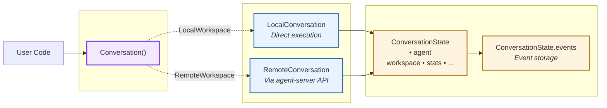
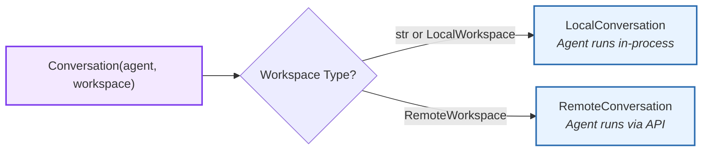
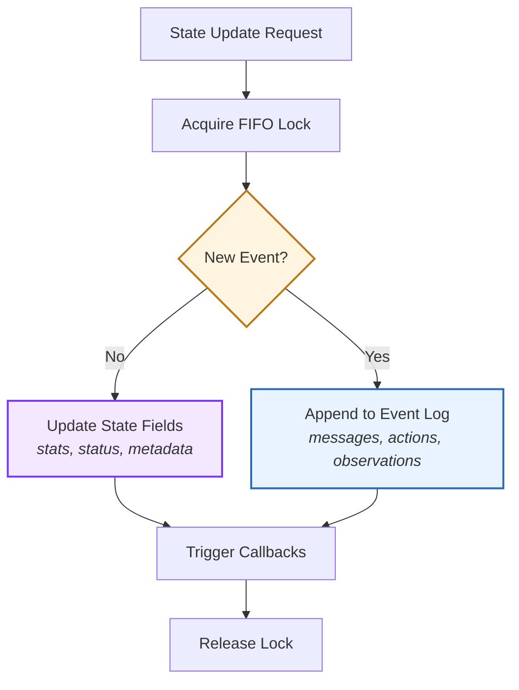
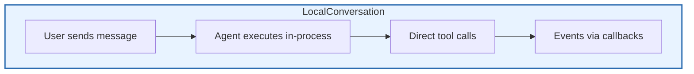
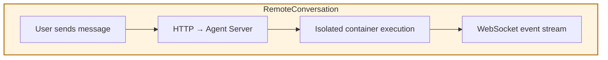
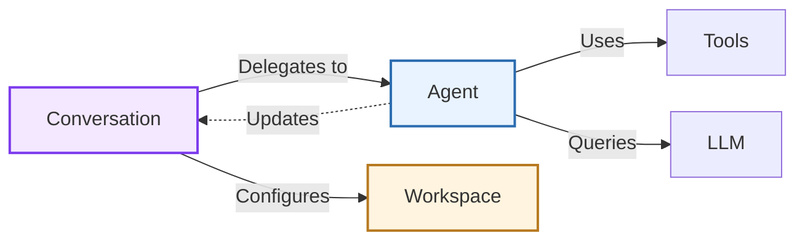

# Conversation

> High-level architecture of the conversation orchestration system

The **Conversation** component orchestrates agent execution through structured message flows and state management. It serves as the primary interface for interacting with agents, managing their lifecycle from initialization to completion.

**Source:** [`openhands-sdk/openhands/sdk/conversation/`](https://github.com/OpenHands/software-agent-sdk/tree/main/openhands-sdk/openhands/sdk/conversation)

## Core Responsibilities

The Conversation system has four primary responsibilities:

1. **Agent Lifecycle Management** - Initialize, run, pause, and terminate agents
2. **State Orchestration** - Maintain conversation history, events, and execution status
3. **Workspace Coordination** - Bridge agent operations with execution environments
4. **Runtime Services** - Provide persistence, monitoring, security, and visualization

## Architecture



### Key Components

| Component                                                                                                                                                  | Purpose            | Design                                                 |
| ---------------------------------------------------------------------------------------------------------------------------------------------------------- | ------------------ | ------------------------------------------------------ |
| **[`Conversation`](https://github.com/OpenHands/software-agent-sdk/blob/main/openhands-sdk/openhands/sdk/conversation/conversation.py)**                   | Unified entrypoint | Returns correct implementation based on workspace type |
| **[`LocalConversation`](https://github.com/OpenHands/software-agent-sdk/blob/main/openhands-sdk/openhands/sdk/conversation/impl/local_conversation.py)**   | Local execution    | Runs agent directly in process                         |
| **[`RemoteConversation`](https://github.com/OpenHands/software-agent-sdk/blob/main/openhands-sdk/openhands/sdk/conversation/impl/remote_conversation.py)** | Remote execution   | Delegates to agent-server via HTTP/WebSocket           |
| **[`ConversationState`](https://github.com/OpenHands/software-agent-sdk/blob/main/openhands-sdk/openhands/sdk/conversation/state.py)**                     | State container    | Pydantic model with validation and serialization       |
| **[`EventLog`](https://github.com/OpenHands/software-agent-sdk/blob/main/openhands-sdk/openhands/sdk/conversation/event_store.py)**                        | Event storage      | Immutable append-only store with efficient queries     |

## Factory Pattern

The [`Conversation`](https://github.com/OpenHands/software-agent-sdk/blob/main/openhands-sdk/openhands/sdk/conversation/conversation.py) class automatically selects the correct implementation based on workspace type:



**Dispatch Logic:**

* **Local:** String paths or `LocalWorkspace` → in-process execution
* **Remote:** `RemoteWorkspace` → agent-server via HTTP/WebSocket

This abstraction enables switching deployment modes without code changes—just swap the workspace type.

## State Management

State updates follow a **two-path pattern** depending on the type of change:



**Two Update Patterns:**

1. **State-Only Updates** - Modify fields without appending events (e.g., status changes, stat increments)
2. **Event-Based Updates** - Append to event log when new messages, actions, or observations occur

**Thread Safety:**

* FIFO Lock ensures ordered, atomic updates
* Callbacks fire after successful commit
* Read operations never block writes

## Execution Models

The conversation system supports two execution models with identical APIs:

### Local vs Remote Execution





| Aspect            | LocalConversation      | RemoteConversation      |
| ----------------- | ---------------------- | ----------------------- |
| **Execution**     | In-process             | Remote container/server |
| **Communication** | Direct function calls  | HTTP + WebSocket        |
| **State Sync**    | Immediate              | Network serialized      |
| **Use Case**      | Development, CLI tools | Production, web apps    |
| **Isolation**     | Process-level          | Container-level         |

**Key Insight:** Same API surface means switching between local and remote requires only changing workspace type—no code changes.

## Auxiliary Services

The conversation system provides pluggable services that operate independently on the event stream:

| Service                                                                                                                                      | Purpose                       | Architecture Pattern                 |
| -------------------------------------------------------------------------------------------------------------------------------------------- | ----------------------------- | ------------------------------------ |
| **[Event Log](https://github.com/OpenHands/software-agent-sdk/blob/main/openhands-sdk/openhands/sdk/conversation/event_store.py)**           | Append-only immutable storage | Event sourcing with indexing         |
| **[Persistence](https://github.com/OpenHands/software-agent-sdk/blob/main/openhands-sdk/openhands/sdk/conversation/state.py)**               | Auto-save & resume            | Debounced writes, incremental events |
| **[Stuck Detection](https://github.com/OpenHands/software-agent-sdk/blob/main/openhands-sdk/openhands/sdk/conversation/stuck_detector.py)**  | Loop prevention               | Sliding window pattern matching      |
| **[Visualization](https://github.com/OpenHands/software-agent-sdk/blob/main/openhands-sdk/openhands/sdk/conversation/visualizer.py)**        | Execution diagrams            | Event stream → visual representation |
| **[Secret Registry](https://github.com/OpenHands/software-agent-sdk/blob/main/openhands-sdk/openhands/sdk/conversation/secret_registry.py)** | Secure value storage          | Memory-only with masked logging      |

**Design Principle:** Services read from the event log but never mutate state directly. This enables:

* Services can be enabled/disabled independently
* Easy to add new services without changing core orchestration
* Event stream acts as the integration point

## Component Relationships

### How Conversation Interacts



**Relationship Characteristics:**

* **Conversation → Agent**: One-way orchestration, agent reports back via state updates
* **Conversation → Workspace**: Configuration only, workspace doesn't know about conversation
* **Agent → Conversation**: Indirect via state events

## See Also

* **[Agent Architecture](/sdk/arch/agent)** - Agent reasoning loop design
* **[Workspace Architecture](/sdk/arch/workspace)** - Execution environment design
* **[Event System](/sdk/arch/events)** - Event types and flow
* **[Conversation Usage Guide](/sdk/guides/convo-persistence)** - Practical examples


---

> To find navigation and other pages in this documentation, fetch the llms.txt file at: https://docs.openhands.dev/llms.txt


# SDK API
# openhands.sdk.conversation

> API reference for openhands.sdk.conversation module

### class BaseConversation

Bases: `ABC`

Abstract base class for conversation implementations.

This class defines the interface that all conversation implementations must follow.
Conversations manage the interaction between users and agents, handling message
exchange, execution control, and state management.

#### Properties

* `confirmation_policy_active`: bool
* `conversation_stats`: ConversationStats
* `id`: UUID
* `is_confirmation_mode_active`: bool
  Check if confirmation mode is active.
  Returns True if BOTH conditions are met:
  1. The conversation state has a security analyzer set (not None)
  2. The confirmation policy is active
* `state`: ConversationStateProtocol

#### Methods

#### **init**()

Initialize the base conversation with span tracking.

#### abstractmethod ask\_agent()

Ask the agent a simple, stateless question and get a direct LLM response.

This bypasses the normal conversation flow and does not modify, persist,
or become part of the conversation state. The request is not remembered by
the main agent, no events are recorded, and execution status is untouched.
It is also thread-safe and may be called while conversation.run() is
executing in another thread.

* Parameters:
  `question` – A simple string question to ask the agent
* Returns:
  A string response from the agent

#### abstractmethod close()

#### static compose\_callbacks()

Compose multiple callbacks into a single callback function.

* Parameters:
  `callbacks` – An iterable of callback functions
* Returns:
  A single callback function that calls all provided callbacks

#### abstractmethod condense()

Force condensation of the conversation history.

This method uses the existing condensation request pattern to trigger
condensation. It adds a CondensationRequest event to the conversation
and forces the agent to take a single step to process it.

The condensation will be applied immediately and will modify the conversation
state by adding a condensation event to the history.

* Raises:
  `ValueError` – If no condenser is configured or the condenser doesn’t
  handle condensation requests.

#### abstractmethod generate\_title()

Generate a title for the conversation based on the first user message.

* Parameters:
  * `llm` – Optional LLM to use for title generation. If not provided,
    uses the agent’s LLM.
  * `max_length` – Maximum length of the generated title.
* Returns:
  A generated title for the conversation.
* Raises:
  `ValueError` – If no user messages are found in the conversation.

#### static get\_persistence\_dir()

Get the persistence directory for the conversation.

* Parameters:
  * `persistence_base_dir` – Base directory for persistence. Can be a string
    path or Path object.
  * `conversation_id` – Unique conversation ID.
* Returns:
  String path to the conversation-specific persistence directory.
  Always returns a normalized string path even if a Path was provided.

#### abstractmethod pause()

#### abstractmethod reject\_pending\_actions()

#### abstractmethod run()

Execute the agent to process messages and perform actions.

This method runs the agent until it finishes processing the current
message or reaches the maximum iteration limit.

#### abstractmethod send\_message()

Send a message to the agent.

* Parameters:
  * `message` – Either a string (which will be converted to a user message)
    or a Message object
  * `sender` – Optional identifier of the sender. Can be used to track
    message origin in multi-agent scenarios. For example, when
    one agent delegates to another, the sender can be set to
    identify which agent is sending the message.

#### abstractmethod set\_confirmation\_policy()

Set the confirmation policy for the conversation.

#### abstractmethod update\_secrets()

### class Conversation

### class Conversation

Bases: `object`

Factory class for creating conversation instances with OpenHands agents.

This factory automatically creates either a LocalConversation or RemoteConversation
based on the workspace type provided. LocalConversation runs the agent locally,
while RemoteConversation connects to a remote agent server.

* Returns:
  LocalConversation if workspace is local, RemoteConversation if workspace
  is remote.

#### Example

```pycon  theme={null}
>>> from openhands.sdk import LLM, Agent, Conversation
>>> llm = LLM(model="claude-sonnet-4-20250514", api_key=SecretStr("key"))
>>> agent = Agent(llm=llm, tools=[])
>>> conversation = Conversation(agent=agent, workspace="./workspace")
>>> conversation.send_message("Hello!")
>>> conversation.run()
```

### class ConversationExecutionStatus

Bases: `str`, `Enum`

Enum representing the current execution state of the conversation.

#### Methods

#### DELETING = 'deleting'

#### ERROR = 'error'

#### FINISHED = 'finished'

#### IDLE = 'idle'

#### PAUSED = 'paused'

#### RUNNING = 'running'

#### STUCK = 'stuck'

#### WAITING\_FOR\_CONFIRMATION = 'waiting\_for\_confirmation'

### class ConversationState

Bases: `OpenHandsModel`

#### Properties

* `activated_knowledge_skills`: list\[str]
* `agent`: AgentBase
* `blocked_actions`: dict\[str, str]
* `blocked_messages`: dict\[str, str]
* `confirmation_policy`: ConfirmationPolicyBase
* `env_observation_persistence_dir`: str | None
  Directory for persisting environment observation files.
* `events`: [EventLog](#class-eventlog)
* `execution_status`: [ConversationExecutionStatus](#class-conversationexecutionstatus)
* `id`: UUID
* `max_iterations`: int
* `model_config`: ClassVar\[ConfigDict] = (configuration object)
  Configuration for the model, should be a dictionary conforming to \[ConfigDict]\[pydantic.config.ConfigDict].
* `persistence_dir`: str | None
* `secret_registry`: [SecretRegistry](#class-secretregistry)
* `security_analyzer`: SecurityAnalyzerBase | None
* `stats`: ConversationStats
* `stuck_detection`: bool
* `workspace`: BaseWorkspace

#### Methods

#### acquire()

Acquire the lock.

* Parameters:
  * `blocking` – If True, block until lock is acquired. If False, return
    immediately.
  * `timeout` – Maximum time to wait for lock (ignored if blocking=False).
    -1 means wait indefinitely.
* Returns:
  True if lock was acquired, False otherwise.

#### block\_action()

Persistently record a hook-blocked action.

#### block\_message()

Persistently record a hook-blocked user message.

#### classmethod create()

Create a new conversation state or resume from persistence.

This factory method handles both new conversation creation and resumption
from persisted state.

New conversation:
The provided Agent is used directly. Pydantic validation happens via the
cls() constructor.

Restored conversation:
The provided Agent is validated against the persisted agent using
agent.load(). Tools must match (they may have been used in conversation
history), but all other configuration can be freely changed: LLM,
agent\_context, condenser, system prompts, etc.

* Parameters:
  * `id` – Unique conversation identifier
  * `agent` – The Agent to use (tools must match persisted on restore)
  * `workspace` – Working directory for agent operations
  * `persistence_dir` – Directory for persisting state and events
  * `max_iterations` – Maximum iterations per run
  * `stuck_detection` – Whether to enable stuck detection
* Returns:
  ConversationState ready for use
* Raises:
  * `ValueError` – If conversation ID or tools mismatch on restore
  * `ValidationError` – If agent or other fields fail Pydantic validation

#### static get\_unmatched\_actions()

Find actions in the event history that don’t have matching observations.

This method identifies ActionEvents that don’t have corresponding
ObservationEvents or UserRejectObservations, which typically indicates
actions that are pending confirmation or execution.

* Parameters:
  `events` – List of events to search through
* Returns:
  List of ActionEvent objects that don’t have corresponding observations,
  in chronological order

#### locked()

Return True if the lock is currently held by any thread.

#### model\_post\_init()

This function is meant to behave like a BaseModel method to initialise private attributes.

It takes context as an argument since that’s what pydantic-core passes when calling it.

* Parameters:
  * `self` – The BaseModel instance.
  * `context` – The context.

#### owned()

Return True if the lock is currently held by the calling thread.

#### pop\_blocked\_action()

Remove and return a hook-blocked action reason, if present.

#### pop\_blocked\_message()

Remove and return a hook-blocked message reason, if present.

#### release()

Release the lock.

* Raises:
  `RuntimeError` – If the current thread doesn’t own the lock.

#### set\_on\_state\_change()

Set a callback to be called when state changes.

* Parameters:
  `callback` – A function that takes an Event (ConversationStateUpdateEvent)
  or None to remove the callback

### class ConversationVisualizerBase

Bases: `ABC`

Base class for conversation visualizers.

This abstract base class defines the interface that all conversation visualizers
must implement. Visualizers can be created before the Conversation is initialized
and will be configured with the conversation state automatically.

The typical usage pattern:

1. Create a visualizer instance:

viz = MyVisualizer()

1. Pass it to Conversation: conv = Conversation(agent, visualizer=viz)
2. Conversation automatically calls viz.initialize(state) to attach the state

You can also pass the uninstantiated class if you don’t need extra args
: for initialization, and Conversation will create it:
: conv = Conversation(agent, visualizer=MyVisualizer)

Conversation will then calls MyVisualizer() followed by initialize(state)

#### Properties

* `conversation_stats`: ConversationStats | None
  Get conversation stats from the state.

#### Methods

#### **init**()

Initialize the visualizer base.

#### initialize()

Initialize the visualizer with conversation state.

This method is called by Conversation after the state is created,
allowing the visualizer to access conversation stats and other
state information.

Subclasses should not override this method, to ensure the state is set.

* Parameters:
  `state` – The conversation state object

#### abstractmethod on\_event()

Handle a conversation event.

This method is called for each event in the conversation and should
implement the visualization logic.

* Parameters:
  `event` – The event to visualize

### class DefaultConversationVisualizer

Bases: [`ConversationVisualizerBase`](#class-conversationvisualizerbase)

Handles visualization of conversation events with Rich formatting.

Provides Rich-formatted output with semantic dividers and complete content display.

#### Methods

#### **init**()

Initialize the visualizer.

* Parameters:
  * `highlight_regex` – Dictionary mapping regex patterns to Rich color styles
    for highlighting keywords in the visualizer.
    For example: (configuration object)
  * `skip_user_messages` – If True, skip displaying user messages. Useful for
    scenarios where user input is not relevant to show.

#### on\_event()

Main event handler that displays events with Rich formatting.

### class EventLog

Bases: [`EventsListBase`](#class-eventslistbase)

#### Methods

#### **init**()

#### append()

Add a new event to the list.

#### get\_id()

Return the event\_id for a given index.

#### get\_index()

Return the integer index for a given event\_id.

### class EventsListBase

Bases: `Sequence`\[`Event`], `ABC`

Abstract base class for event lists that can be appended to.

This provides a common interface for both local EventLog and remote
RemoteEventsList implementations, avoiding circular imports in protocols.

#### Methods

#### abstractmethod append()

Add a new event to the list.

### class LocalConversation

Bases: [`BaseConversation`](#class-baseconversation)

#### Properties

* `agent`: AgentBase
* `id`: UUID
  Get the unique ID of the conversation.
* `llm_registry`: LLMRegistry
* `max_iteration_per_run`: int
* `state`: [ConversationState](#class-conversationstate)
  Get the conversation state.
  It returns a protocol that has a subset of ConversationState methods
  and properties. We will have the ability to access the same properties
  of ConversationState on a remote conversation object.
  But we won’t be able to access methods that mutate the state.
* `stuck_detector`: [StuckDetector](#class-stuckdetector) | None
  Get the stuck detector instance if enabled.
* `workspace`: LocalWorkspace

#### Methods

#### **init**()

Initialize the conversation.

* Parameters:
  * `agent` – The agent to use for the conversation
  * `workspace` – Working directory for agent operations and tool execution.
    Can be a string path, Path object, or LocalWorkspace instance.
  * `persistence_dir` – Directory for persisting conversation state and events.
    Can be a string path or Path object.
  * `conversation_id` – Optional ID for the conversation. If provided, will
    be used to identify the conversation. The user might want to
    suffix their persistent filestore with this ID.
  * `callbacks` – Optional list of callback functions to handle events
  * `token_callbacks` – Optional list of callbacks invoked for streaming deltas
  * `hook_config` – Optional hook configuration to auto-wire session hooks
  * `max_iteration_per_run` – Maximum number of iterations per run
  * `visualizer` –

    Visualization configuration. Can be:

    * ConversationVisualizerBase subclass: Class to instantiate

    > (default: ConversationVisualizer)

    * ConversationVisualizerBase instance: Use custom visualizer
    * None: No visualization
  * `stuck_detection` – Whether to enable stuck detection
  * `stuck_detection_thresholds` – Optional configuration for stuck detection
    thresholds. Can be a StuckDetectionThresholds instance or
    a dict with keys: ‘action\_observation’, ‘action\_error’,
    ‘monologue’, ‘alternating\_pattern’. Values are integers
    representing the number of repetitions before triggering.

#### ask\_agent()

Ask the agent a simple, stateless question and get a direct LLM response.

This bypasses the normal conversation flow and does not modify, persist,
or become part of the conversation state. The request is not remembered by
the main agent, no events are recorded, and execution status is untouched.
It is also thread-safe and may be called while conversation.run() is
executing in another thread.

* Parameters:
  `question` – A simple string question to ask the agent
* Returns:
  A string response from the agent

#### close()

Close the conversation and clean up all tool executors.

#### condense()

Synchronously force condense the conversation history.

If the agent is currently running, condense() will wait for the
ongoing step to finish before proceeding.

Raises ValueError if no compatible condenser exists.

#### property conversation\_stats

#### generate\_title()

Generate a title for the conversation based on the first user message.

* Parameters:
  * `llm` – Optional LLM to use for title generation. If not provided,
    uses self.agent.llm.
  * `max_length` – Maximum length of the generated title.
* Returns:
  A generated title for the conversation.
* Raises:
  `ValueError` – If no user messages are found in the conversation.

#### pause()

Pause agent execution.

This method can be called from any thread to request that the agent
pause execution. The pause will take effect at the next iteration
of the run loop (between agent steps).

Note: If called during an LLM completion, the pause will not take
effect until the current LLM call completes.

#### reject\_pending\_actions()

Reject all pending actions from the agent.

This is a non-invasive method to reject actions between run() calls.
Also clears the agent\_waiting\_for\_confirmation flag.

#### run()

Runs the conversation until the agent finishes.

In confirmation mode:

* First call: creates actions but doesn’t execute them, stops and waits
* Second call: executes pending actions (implicit confirmation)

In normal mode:

* Creates and executes actions immediately

Can be paused between steps

#### send\_message()

Send a message to the agent.

* Parameters:
  * `message` – Either a string (which will be converted to a user message)
    or a Message object
  * `sender` – Optional identifier of the sender. Can be used to track
    message origin in multi-agent scenarios. For example, when
    one agent delegates to another, the sender can be set to
    identify which agent is sending the message.

#### set\_confirmation\_policy()

Set the confirmation policy and store it in conversation state.

#### set\_security\_analyzer()

Set the security analyzer for the conversation.

#### update\_secrets()

Add secrets to the conversation.

* Parameters:
  `secrets` – Dictionary mapping secret keys to values or no-arg callables.
  SecretValue = str | Callable\[\[], str]. Callables are invoked lazily
  when a command references the secret key.

### class RemoteConversation

Bases: [`BaseConversation`](#class-baseconversation)

#### Properties

* `agent`: AgentBase
* `id`: UUID
* `max_iteration_per_run`: int
* `state`: RemoteState
  Access to remote conversation state.
* `workspace`: RemoteWorkspace

#### Methods

#### **init**()

Remote conversation proxy that talks to an agent server.

* Parameters:
  * `agent` – Agent configuration (will be sent to the server)
  * `workspace` – The working directory for agent operations and tool execution.
  * `conversation_id` – Optional existing conversation id to attach to
  * `callbacks` – Optional callbacks to receive events (not yet streamed)
  * `max_iteration_per_run` – Max iterations configured on server
  * `stuck_detection` – Whether to enable stuck detection on server
  * `stuck_detection_thresholds` – Optional configuration for stuck detection
    thresholds. Can be a StuckDetectionThresholds instance or
    a dict with keys: ‘action\_observation’, ‘action\_error’,
    ‘monologue’, ‘alternating\_pattern’. Values are integers
    representing the number of repetitions before triggering.
  * `hook_config` – Optional hook configuration for session hooks
  * `visualizer` –

    Visualization configuration. Can be:

    * ConversationVisualizerBase subclass: Class to instantiate

    > (default: ConversationVisualizer)

    * ConversationVisualizerBase instance: Use custom visualizer
    * None: No visualization
  * `secrets` – Optional secrets to initialize the conversation with

#### ask\_agent()

Ask the agent a simple, stateless question and get a direct LLM response.

This bypasses the normal conversation flow and does not modify, persist,
or become part of the conversation state. The request is not remembered by
the main agent, no events are recorded, and execution status is untouched.
It is also thread-safe and may be called while conversation.run() is
executing in another thread.

* Parameters:
  `question` – A simple string question to ask the agent
* Returns:
  A string response from the agent

#### close()

Close the conversation and clean up resources.

Note: We don’t close self.\_client here because it’s shared with the workspace.
The workspace owns the client and will close it during its own cleanup.
Closing it here would prevent the workspace from making cleanup API calls.

#### condense()

Force condensation of the conversation history.

This method sends a condensation request to the remote agent server.
The server will use the existing condensation request pattern to trigger
condensation if a condenser is configured and handles condensation requests.

The condensation will be applied on the server side and will modify the
conversation state by adding a condensation event to the history.

* Raises:
  `HTTPError` – If the server returns an error (e.g., no condenser configured).

#### property conversation\_stats

#### generate\_title()

Generate a title for the conversation based on the first user message.

* Parameters:
  * `llm` – Optional LLM to use for title generation. If provided, its usage\_id
    will be sent to the server. If not provided, uses the agent’s LLM.
  * `max_length` – Maximum length of the generated title.
* Returns:
  A generated title for the conversation.

#### pause()

#### reject\_pending\_actions()

#### run()

Trigger a run on the server.

* Parameters:
  * `blocking` – If True (default), wait for the run to complete by polling
    the server. If False, return immediately after triggering the run.
  * `poll_interval` – Time in seconds between status polls (only used when
    blocking=True). Default is 1.0 second.
  * `timeout` – Maximum time in seconds to wait for the run to complete
    (only used when blocking=True). Default is 3600 seconds.
* Raises:
  `ConversationRunError` – If the run fails or times out.

#### send\_message()

Send a message to the agent.

* Parameters:
  * `message` – Either a string (which will be converted to a user message)
    or a Message object
  * `sender` – Optional identifier of the sender. Can be used to track
    message origin in multi-agent scenarios. For example, when
    one agent delegates to another, the sender can be set to
    identify which agent is sending the message.

#### set\_confirmation\_policy()

Set the confirmation policy for the conversation.

#### set\_security\_analyzer()

Set the security analyzer for the remote conversation.

#### property stuck\_detector

Stuck detector for compatibility.
Not implemented for remote conversations.

#### update\_secrets()

### class SecretRegistry

Bases: `OpenHandsModel`

Manages secrets and injects them into bash commands when needed.

The secret registry stores a mapping of secret keys to SecretSources
that retrieve the actual secret values. When a bash command is about to be
executed, it scans the command for any secret keys and injects the corresponding
environment variables.

Secret sources will redact / encrypt their sensitive values as appropriate when
serializing, depending on the content of the context. If a context is present
and contains a ‘cipher’ object, this is used for encryption. If it contains a
boolean ‘expose\_secrets’ flag set to True, secrets are dunped in plain text.
Otherwise secrets are redacted.

Additionally, it tracks the latest exported values to enable consistent masking
even when callable secrets fail on subsequent calls.

#### Properties

* `model_config`: ClassVar\[ConfigDict] = (configuration object)
  Configuration for the model, should be a dictionary conforming to \[ConfigDict]\[pydantic.config.ConfigDict].
* `secret_sources`: dict\[str, SecretSource]

#### Methods

#### find\_secrets\_in\_text()

Find all secret keys mentioned in the given text.

* Parameters:
  `text` – The text to search for secret keys
* Returns:
  Set of secret keys found in the text

#### get\_secrets\_as\_env\_vars()

Get secrets that should be exported as environment variables for a command.

* Parameters:
  `command` – The bash command to check for secret references
* Returns:
  Dictionary of environment variables to export (key -> value)

#### mask\_secrets\_in\_output()

Mask secret values in the given text.

This method uses both the current exported values and attempts to get
fresh values from callables to ensure comprehensive masking.

* Parameters:
  `text` – The text to mask secrets in
* Returns:
  Text with secret values replaced by `<secret-hidden>`

#### model\_post\_init()

This function is meant to behave like a BaseModel method to initialise private attributes.

It takes context as an argument since that’s what pydantic-core passes when calling it.

* Parameters:
  * `self` – The BaseModel instance.
  * `context` – The context.

#### update\_secrets()

Add or update secrets in the manager.

* Parameters:
  `secrets` – Dictionary mapping secret keys to either string values
  or callable functions that return string values

### class StuckDetector

Bases: `object`

Detects when an agent is stuck in repetitive or unproductive patterns.

This detector analyzes the conversation history to identify various stuck patterns:

1. Repeating action-observation cycles
2. Repeating action-error cycles
3. Agent monologue (repeated messages without user input)
4. Repeating alternating action-observation patterns
5. Context window errors indicating memory issues

#### Properties

* `action_error_threshold`: int
* `action_observation_threshold`: int
* `alternating_pattern_threshold`: int
* `monologue_threshold`: int
* `state`: [ConversationState](#class-conversationstate)
* `thresholds`: StuckDetectionThresholds

#### Methods

#### **init**()

#### is\_stuck()

Check if the agent is currently stuck.


---

> To find navigation and other pages in this documentation, fetch the llms.txt file at: https://docs.openhands.dev/llms.txt