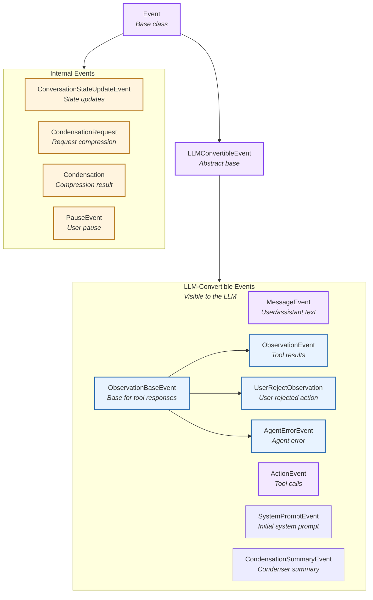
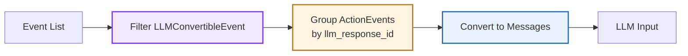
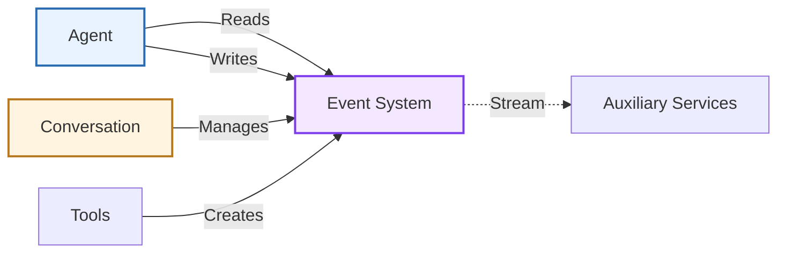

# Events

> High-level architecture of the typed event framework

The **Event System** provides an immutable, type-safe event framework that drives agent execution and state management. Events form an append-only log that serves as both the agent's memory and the integration point for auxiliary services.

**Source:** [`openhands-sdk/openhands/sdk/event/`](https://github.com/OpenHands/software-agent-sdk/tree/main/openhands-sdk/openhands/sdk/event)

## Core Responsibilities

The Event System has four primary responsibilities:

1. **Type Safety** - Enforce event schemas through Pydantic models
2. **LLM Integration** - Convert events to/from LLM message formats
3. **Append-Only Log** - Maintain immutable event history
4. **Service Integration** - Enable observers to react to event streams

## Architecture



### Key Components

| Component                                                                                                                                                 | Purpose               | Design                                                        |
| --------------------------------------------------------------------------------------------------------------------------------------------------------- | --------------------- | ------------------------------------------------------------- |
| **[`Event`](https://github.com/OpenHands/software-agent-sdk/blob/main/openhands-sdk/openhands/sdk/event/base.py)**                                        | Base event class      | Immutable Pydantic model with ID, timestamp, source           |
| **[`LLMConvertibleEvent`](https://github.com/OpenHands/software-agent-sdk/blob/main/openhands-sdk/openhands/sdk/event/base.py)**                          | LLM-compatible events | Abstract class with `to_llm_message()` method                 |
| **[`MessageEvent`](https://github.com/OpenHands/software-agent-sdk/blob/main/openhands-sdk/openhands/sdk/event/llm_convertible/message.py)**              | Text messages         | User or assistant conversational messages with skills         |
| **[`ActionEvent`](https://github.com/OpenHands/software-agent-sdk/blob/main/openhands-sdk/openhands/sdk/event/llm_convertible/action.py)**                | Tool calls            | Agent tool invocations with thought, reasoning, security risk |
| **[`ObservationBaseEvent`](https://github.com/OpenHands/software-agent-sdk/blob/main/openhands-sdk/openhands/sdk/event/llm_convertible/observation.py)**  | Tool response base    | Base for all tool call responses                              |
| **[`ObservationEvent`](https://github.com/OpenHands/software-agent-sdk/blob/main/openhands-sdk/openhands/sdk/event/llm_convertible/observation.py)**      | Tool results          | Successful tool execution outcomes                            |
| **[`UserRejectObservation`](https://github.com/OpenHands/software-agent-sdk/blob/main/openhands-sdk/openhands/sdk/event/llm_convertible/observation.py)** | User rejection        | User rejected action in confirmation mode                     |
| **[`AgentErrorEvent`](https://github.com/OpenHands/software-agent-sdk/blob/main/openhands-sdk/openhands/sdk/event/llm_convertible/observation.py)**       | Agent errors          | Errors from agent/scaffold (not model output)                 |
| **[`SystemPromptEvent`](https://github.com/OpenHands/software-agent-sdk/blob/main/openhands-sdk/openhands/sdk/event/llm_convertible/system.py)**          | System context        | System prompt with tool schemas                               |
| **[`CondensationSummaryEvent`](https://github.com/OpenHands/software-agent-sdk/blob/main/openhands-sdk/openhands/sdk/event/condenser.py)**                | Condenser summary     | LLM-convertible summary of forgotten events                   |
| **[`ConversationStateUpdateEvent`](https://github.com/OpenHands/software-agent-sdk/blob/main/openhands-sdk/openhands/sdk/event/conversation_state.py)**   | State updates         | Key-value conversation state changes                          |
| **[`Condensation`](https://github.com/OpenHands/software-agent-sdk/blob/main/openhands-sdk/openhands/sdk/event/condenser.py)**                            | Condensation result   | Events being forgotten with optional summary                  |
| **[`CondensationRequest`](https://github.com/OpenHands/software-agent-sdk/blob/main/openhands-sdk/openhands/sdk/event/condenser.py)**                     | Request compression   | Trigger for conversation history compression                  |
| **[`PauseEvent`](https://github.com/OpenHands/software-agent-sdk/blob/main/openhands-sdk/openhands/sdk/event/user_action.py)**                            | User pause            | User requested pause of agent execution                       |

## Event Types

### LLM-Convertible Events

Events that participate in agent reasoning and can be converted to LLM messages:

| Event Type                   | Source      | Content                                          | LLM Role                      |
| ---------------------------- | ----------- | ------------------------------------------------ | ----------------------------- |
| **MessageEvent (user)**      | user        | Text, images                                     | `user`                        |
| **MessageEvent (agent)**     | agent       | Text reasoning, skills                           | `assistant`                   |
| **ActionEvent**              | agent       | Tool call with thought, reasoning, security risk | `assistant` with `tool_calls` |
| **ObservationEvent**         | environment | Tool execution result                            | `tool`                        |
| **UserRejectObservation**    | environment | Rejection reason                                 | `tool`                        |
| **AgentErrorEvent**          | agent       | Error details                                    | `tool`                        |
| **SystemPromptEvent**        | agent       | System prompt with tool schemas                  | `system`                      |
| **CondensationSummaryEvent** | environment | Summary of forgotten events                      | `user`                        |

The event system bridges agent events to LLM messages:



**Special Handling - Parallel Function Calling:**

When multiple `ActionEvent`s share the same `llm_response_id` (parallel function calling):

1. Group all ActionEvents by `llm_response_id`
2. Combine into single Message with multiple `tool_calls`
3. Only first event's `thought`, `reasoning_content`, and `thinking_blocks` are included
4. All subsequent events in the batch have empty thought fields

**Example:**

```
ActionEvent(llm_response_id="abc123", thought="Let me check...", tool_call=tool1)
ActionEvent(llm_response_id="abc123", thought=[], tool_call=tool2)
→ Combined into single Message(role="assistant", content="Let me check...", tool_calls=[tool1, tool2])
```

### Internal Events

Events for metadata, control flow, and user actions (not sent to LLM):

| Event Type                       | Source      | Purpose                     | Key Fields                                         |
| -------------------------------- | ----------- | --------------------------- | -------------------------------------------------- |
| **ConversationStateUpdateEvent** | environment | State synchronization       | `key` (field name), `value` (serialized data)      |
| **CondensationRequest**          | environment | Trigger history compression | Signal to condenser when context window exceeded   |
| **Condensation**                 | environment | Compression result          | `forgotten_event_ids`, `summary`, `summary_offset` |
| **PauseEvent**                   | user        | User pause action           | Indicates agent execution was paused by user       |

**Source Types:**

* **user**: Event originated from user input
* **agent**: Event generated by agent logic
* **environment**: Event from system/framework/tools

## Component Relationships

### How Events Integrate



**Relationship Characteristics:**

* **Agent → Events**: Reads history for context, writes actions/messages
* **Conversation → Events**: Owns and persists event log
* **Tools → Events**: Create ObservationEvents after execution
* **Services → Events**: Read-only observers for monitoring, visualization

## Error Events: Agent vs Conversation

Two distinct error events exist in the SDK, with different purpose and visibility:

* AgentErrorEvent
  * Type: ObservationBaseEvent (LLM-convertible)
  * Scope: Error for a specific tool call (has tool\_name and tool\_call\_id)
  * Source: "agent"
  * LLM visibility: Sent as a tool message so the model can react/recover
  * Effect: Conversation continues; not a terminal state
  * Code: [https://github.com/OpenHands/software-agent-sdk/blob/main/openhands-sdk/openhands/sdk/event/llm\_convertible/observation.py](https://github.com/OpenHands/software-agent-sdk/blob/main/openhands-sdk/openhands/sdk/event/llm_convertible/observation.py)

* ConversationErrorEvent
  * Type: Event (not LLM-convertible)
  * Scope: Conversation-level runtime failure (no tool\_name/tool\_call\_id)
  * Source: typically "environment"
  * LLM visibility: Not sent to the model
  * Effect: Run loop transitions to ERROR and run() raises ConversationRunError; surface top-level error to client applications
  * Code: [https://github.com/OpenHands/software-agent-sdk/blob/main/openhands-sdk/openhands/sdk/event/conversation\_error.py](https://github.com/OpenHands/software-agent-sdk/blob/main/openhands-sdk/openhands/sdk/event/conversation_error.py)

## See Also

* **[Agent Architecture](/sdk/arch/agent)** - How agents read and write events
* **[Conversation Architecture](/sdk/arch/conversation)** - Event log management
* **[Tool System](/sdk/arch/tool-system)** - ActionEvent and ObservationEvent generation
* **[Condenser](/sdk/arch/condenser)** - Event history compression


---

> To find navigation and other pages in this documentation, fetch the llms.txt file at: https://docs.openhands.dev/llms.txt

# SDK API
# openhands.sdk.event

> API reference for openhands.sdk.event module

### class ActionEvent

Bases: [`LLMConvertibleEvent`](#class-llmconvertibleevent)

#### Properties

* `action`: Action | None
* `llm_response_id`: str
* `model_config`: ClassVar\[ConfigDict] = (configuration object)
  Configuration for the model, should be a dictionary conforming to \[ConfigDict]\[pydantic.config.ConfigDict].
* `reasoning_content`: str | None
* `responses_reasoning_item`: ReasoningItemModel | None
* `security_risk`: SecurityRisk
* `source`: Literal\['agent', 'user', 'environment']
* `thinking_blocks`: list\[ThinkingBlock | RedactedThinkingBlock]
* `thought`: Sequence\[TextContent]
* `tool_call`: MessageToolCall
* `tool_call_id`: str
* `tool_name`: str
* `visualize`: Text
  Return Rich Text representation of this action event.

#### Methods

#### to\_llm\_message()

Individual message - may be incomplete for multi-action batches

### class AgentErrorEvent

Bases: [`ObservationBaseEvent`](#class-observationbaseevent)

Error triggered by the agent.

Note: This event should not contain model “thought” or “reasoning\_content”. It
represents an error produced by the agent/scaffold, not model output.

#### Properties

* `error`: str
* `model_config`: ClassVar\[ConfigDict] = (configuration object)
  Configuration for the model, should be a dictionary conforming to \[ConfigDict]\[pydantic.config.ConfigDict].
* `source`: Literal\['agent', 'user', 'environment']
* `visualize`: Text
  Return Rich Text representation of this agent error event.

#### Methods

#### to\_llm\_message()

### class Condensation

Bases: [`Event`](#class-event)

This action indicates a condensation of the conversation history is happening.

#### Properties

* `forgotten_event_ids`: list\[str]
* `llm_response_id`: str
* `model_config`: ClassVar\[ConfigDict] = (configuration object)
  Configuration for the model, should be a dictionary conforming to \[ConfigDict]\[pydantic.config.ConfigDict].
* `source`: Literal\['agent', 'user', 'environment']
* `summary`: str | None
* `summary_offset`: int | None
* `visualize`: Text
  Return Rich Text representation of this event.
  This is a fallback implementation for unknown event types.
  Subclasses should override this method to provide specific visualization.

### class CondensationRequest

Bases: [`Event`](#class-event)

This action is used to request a condensation of the conversation history.

#### Properties

* `model_config`: ClassVar\[ConfigDict] = (configuration object)
  Configuration for the model, should be a dictionary conforming to \[ConfigDict]\[pydantic.config.ConfigDict].
* `source`: Literal\['agent', 'user', 'environment']
* `visualize`: Text
  Return Rich Text representation of this event.
  This is a fallback implementation for unknown event types.
  Subclasses should override this method to provide specific visualization.

#### Methods

#### action

The action type, namely ActionType.CONDENSATION\_REQUEST.

* Type:
  str

### class CondensationSummaryEvent

Bases: [`LLMConvertibleEvent`](#class-llmconvertibleevent)

This event represents a summary generated by a condenser.

#### Properties

* `model_config`: ClassVar\[ConfigDict] = (configuration object)
  Configuration for the model, should be a dictionary conforming to \[ConfigDict]\[pydantic.config.ConfigDict].
* `source`: Literal\['agent', 'user', 'environment']
* `summary`: str
  The summary text.

#### Methods

#### to\_llm\_message()

### class ConversationStateUpdateEvent

Bases: [`Event`](#class-event)

Event that contains conversation state updates.

This event is sent via websocket whenever the conversation state changes,
allowing remote clients to stay in sync without making REST API calls.

All fields are serialized versions of the corresponding ConversationState fields
to ensure compatibility with websocket transmission.

#### Properties

* `key`: str
* `model_config`: ClassVar\[ConfigDict] = (configuration object)
  Configuration for the model, should be a dictionary conforming to \[ConfigDict]\[pydantic.config.ConfigDict].
* `source`: Literal\['agent', 'user', 'environment']
* `value`: Any

#### Methods

#### classmethod from\_conversation\_state()

Create a state update event from a ConversationState object.

This creates an event containing a snapshot of important state fields.

* Parameters:
  * `state` – The ConversationState to serialize
  * `conversation_id` – The conversation ID for the event
* Returns:
  A ConversationStateUpdateEvent with serialized state data

#### classmethod validate\_key()

#### classmethod validate\_value()

### class Event

Bases: `DiscriminatedUnionMixin`, `ABC`

Base class for all events.

#### Properties

* `id`: str
* `model_config`: ClassVar\[ConfigDict] = (configuration object)
  Configuration for the model, should be a dictionary conforming to \[ConfigDict]\[pydantic.config.ConfigDict].
* `source`: Literal\['agent', 'user', 'environment']
* `timestamp`: str
* `visualize`: Text
  Return Rich Text representation of this event.
  This is a fallback implementation for unknown event types.
  Subclasses should override this method to provide specific visualization.

### class LLMCompletionLogEvent

Bases: [`Event`](#class-event)

Event containing LLM completion log data.

When an LLM is configured with log\_completions=True in a remote conversation,
this event streams the completion log data back to the client through WebSocket
instead of writing it to a file inside the Docker container.

#### Properties

* `filename`: str
* `log_data`: str
* `model_config`: ClassVar\[ConfigDict] = (configuration object)
  Configuration for the model, should be a dictionary conforming to \[ConfigDict]\[pydantic.config.ConfigDict].
* `model_name`: str
* `source`: Literal\['agent', 'user', 'environment']
* `usage_id`: str

### class LLMConvertibleEvent

Bases: [`Event`](#class-event), `ABC`

Base class for events that can be converted to LLM messages.

#### Properties

* `id`: EventID
* `model_config`: ClassVar\[ConfigDict] = (configuration object)
  Configuration for the model, should be a dictionary conforming to \[ConfigDict]\[pydantic.config.ConfigDict].
* `source`: SourceType
* `timestamp`: str

#### Methods

#### static events\_to\_messages()

Convert event stream to LLM message stream, handling multi-action batches

#### abstractmethod to\_llm\_message()

### class MessageEvent

Bases: [`LLMConvertibleEvent`](#class-llmconvertibleevent)

Message from either agent or user.

This is originally the “MessageAction”, but it suppose not to be tool call.

#### Properties

* `activated_skills`: list\[str]
* `extended_content`: list\[TextContent]
* `id`: EventID
* `llm_message`: Message
* `llm_response_id`: str | None
* `model_config`: ClassVar\[ConfigDict] = (configuration object)
  Configuration for the model, should be a dictionary conforming to \[ConfigDict]\[pydantic.config.ConfigDict].
* `reasoning_content`: str
* `sender`: str | None
* `source`: Literal\['agent', 'user', 'environment']
* `thinking_blocks`: Sequence\[ThinkingBlock | RedactedThinkingBlock]
  Return the Anthropic thinking blocks from the LLM message.
* `timestamp`: str
* `visualize`: Text
  Return Rich Text representation of this message event.

#### Methods

#### to\_llm\_message()

### class ObservationBaseEvent

Bases: [`LLMConvertibleEvent`](#class-llmconvertibleevent)

Base class for anything as a response to a tool call.

Examples include tool execution, error, user reject.

#### Properties

* `model_config`: ClassVar\[ConfigDict] = (configuration object)
  Configuration for the model, should be a dictionary conforming to \[ConfigDict]\[pydantic.config.ConfigDict].
* `source`: Literal\['agent', 'user', 'environment']
* `tool_call_id`: str
* `tool_name`: str

### class ObservationEvent

Bases: [`ObservationBaseEvent`](#class-observationbaseevent)

#### Properties

* `action_id`: str
* `model_config`: ClassVar\[ConfigDict] = (configuration object)
  Configuration for the model, should be a dictionary conforming to \[ConfigDict]\[pydantic.config.ConfigDict].
* `observation`: Observation
* `visualize`: Text
  Return Rich Text representation of this observation event.

#### Methods

#### to\_llm\_message()

### class PauseEvent

Bases: [`Event`](#class-event)

Event indicating that the agent execution was paused by user request.

#### Properties

* `model_config`: ClassVar\[ConfigDict] = (configuration object)
  Configuration for the model, should be a dictionary conforming to \[ConfigDict]\[pydantic.config.ConfigDict].
* `source`: Literal\['agent', 'user', 'environment']
* `visualize`: Text
  Return Rich Text representation of this pause event.

### class SystemPromptEvent

Bases: [`LLMConvertibleEvent`](#class-llmconvertibleevent)

System prompt added by the agent.

#### Properties

* `model_config`: ClassVar\[ConfigDict] = (configuration object)
  Configuration for the model, should be a dictionary conforming to \[ConfigDict]\[pydantic.config.ConfigDict].
* `source`: Literal\['agent', 'user', 'environment']
* `system_prompt`: TextContent
* `tools`: list\[ToolDefinition]
* `visualize`: Text
  Return Rich Text representation of this system prompt event.

#### Methods

#### to\_llm\_message()

### class TokenEvent

Bases: [`Event`](#class-event)

Event from VLLM representing token IDs used in LLM interaction.

#### Properties

* `model_config`: ClassVar\[ConfigDict] = (configuration object)
  Configuration for the model, should be a dictionary conforming to \[ConfigDict]\[pydantic.config.ConfigDict].
* `prompt_token_ids`: list\[int]
* `response_token_ids`: list\[int]
* `source`: Literal\['agent', 'user', 'environment']

### class UserRejectObservation

Bases: [`ObservationBaseEvent`](#class-observationbaseevent)

Observation when user rejects an action in confirmation mode.

#### Properties

* `action_id`: str
* `model_config`: ClassVar\[ConfigDict] = (configuration object)
  Configuration for the model, should be a dictionary conforming to \[ConfigDict]\[pydantic.config.ConfigDict].
* `rejection_reason`: str
* `visualize`: Text
  Return Rich Text representation of this user rejection event.

#### Methods

#### to\_llm\_message()


---

> To find navigation and other pages in this documentation, fetch the llms.txt file at: https://docs.openhands.dev/llms.txt