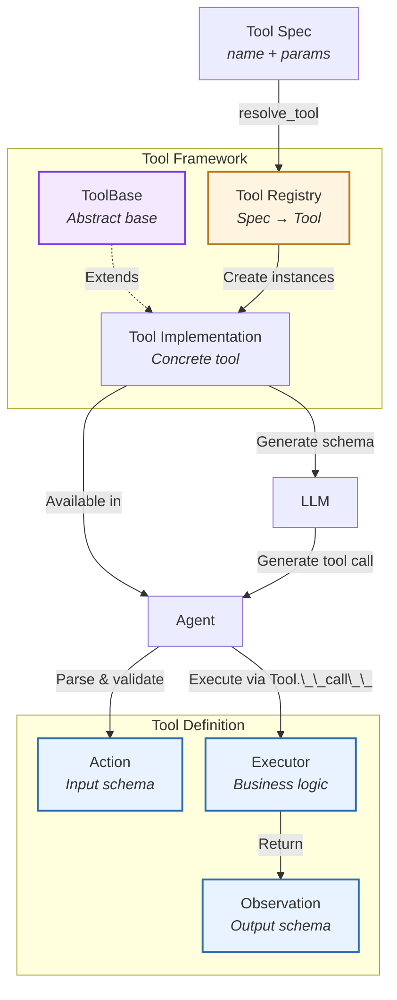
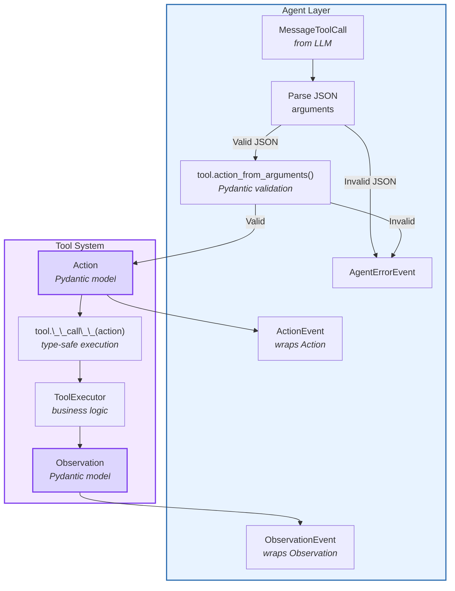
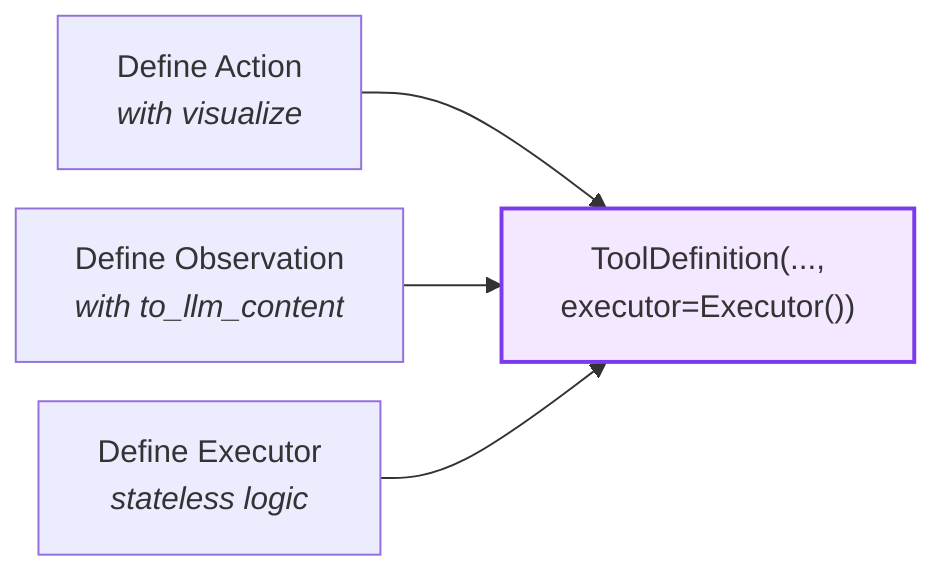
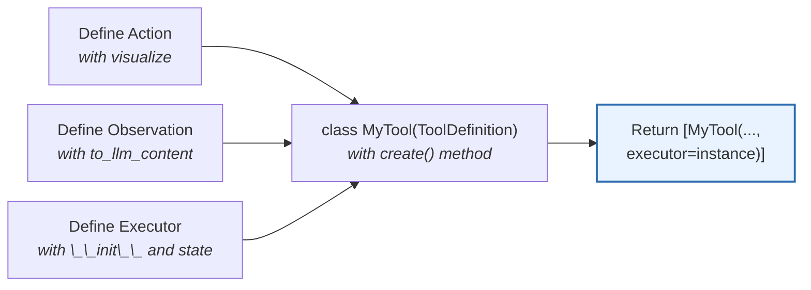
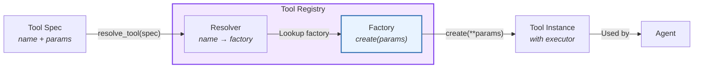
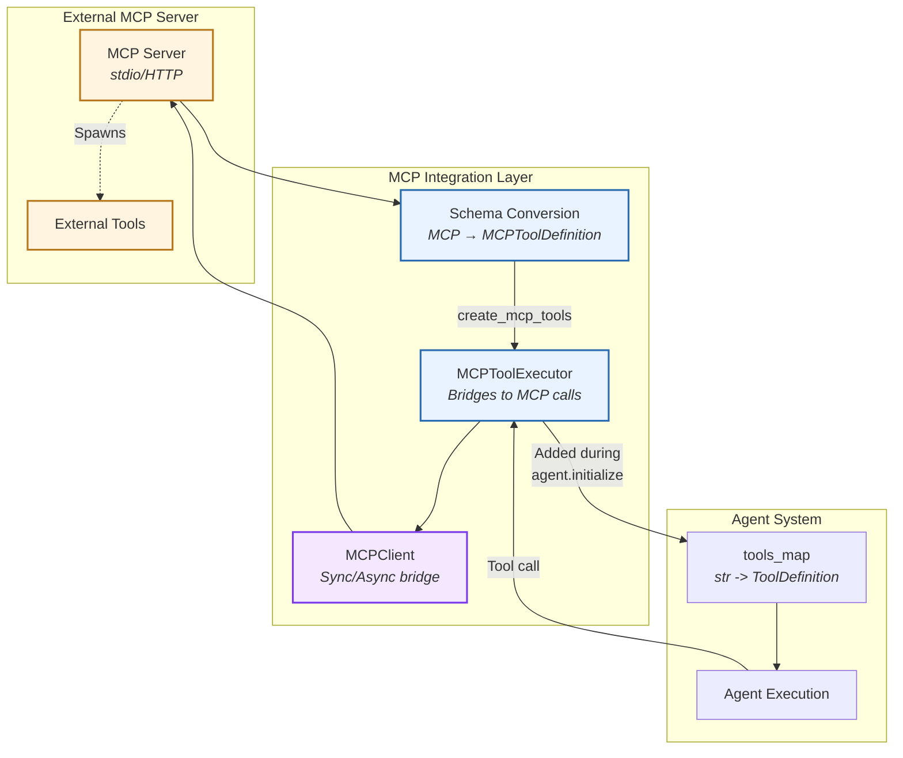
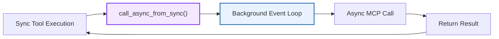
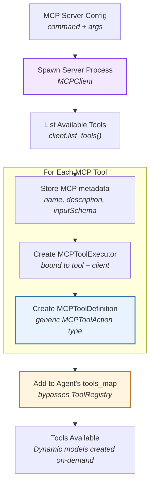
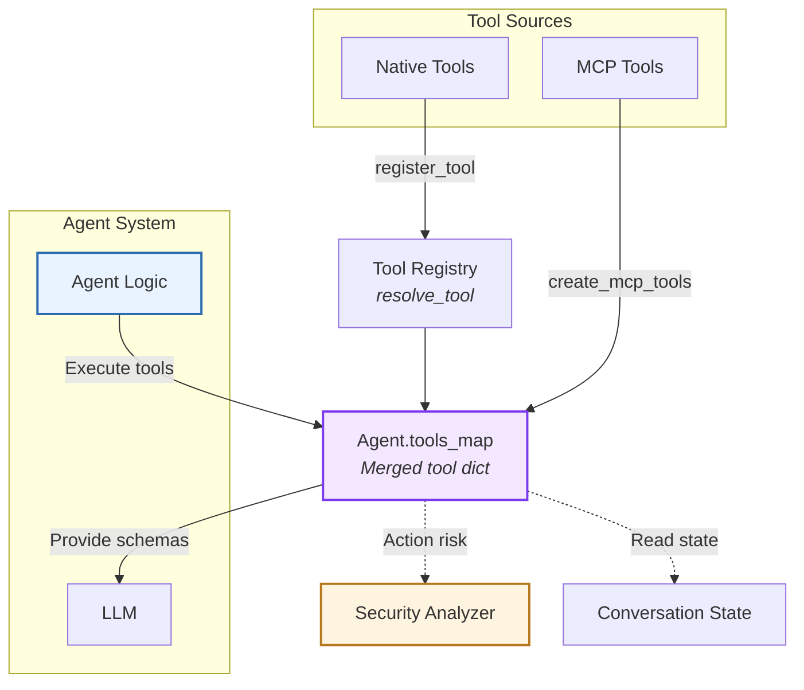

# Tool System & MCP

> High-level architecture of the action-observation tool framework

The **Tool System** provides a type-safe, extensible framework for defining agent capabilities. It standardizes how agents interact with external systems through a structured Action-Observation pattern with automatic validation and schema generation.

**Source:** [`openhands-sdk/openhands/sdk/tool/`](https://github.com/OpenHands/software-agent-sdk/tree/main/openhands-sdk/openhands/sdk/tool)

## Core Responsibilities

The Tool System has four primary responsibilities:

1. **Type Safety** - Enforce action/observation schemas via Pydantic models
2. **Schema Generation** - Auto-generate LLM-compatible tool descriptions from Pydantic schemas
3. **Execution Lifecycle** - Validate inputs, execute logic, wrap outputs
4. **Tool Registry** - Discover and resolve tools by name or pattern

## Tool System

### Architecture Overview



### Key Components

| Component                                                                                                                    | Purpose             | Design                                                                 |
| ---------------------------------------------------------------------------------------------------------------------------- | ------------------- | ---------------------------------------------------------------------- |
| **[`ToolBase`](https://github.com/OpenHands/software-agent-sdk/blob/main/openhands-sdk/openhands/sdk/tool/tool.py)**         | Abstract base class | Generic over Action and Observation types, defines abstract `create()` |
| **[`ToolDefinition`](https://github.com/OpenHands/software-agent-sdk/blob/main/openhands-sdk/openhands/sdk/tool/tool.py)**   | Concrete tool class | Can be instantiated directly or subclassed for factory pattern         |
| **[`Action`](https://github.com/OpenHands/software-agent-sdk/blob/main/openhands-sdk/openhands/sdk/tool/schema.py)**         | Input model         | Pydantic model with `visualize` property                               |
| **[`Observation`](https://github.com/OpenHands/software-agent-sdk/blob/main/openhands-sdk/openhands/sdk/tool/schema.py)**    | Output model        | Pydantic model with `to_llm_content` property                          |
| **[`ToolExecutor`](https://github.com/OpenHands/software-agent-sdk/blob/main/openhands-sdk/openhands/sdk/tool/tool.py)**     | Execution interface | ABC with `__call__()` method, optional `close()`                       |
| **[`ToolAnnotations`](https://github.com/OpenHands/software-agent-sdk/blob/main/openhands-sdk/openhands/sdk/tool/tool.py)**  | Behavioral hints    | MCP-spec hints (readOnly, destructive, idempotent, openWorld)          |
| **[`Tool` (spec)](https://github.com/OpenHands/software-agent-sdk/blob/main/openhands-sdk/openhands/sdk/tool/spec.py)**      | Tool specification  | Configuration object with name and params                              |
| **[`ToolRegistry`](https://github.com/OpenHands/software-agent-sdk/blob/main/openhands-sdk/openhands/sdk/tool/registry.py)** | Tool discovery      | Resolves Tool specs to ToolDefinition instances                        |

### Action-Observation Pattern

The tool system follows a **strict input-output contract**: `Action → Observation`. The Agent layer wraps these in events for conversation management.



**Tool System Boundary:**

* **Input**: `dict[str, Any]` (JSON arguments) → validated `Action` instance
* **Output**: `Observation` instance with structured result
* **No knowledge of**: Events, LLM messages, conversation state

### Tool Definition

Tools are defined using two patterns depending on complexity:

#### Pattern 1: Direct Instantiation (Simple Tools)

For stateless tools that don't need runtime configuration (e.g., `finish`, `think`):



**Components:**

1. **Action** - Pydantic model with `visualize` property for display
2. **Observation** - Pydantic model with `to_llm_content` property for LLM
3. **ToolExecutor** - Stateless executor with `__call__(action) → observation`
4. **ToolDefinition** - Direct instantiation with executor instance

#### Pattern 2: Subclass with Factory (Stateful Tools)

For tools requiring runtime configuration or persistent state (e.g., `execute_bash`, `file_editor`, `glob`):



**Components:**

1. **Action/Observation** - Same as Pattern 1
2. **ToolExecutor** - Stateful executor with `__init__()` for configuration and optional `close()` for cleanup
3. **MyTool(ToolDefinition)** - Subclass with `@classmethod create(conv_state, ...)` factory method
4. **Factory Method** - Returns sequence of configured tool instances

```mermaid  theme={null}
%%{init: {"theme": "default", "flowchart": {"nodeSpacing": 30}} }%%
flowchart TB
    subgraph Pattern1["Pattern 1: Direct Instantiation"]
        P1A["Define Action/Observation<br>with visualize/to_llm_content"]
        P1E["Define ToolExecutor<br>with \_\_call\_\_()"]
        P1T["ToolDefinition(...,<br>executor=Executor())"]
    end
    
    subgraph Pattern2["Pattern 2: Subclass with Factory"]
        P2A["Define Action/Observation<br>with visualize/to_llm_content"]
        P2E["Define Stateful ToolExecutor<br>with \_\_init\_\_() and \_\_call\_\_()"]
        P2C["class MyTool(ToolDefinition)<br>@classmethod create()"]
        P2I["Return [MyTool(...,<br>executor=instance)]"]
    end
    
    P1A --> P1E
    P1E --> P1T
    
    P2A --> P2E
    P2E --> P2C
    P2C --> P2I
    
    style P1T fill:#f3e8ff,stroke:#7c3aed,stroke-width:2px
    style P2I fill:#e8f3ff,stroke:#2b6cb0,stroke-width:2px
```



**Key Design Elements:**

| Component          | Purpose                         | Requirements                                                                           |
| ------------------ | ------------------------------- | -------------------------------------------------------------------------------------- |
| **Action**         | Defines LLM-provided parameters | Extends `Action`, includes `visualize` property returning Rich Text                    |
| **Observation**    | Defines structured output       | Extends `Observation`, includes `to_llm_content` property returning content list       |
| **ToolExecutor**   | Implements business logic       | Extends `ToolExecutor[ActionT, ObservationT]`, implements `__call__()` method          |
| **ToolDefinition** | Ties everything together        | Either instantiate directly (Pattern 1) or subclass with `create()` method (Pattern 2) |

**When to Use Each Pattern:**

| Pattern                   | Use Case                                       | Examples                                      |
| ------------------------- | ---------------------------------------------- | --------------------------------------------- |
| **Direct Instantiation**  | Stateless tools with no configuration needs    | `finish`, `think`, simple utilities           |
| **Subclass with Factory** | Tools requiring runtime state or configuration | `execute_bash`, `file_editor`, `glob`, `grep` |

### Tool Annotations

Tools include optional `ToolAnnotations` based on the [Model Context Protocol (MCP) spec](https://github.com/modelcontextprotocol/modelcontextprotocol) that provide behavioral hints to LLMs:

| Field             | Meaning                        | Examples                                      |
| ----------------- | ------------------------------ | --------------------------------------------- |
| `readOnlyHint`    | Tool doesn't modify state      | `glob` (True), `execute_bash` (False)         |
| `destructiveHint` | May delete/overwrite data      | `file_editor` (True), `task_tracker` (False)  |
| `idempotentHint`  | Repeated calls are safe        | `glob` (True), `execute_bash` (False)         |
| `openWorldHint`   | Interacts beyond closed domain | `execute_bash` (True), `task_tracker` (False) |

**Key Behaviors:**

* [LLM-based Security risk prediction](/sdk/guides/security) automatically added for tools with `readOnlyHint=False`
* Annotations help LLMs reason about tool safety and side effects

### Tool Registry

The registry enables **dynamic tool discovery** and instantiation from tool specifications:



**Resolution Workflow:**

1. **[Tool (Spec)](https://github.com/OpenHands/software-agent-sdk/blob/main/openhands-sdk/openhands/sdk/tool/spec.py)** - Configuration object with `name` (e.g., "BashTool") and `params` (e.g., `{"working_dir": "/workspace"}`)
2. **Resolver Lookup** - Registry finds the registered resolver for the tool name
3. **Factory Invocation** - Resolver calls the tool's `.create()` method with params and conversation state
4. **Instance Creation** - Tool instance(s) are created with configured executors
5. **Agent Usage** - Instances are added to the agent's tools\_map for execution

**Registration Types:**

| Type                 | Registration                     | Resolver Behavior                                    |
| -------------------- | -------------------------------- | ---------------------------------------------------- |
| **Tool Instance**    | `register_tool(name, instance)`  | Returns the fixed instance (params not allowed)      |
| **Tool Subclass**    | `register_tool(name, ToolClass)` | Calls `ToolClass.create(**params, conv_state=state)` |
| **Factory Function** | `register_tool(name, factory)`   | Calls `factory(**params, conv_state=state)`          |

### File Organization

Tools follow a consistent file structure for maintainability:

```
openhands-tools/openhands/tools/my_tool/
├── __init__.py           # Export MyTool
├── definition.py         # Action, Observation, MyTool(ToolDefinition)
├── impl.py              # MyExecutor(ToolExecutor)
└── [other modules]      # Tool-specific utilities
```

**File Responsibilities:**

| File            | Contains                                     | Purpose                                        |
| --------------- | -------------------------------------------- | ---------------------------------------------- |
| `definition.py` | Action, Observation, ToolDefinition subclass | Public API, schema definitions, factory method |
| `impl.py`       | ToolExecutor implementation                  | Business logic, state management, execution    |
| `__init__.py`   | Tool exports                                 | Package interface                              |

**Benefits:**

* **Separation of Concerns** - Public API separate from implementation
* **Avoid Circular Imports** - Import `impl` only inside `create()` method
* **Consistency** - All tools follow same structure for discoverability

**Example Reference:** See [`execute_bash/`](https://github.com/OpenHands/software-agent-sdk/tree/main/openhands-tools/openhands/tools/execute_bash) for complete implementation

## MCP Integration

The tool system supports external tools via the [Model Context Protocol (MCP)](https://modelcontextprotocol.io/). MCP tools are **configured separately from the tool registry** via the `mcp_config` field in `Agent` class and are automatically discovered from MCP servers during agent initialization.

**Source:** [`openhands-sdk/openhands/sdk/mcp/`](https://github.com/OpenHands/software-agent-sdk/tree/main/openhands-sdk/openhands/sdk/mcp)

### Architecture Overview



### Key Components

| Component                                                                                                                            | Purpose                | Design                                                                 |
| ------------------------------------------------------------------------------------------------------------------------------------ | ---------------------- | ---------------------------------------------------------------------- |
| **[`MCPClient`](https://github.com/OpenHands/software-agent-sdk/blob/main/openhands-sdk/openhands/sdk/mcp/client.py)**               | MCP server connection  | Extends FastMCP with sync/async bridge                                 |
| **[`MCPToolDefinition`](https://github.com/OpenHands/software-agent-sdk/blob/main/openhands-sdk/openhands/sdk/mcp/tool.py)**         | Tool wrapper           | Wraps MCP tools as SDK `ToolDefinition` with dynamic validation        |
| **[`MCPToolExecutor`](https://github.com/OpenHands/software-agent-sdk/blob/main/openhands-sdk/openhands/sdk/mcp/tool.py)**           | Execution handler      | Bridges agent actions to MCP tool calls via MCPClient                  |
| **[`MCPToolAction`](https://github.com/OpenHands/software-agent-sdk/blob/main/openhands-sdk/openhands/sdk/mcp/definition.py)**       | Generic action wrapper | Simple `dict[str, Any]` wrapper for MCP tool arguments                 |
| **[`MCPToolObservation`](https://github.com/OpenHands/software-agent-sdk/blob/main/openhands-sdk/openhands/sdk/mcp/definition.py)**  | Result wrapper         | Wraps MCP tool results as observations with content blocks             |
| **[`_create_mcp_action_type()`](https://github.com/OpenHands/software-agent-sdk/blob/main/openhands-sdk/openhands/sdk/mcp/tool.py)** | Dynamic schema         | Runtime Pydantic model generated from MCP `inputSchema` for validation |

### Sync/Async Bridge

MCP protocol is asynchronous, but SDK tools execute synchronously. The bridge pattern in [client.py](https://github.com/OpenHands/software-agent-sdk/blob/main/openhands-sdk/openhands/sdk/mcp/client.py) solves this:



**Bridge Features:**

* **Background Event Loop** - Executes async code from sync contexts
* **Timeout Support** - Configurable timeouts for MCP operations
* **Error Handling** - Wraps MCP errors in observations
* **Connection Pooling** - Reuses connections across tool calls

### Tool Discovery Flow

**Source:** [`create_mcp_tools()`](https://github.com/OpenHands/software-agent-sdk/blob/main/openhands-sdk/openhands/sdk/mcp/utils.py) | [`agent._initialize()`](https://github.com/OpenHands/software-agent-sdk/blob/main/openhands-sdk/openhands/sdk/agent/base.py)



**Discovery Steps:**

1. **Spawn Server** - Launch MCP server via stdio protocol (using `MCPClient`)
2. **List Tools** - Call MCP `tools/list` endpoint to retrieve available tools
3. **Parse Schemas** - Extract tool names, descriptions, and `inputSchema` from MCP response
4. **Create Definitions** - For each tool, call `MCPToolDefinition.create()` which:
   * Creates an `MCPToolExecutor` instance bound to the tool name and client
   * Wraps the MCP tool metadata in `MCPToolDefinition`
   * Uses generic `MCPToolAction` as the action type (NOT dynamic models yet)
5. **Add to Agent** - All `MCPToolDefinition` instances are added to agent's `tools_map` during `initialize()` (bypasses ToolRegistry)
6. **Lazy Validation** - Dynamic Pydantic models are generated lazily when:
   * `action_from_arguments()` is called (argument validation)
   * `to_openai_tool()` is called (schema export to LLM)

**Schema Handling:**

| MCP Schema           | SDK Integration                                             | When Used                    |
| -------------------- | ----------------------------------------------------------- | ---------------------------- |
| `name`               | Tool name (stored in `MCPToolDefinition`)                   | Discovery, execution         |
| `description`        | Tool description for LLM                                    | Discovery, LLM prompt        |
| `inputSchema`        | Stored in `mcp_tool.inputSchema`                            | Lazy model generation        |
| `inputSchema` fields | Converted to Pydantic fields via `Schema.from_mcp_schema()` | Validation, schema export    |
| `annotations`        | Mapped to `ToolAnnotations`                                 | Security analysis, LLM hints |

### MCP Server Configuration

MCP servers are configured via the `mcp_config` field on the `Agent` class. Configuration follows [FastMCP config format](https://gofastmcp.com/clients/client#configuration-format):

```python  theme={null}
from openhands.sdk import Agent

agent = Agent(
    mcp_config={
        "mcpServers": {
            "fetch": {
                "command": "uvx",
                "args": ["mcp-server-fetch"]
            },
            "filesystem": {
                "command": "npx",
                "args": ["-y", "@modelcontextprotocol/server-filesystem", "/path"]
            }
        }
    }
)
```

## Component Relationships



**Relationship Characteristics:**

* **Native → Registry → tools\_map**: Native tools resolved via `ToolRegistry`
* **MCP → tools\_map**: MCP tools bypass registry, added directly during `initialize()`
* **tools\_map → LLM**: Generate schemas describing all available capabilities
* **Agent → tools\_map**: Execute actions, receive observations
* **tools\_map → Conversation**: Read state for context-aware execution
* **tools\_map → Security**: Tool annotations inform risk assessment

## See Also

* **[Agent Architecture](/sdk/arch/agent)** - How agents select and execute tools
* **[Events](/sdk/arch/events)** - ActionEvent and ObservationEvent structures
* **[Security Analyzer](/sdk/arch/security)** - Action risk assessment
* **[Skill Architecture](/sdk/arch/skill)** - Embedding MCP configs in repository skills
* **[Custom Tools Guide](/sdk/guides/custom-tools)** - Building your own tools
* **[FastMCP Documentation](https://gofastmcp.com/)** - Underlying MCP client library


---

> To find navigation and other pages in this documentation, fetch the llms.txt file at: https://docs.openhands.dev/llms.txt


# Custom Tools

> Tools define what agents can do. The SDK includes built-in tools for common operations and supports creating custom tools for specialized needs.

## Built-in Tools

```python  theme={null}
from openhands.tools import BashTool, FileEditorTool
from openhands.tools.preset import get_default_tools

# Use specific tools
agent = Agent(llm=llm, tools=[BashTool.create(), FileEditorTool.create()])

# Or use preset
tools = get_default_tools()
agent = Agent(llm=llm, tools=tools)
```

<Note>
  See [source code](https://github.com/OpenHands/software-agent-sdk/tree/main/openhands-sdk/openhands/tools) for the complete list of available tools and design philosophy.
</Note>

## Understanding the Tool System

The SDK's tool system is built around three core components:

1. **Action** - Defines input parameters (what the tool accepts)
2. **Observation** - Defines output data (what the tool returns)
3. **Executor** - Implements the tool's logic (what the tool does)

These components are tied together by a **ToolDefinition** that registers the tool with the agent. The tools package ([source code](https://github.com/OpenHands/software-agent-sdk/tree/main/openhands-sdk/openhands/tools)) provides built-in tools that follow these patterns.

## Creating a Custom Tool

<Note>
  This example is available on GitHub: [examples/01\_standalone\_sdk/02\_custom\_tools.py](https://github.com/OpenHands/software-agent-sdk/blob/main/examples/01_standalone_sdk/02_custom_tools.py)
</Note>

Here's a minimal example of creating a custom grep tool:

```python icon="python" expandable examples/01_standalone_sdk/02_custom_tools.py theme={null}
"""Advanced example showing explicit executor usage and custom grep tool."""

import os
import shlex
from collections.abc import Sequence

from pydantic import Field, SecretStr

from openhands.sdk import (
    LLM,
    Action,
    Agent,
    Conversation,
    Event,
    ImageContent,
    LLMConvertibleEvent,
    Observation,
    TextContent,
    ToolDefinition,
    get_logger,
)
from openhands.sdk.tool import (
    Tool,
    ToolExecutor,
    register_tool,
)
from openhands.tools.file_editor import FileEditorTool
from openhands.tools.terminal import (
    TerminalAction,
    TerminalExecutor,
    TerminalTool,
)


logger = get_logger(__name__)

# --- Action / Observation ---


class GrepAction(Action):
    pattern: str = Field(description="Regex to search for")
    path: str = Field(
        default=".", description="Directory to search (absolute or relative)"
    )
    include: str | None = Field(
        default=None, description="Optional glob to filter files (e.g. '*.py')"
    )


class GrepObservation(Observation):
    matches: list[str] = Field(default_factory=list)
    files: list[str] = Field(default_factory=list)
    count: int = 0

    @property
    def to_llm_content(self) -> Sequence[TextContent | ImageContent]:
        if not self.count:
            return [TextContent(text="No matches found.")]
        files_list = "\n".join(f"- {f}" for f in self.files[:20])
        sample = "\n".join(self.matches[:10])
        more = "\n..." if self.count > 10 else ""
        ret = (
            f"Found {self.count} matching lines.\n"
            f"Files:\n{files_list}\n"
            f"Sample:\n{sample}{more}"
        )
        return [TextContent(text=ret)]


# --- Executor ---


class GrepExecutor(ToolExecutor[GrepAction, GrepObservation]):
    def __init__(self, terminal: TerminalExecutor):
        self.terminal: TerminalExecutor = terminal

    def __call__(self, action: GrepAction, conversation=None) -> GrepObservation:  # noqa: ARG002
        root = os.path.abspath(action.path)
        pat = shlex.quote(action.pattern)
        root_q = shlex.quote(root)

        # Use grep -r; add --include when provided
        if action.include:
            inc = shlex.quote(action.include)
            cmd = f"grep -rHnE --include {inc} {pat} {root_q} 2>/dev/null | head -100"
        else:
            cmd = f"grep -rHnE {pat} {root_q} 2>/dev/null | head -100"

        result = self.terminal(TerminalAction(command=cmd))

        matches: list[str] = []
        files: set[str] = set()

        # grep returns exit code 1 when no matches; treat as empty
        output_text = result.text

        if output_text.strip():
            for line in output_text.strip().splitlines():
                matches.append(line)
                # Expect "path:line:content" — take the file part before first ":"
                file_path = line.split(":", 1)[0]
                if file_path:
                    files.add(os.path.abspath(file_path))

        return GrepObservation(matches=matches, files=sorted(files), count=len(matches))


# Tool description
_GREP_DESCRIPTION = """Fast content search tool.
* Searches file contents using regular expressions
* Supports full regex syntax (eg. "log.*Error", "function\\s+\\w+", etc.)
* Filter files by pattern with the include parameter (eg. "*.js", "*.{ts,tsx}")
* Returns matching file paths sorted by modification time.
* Only the first 100 results are returned. Consider narrowing your search with stricter regex patterns or provide path parameter if you need more results.
* Use this tool when you need to find files containing specific patterns
* When you are doing an open ended search that may require multiple rounds of globbing and grepping, use the Agent tool instead
"""  # noqa: E501


# --- Tool Definition ---


class GrepTool(ToolDefinition[GrepAction, GrepObservation]):
    """A custom grep tool that searches file contents using regular expressions."""

    @classmethod
    def create(
        cls, conv_state, terminal_executor: TerminalExecutor | None = None
    ) -> Sequence[ToolDefinition]:
        """Create GrepTool instance with a GrepExecutor.

        Args:
            conv_state: Conversation state to get working directory from.
            terminal_executor: Optional terminal executor to reuse. If not provided,
                         a new one will be created.

        Returns:
            A sequence containing a single GrepTool instance.
        """
        if terminal_executor is None:
            terminal_executor = TerminalExecutor(
                working_dir=conv_state.workspace.working_dir
            )
        grep_executor = GrepExecutor(terminal_executor)

        return [
            cls(
                description=_GREP_DESCRIPTION,
                action_type=GrepAction,
                observation_type=GrepObservation,
                executor=grep_executor,
            )
        ]


# Configure LLM
api_key = os.getenv("LLM_API_KEY")
assert api_key is not None, "LLM_API_KEY environment variable is not set."
model = os.getenv("LLM_MODEL", "anthropic/claude-sonnet-4-5-20250929")
base_url = os.getenv("LLM_BASE_URL")
llm = LLM(
    usage_id="agent",
    model=model,
    base_url=base_url,
    api_key=SecretStr(api_key),
)

# Tools - demonstrating both simplified and advanced patterns
cwd = os.getcwd()


def _make_bash_and_grep_tools(conv_state) -> list[ToolDefinition]:
    """Create terminal and custom grep tools sharing one executor."""

    terminal_executor = TerminalExecutor(working_dir=conv_state.workspace.working_dir)
    # terminal_tool = terminal_tool.set_executor(executor=terminal_executor)
    terminal_tool = TerminalTool.create(conv_state, executor=terminal_executor)[0]

    # Use the GrepTool.create() method with shared terminal_executor
    grep_tool = GrepTool.create(conv_state, terminal_executor=terminal_executor)[0]

    return [terminal_tool, grep_tool]


register_tool("BashAndGrepToolSet", _make_bash_and_grep_tools)

tools = [
    Tool(name=FileEditorTool.name),
    Tool(name="BashAndGrepToolSet"),
]

# Agent
agent = Agent(llm=llm, tools=tools)

llm_messages = []  # collect raw LLM messages


def conversation_callback(event: Event):
    if isinstance(event, LLMConvertibleEvent):
        llm_messages.append(event.to_llm_message())


conversation = Conversation(
    agent=agent, callbacks=[conversation_callback], workspace=cwd
)

conversation.send_message(
    "Hello! Can you use the grep tool to find all files "
    "containing the word 'class' in this project, then create a summary file listing them? "  # noqa: E501
    "Use the pattern 'class' to search and include only Python files with '*.py'."  # noqa: E501
)
conversation.run()

conversation.send_message("Great! Now delete that file.")
conversation.run()

print("=" * 100)
print("Conversation finished. Got the following LLM messages:")
for i, message in enumerate(llm_messages):
    print(f"Message {i}: {str(message)[:200]}")

# Report cost
cost = llm.metrics.accumulated_cost
print(f"EXAMPLE_COST: {cost}")
```

```bash Running the Example theme={null}
export LLM_API_KEY="your-api-key"
cd agent-sdk
uv run python examples/01_standalone_sdk/02_custom_tools.py
```

### Tool Registration

Tools are registered using `register_tool()` and referenced by name:

```python  theme={null}
# Register a simple tool class
register_tool("FileEditorTool", FileEditorTool)

# Register a factory function that creates multiple tools
register_tool("BashAndGrepToolSet", _make_bash_and_grep_tools)

# Use registered tools by name
tools = [
    Tool(name="FileEditorTool"),
    Tool(name="BashAndGrepToolSet"),
]
```

### Factory Functions

Tool factory functions receive `conv_state` as a parameter, allowing access to workspace information:

```python  theme={null}
def _make_bash_and_grep_tools(conv_state) -> list[ToolDefinition]:
    """Create execute_bash and custom grep tools sharing one executor."""
    bash_executor = BashExecutor(working_dir=conv_state.workspace.working_dir)
    # Create and configure tools...
    return [bash_tool, grep_tool]
```

### Shared Executors

Multiple tools can share executors for efficiency and state consistency:

```python  theme={null}
bash_executor = BashExecutor(working_dir=conv_state.workspace.working_dir)
bash_tool = execute_bash_tool.set_executor(executor=bash_executor)

grep_executor = GrepExecutor(bash_executor)
grep_tool = ToolDefinition(
    name="grep",
    description=_GREP_DESCRIPTION,
    action_type=GrepAction,
    observation_type=GrepObservation,
    executor=grep_executor,
)
```

### Output Formatting

The `to_llm_content()` property formats observations for the LLM:

```python  theme={null}
@property
def to_llm_content(self) -> Sequence[TextContent | ImageContent]:
    if not self.count:
        return [TextContent(text="No matches found.")]
    files_list = "\n".join(f"- {f}" for f in self.files[:20])
    sample = "\n".join(self.matches[:10])
    more = "\n..." if self.count > 10 else ""
    ret = (
        f"Found {self.count} matching lines.\n"
        f"Files:\n{files_list}\n"
        f"Sample:\n{sample}{more}"
    )
    return [TextContent(text=ret)]
```

## When to Create Custom Tools

Create custom tools when you need to:

* Combine multiple operations into a single, structured interface
* Add typed parameters with validation
* Format complex outputs for LLM consumption
* Integrate with external APIs or services

## Next Steps

* **[Model Context Protocol (MCP) Integration](/sdk/guides/mcp)** - Use Model Context Protocol servers
* **[Tools Package Source Code](https://github.com/OpenHands/software-agent-sdk/tree/main/openhands-sdk/openhands/tools)** - Built-in tools implementation


---

> To find navigation and other pages in this documentation, fetch the llms.txt file at: https://docs.openhands.dev/llms.txt


# SDK API
# openhands.sdk.tool

> API reference for openhands.sdk.tool module

### class Action

Bases: `Schema`, `ABC`

Base schema for input action.

#### Properties

* `model_config`: ClassVar\[ConfigDict] = (configuration object)
  Configuration for the model, should be a dictionary conforming to \[ConfigDict]\[pydantic.config.ConfigDict].
* `visualize`: Text
  Return Rich Text representation of this action.
  This method can be overridden by subclasses to customize visualization.
  The base implementation displays all action fields systematically.

### class ExecutableTool

Bases: `Protocol`

Protocol for tools that are guaranteed to have a non-None executor.

This eliminates the need for runtime None checks and type narrowing
when working with tools that are known to be executable.

#### Properties

* `executor`: [ToolExecutor](#class-toolexecutor)\[Any, Any]
* `name`: str

#### Methods

#### **init**()

### class FinishTool

Bases: `ToolDefinition[FinishAction, FinishObservation]`

Tool for signaling the completion of a task or conversation.

#### Properties

* `model_config`: ClassVar\[ConfigDict] = (configuration object)
  Configuration for the model, should be a dictionary conforming to \[ConfigDict]\[pydantic.config.ConfigDict].
* `name`: ClassVar\[str] = 'finish'

#### Methods

#### classmethod create()

Create FinishTool instance.

* Parameters:
  * `conv_state` – Optional conversation state (not used by FinishTool).
    params\* – Additional parameters (none supported).
* Returns:
  A sequence containing a single FinishTool instance.
* Raises:
  `ValueError` – If any parameters are provided.

### class Observation

Bases: `Schema`, `ABC`

Base schema for output observation.

#### Properties

* `ERROR_MESSAGE_HEADER`: ClassVar\[str] = '\[An error occurred during execution.]n'
* `content`: list\[TextContent | ImageContent]
* `is_error`: bool
* `model_config`: ClassVar\[ConfigDict] = (configuration object)
  Configuration for the model, should be a dictionary conforming to \[ConfigDict]\[pydantic.config.ConfigDict].
* `text`: str
  Extract all text content from the observation.
  * Returns:
    Concatenated text from all TextContent items in content.
* `to_llm_content`: Sequence\[TextContent | ImageContent]
  Default content formatting for converting observation to LLM readable content.
  Subclasses can override to provide richer content (e.g., images, diffs).
* `visualize`: Text
  Return Rich Text representation of this observation.
  Subclasses can override for custom visualization; by default we show the
  same text that would be sent to the LLM.

#### Methods

#### classmethod from\_text()

Utility to create an Observation from a simple text string.

* Parameters:
  * `text` – The text content to include in the observation.
  * `is_error` – Whether this observation represents an error.
    kwargs\* – Additional fields for the observation subclass.
* Returns:
  An Observation instance with the text wrapped in a TextContent.

### class ThinkTool

Bases: `ToolDefinition[ThinkAction, ThinkObservation]`

Tool for logging thoughts without making changes.

#### Properties

* `model_config`: ClassVar\[ConfigDict] = (configuration object)
  Configuration for the model, should be a dictionary conforming to \[ConfigDict]\[pydantic.config.ConfigDict].
* `name`: ClassVar\[str] = 'think'

#### Methods

#### classmethod create()

Create ThinkTool instance.

* Parameters:
  * `conv_state` – Optional conversation state (not used by ThinkTool).
    params\* – Additional parameters (none supported).
* Returns:
  A sequence containing a single ThinkTool instance.
* Raises:
  `ValueError` – If any parameters are provided.

### class Tool

Bases: `BaseModel`

Defines a tool to be initialized for the agent.

This is only used in agent-sdk for type schema for server use.

#### Properties

* `model_config`: ClassVar\[ConfigDict] = (configuration object)
  Configuration for the model, should be a dictionary conforming to \[ConfigDict]\[pydantic.config.ConfigDict].
* `name`: str
* `params`: dict\[str, Any]

#### Methods

#### classmethod validate\_name()

Validate that name is not empty.

#### classmethod validate\_params()

Convert None params to empty dict.

### class ToolAnnotations

Bases: `BaseModel`

Annotations to provide hints about the tool’s behavior.

Based on Model Context Protocol (MCP) spec:
[https://github.com/modelcontextprotocol/modelcontextprotocol/blob/caf3424488b10b4a7b1f8cb634244a450a1f4400/schema/2025-06-18/schema.ts#L838](https://github.com/modelcontextprotocol/modelcontextprotocol/blob/caf3424488b10b4a7b1f8cb634244a450a1f4400/schema/2025-06-18/schema.ts#L838)

#### Properties

* `destructiveHint`: bool
* `idempotentHint`: bool
* `model_config`: ClassVar\[ConfigDict] = (configuration object)
  Configuration for the model, should be a dictionary conforming to \[ConfigDict]\[pydantic.config.ConfigDict].
* `openWorldHint`: bool
* `readOnlyHint`: bool
* `title`: str | None

### class ToolDefinition

Bases: `DiscriminatedUnionMixin`, `ABC`, `Generic`

Base class for all tool implementations.

This class serves as a base for the discriminated union of all tool types.
All tools must inherit from this class and implement the .create() method for
proper initialization with executors and parameters.

Features:

* Normalize input/output schemas (class or dict) into both model+schema.
* Validate inputs before execute.
* Coerce outputs only if an output model is defined; else return vanilla JSON.
* Export MCP tool description.

#### Examples

Simple tool with no parameters:
: class FinishTool(ToolDefinition\[FinishAction, FinishObservation]):
: @classmethod
def create(cls, conv\_state=None,
`<br/>`

```
**
```

`<br/>`
params):
`<br/>`

> return \[cls(name=”finish”, …, executor=FinishExecutor())]

Complex tool with initialization parameters:
: class TerminalTool(ToolDefinition\[TerminalAction,
: TerminalObservation]):
@classmethod
def create(cls, conv\_state,
`<br/>`

```
**
```

`<br/>`
params):
`<br/>`

> executor = TerminalExecutor(
> : working\_dir=conv\_state.workspace.working\_dir,
> `<br/>`
>
> ```
> **
> ```
>
> `<br/>`
> params,
> `<br/>`
> )
> return \[cls(name=”terminal”, …, executor=executor)]

#### Properties

* `action_type`: type\[[Action](#class-action)]
* `annotations`: [ToolAnnotations](#class-toolannotations) | None
* `description`: str
* `executor`: Annotated\[[ToolExecutor](#class-toolexecutor) | None, SkipJsonSchema()]
* `meta`: dict\[str, Any] | None
* `model_config`: ClassVar\[ConfigDict] = (configuration object)
  Configuration for the model, should be a dictionary conforming to \[ConfigDict]\[pydantic.config.ConfigDict].
* `name`: ClassVar\[str] = ''
* `observation_type`: type\[[Observation](#class-observation)] | None
* `title`: str

#### Methods

#### action\_from\_arguments()

Create an action from parsed arguments.

This method can be overridden by subclasses to provide custom logic
for creating actions from arguments (e.g., for MCP tools).

* Parameters:
  `arguments` – The parsed arguments from the tool call.
* Returns:
  The action instance created from the arguments.

#### as\_executable()

Return this tool as an ExecutableTool, ensuring it has an executor.

This method eliminates the need for runtime None checks by guaranteeing
that the returned tool has a non-None executor.

* Returns:
  This tool instance, typed as ExecutableTool.
* Raises:
  `NotImplementedError` – If the tool has no executor.

#### abstractmethod classmethod create()

Create a sequence of Tool instances.

This method must be implemented by all subclasses to provide custom
initialization logic, typically initializing the executor with parameters
from conv\_state and other optional parameters.

* Parameters:
  args\*\* – Variable positional arguments (typically conv\_state as first arg).
  kwargs\* – Optional parameters for tool initialization.
* Returns:
  A sequence of Tool instances. Even single tools are returned as a sequence
  to provide a consistent interface and eliminate union return types.

#### classmethod resolve\_kind()

Resolve a kind string to its corresponding tool class.

* Parameters:
  `kind` – The name of the tool class to resolve
* Returns:
  The tool class corresponding to the kind
* Raises:
  `ValueError` – If the kind is unknown

#### set\_executor()

Create a new Tool instance with the given executor.

#### to\_mcp\_tool()

Convert a Tool to an MCP tool definition.

Allow overriding input/output schemas (usually by subclasses).

* Parameters:
  * `input_schema` – Optionally override the input schema.
  * `output_schema` – Optionally override the output schema.

#### to\_openai\_tool()

Convert a Tool to an OpenAI tool.

* Parameters:
  * `add_security_risk_prediction` – Whether to add a security\_risk field
    to the action schema for LLM to predict. This is useful for
    tools that may have safety risks, so the LLM can reason about
    the risk level before calling the tool.
  * `action_type` – Optionally override the action\_type to use for the schema.
    This is useful for MCPTool to use a dynamically created action type
    based on the tool’s input schema.

#### to\_responses\_tool()

Convert a Tool to a Responses API function tool (LiteLLM typed).

For Responses API, function tools expect top-level keys:
(JSON configuration object)

### class ToolExecutor

Bases: `ABC`, `Generic`

Executor function type for a Tool.

#### Methods

#### close()

Close the executor and clean up resources.

Default implementation does nothing. Subclasses should override
this method to perform cleanup (e.g., closing connections,
terminating processes, etc.).


---

> To find navigation and other pages in this documentation, fetch the llms.txt file at: https://docs.openhands.dev/llms.txt