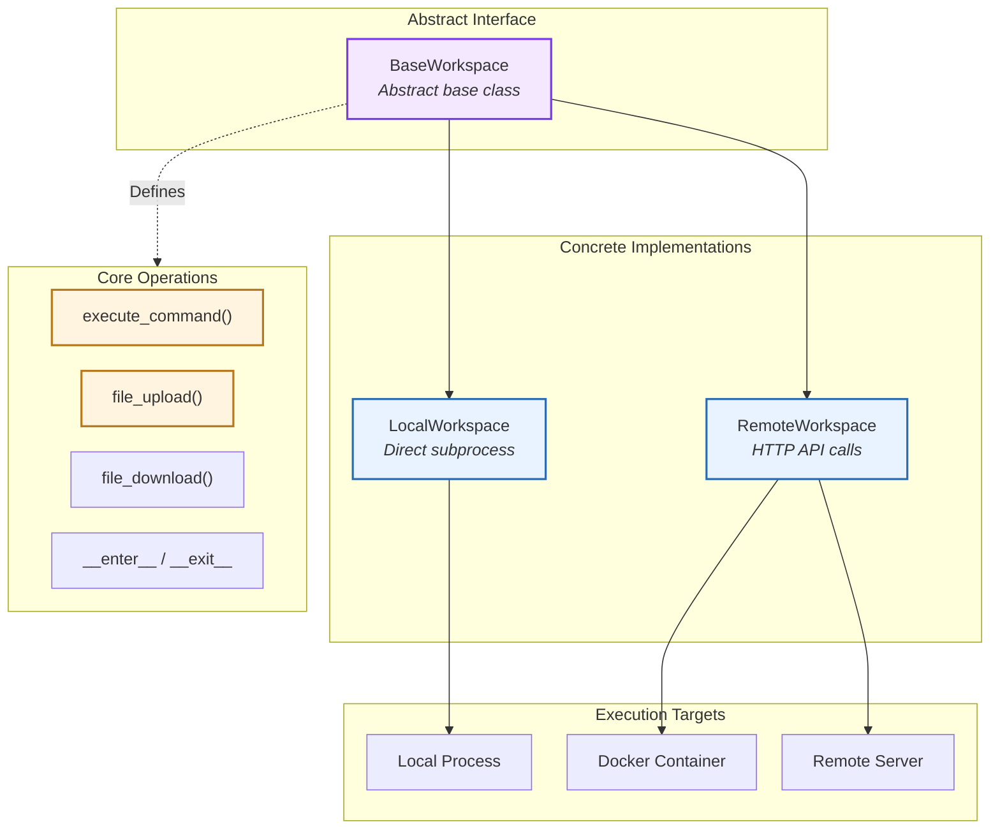
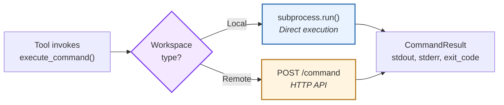
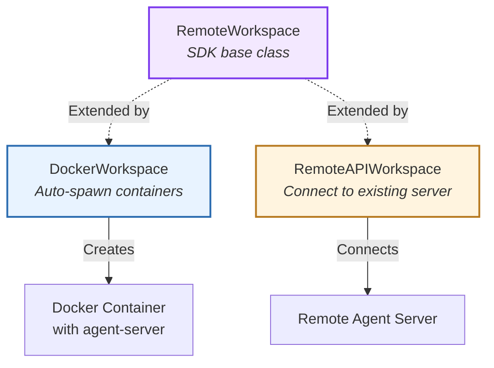
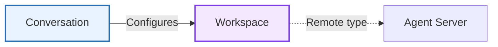

# Workspace

> High-level architecture of the execution environment abstraction

The **Workspace** component abstracts execution environments for agent operations. It provides a unified interface for command execution and file operations across local processes, containers, and remote servers.

**Source:** [`openhands/sdk/workspace/`](https://github.com/OpenHands/software-agent-sdk/tree/main/openhands-sdk/openhands/sdk/workspace)

## Core Responsibilities

The Workspace system has four primary responsibilities:

1. **Execution Abstraction** - Unified interface for command execution across environments
2. **File Operations** - Upload, download, and manipulate files in workspace
3. **Resource Management** - Context manager protocol for setup/teardown
4. **Environment Isolation** - Separate agent execution from host system

## Architecture



### Key Components

| Component                                                                                                                               | Purpose            | Design                                            |
| --------------------------------------------------------------------------------------------------------------------------------------- | ------------------ | ------------------------------------------------- |
| **[`BaseWorkspace`](https://github.com/OpenHands/software-agent-sdk/blob/main/openhands-sdk/openhands/sdk/workspace/base.py)**          | Abstract interface | Defines execution and file operation contracts    |
| **[`LocalWorkspace`](https://github.com/OpenHands/software-agent-sdk/blob/main/openhands-sdk/openhands/sdk/workspace/local.py)**        | Local execution    | Subprocess-based command execution                |
| **[`RemoteWorkspace`](https://github.com/OpenHands/software-agent-sdk/blob/main/openhands-sdk/openhands/sdk/workspace/remote/base.py)** | Remote execution   | HTTP API-based execution via agent-server         |
| **[`CommandResult`](https://github.com/OpenHands/software-agent-sdk/blob/main/openhands-sdk/openhands/sdk/workspace/models.py)**        | Execution output   | Structured result with stdout, stderr, exit\_code |
| **[`FileOperationResult`](https://github.com/OpenHands/software-agent-sdk/blob/main/openhands-sdk/openhands/sdk/workspace/models.py)**  | File op outcome    | Success status and metadata                       |

## Workspace Types

### Local vs Remote Execution

| Aspect          | LocalWorkspace     | RemoteWorkspace      |
| --------------- | ------------------ | -------------------- |
| **Execution**   | Direct subprocess  | HTTP → agent-server  |
| **Isolation**   | Process-level      | Container/VM-level   |
| **Performance** | Fast (no network)  | Network overhead     |
| **Security**    | Host system access | Sandboxed            |
| **Use Case**    | Development, CLI   | Production, web apps |

## Core Operations

### Command Execution



**Command Result Structure:**

| Field          | Type  | Description                     |
| -------------- | ----- | ------------------------------- |
| **stdout**     | str   | Standard output stream          |
| **stderr**     | str   | Standard error stream           |
| **exit\_code** | int   | Process exit code (0 = success) |
| **timeout**    | bool  | Whether command timed out       |
| **duration**   | float | Execution time in seconds       |

### File Operations

| Operation    | Local Implementation  | Remote Implementation              |
| ------------ | --------------------- | ---------------------------------- |
| **Upload**   | `shutil.copy()`       | `POST /file/upload` with multipart |
| **Download** | `shutil.copy()`       | `GET /file/download` stream        |
| **Result**   | `FileOperationResult` | `FileOperationResult`              |

## Resource Management

Workspaces use **context manager** for safe resource handling:

**Lifecycle Hooks:**

| Phase     | LocalWorkspace           | RemoteWorkspace                       |
| --------- | ------------------------ | ------------------------------------- |
| **Enter** | Create working directory | Connect to agent-server, verify       |
| **Use**   | Execute commands         | Proxy commands via HTTP               |
| **Exit**  | No cleanup (persistent)  | Disconnect, optionally stop container |

## Remote Workspace Extensions

The SDK provides remote workspace implementations in `openhands-workspace` package:



**Implementation Comparison:**

| Type                   | Setup           | Isolation     | Use Case                   |
| ---------------------- | --------------- | ------------- | -------------------------- |
| **LocalWorkspace**     | Immediate       | Process       | Development, trusted code  |
| **DockerWorkspace**    | Spawn container | Container     | Multi-user, untrusted code |
| **RemoteAPIWorkspace** | Connect to URL  | Remote server | Distributed systems, cloud |

**Source:**

* **DockerWorkspace**: [`openhands-workspace/openhands/workspace/docker`](https://github.com/OpenHands/software-agent-sdk/tree/main/openhands-workspace/openhands/workspace/docker)
* **RemoteAPIWorkspace**: [`openhands-workspace/openhands/workspace/remote_api`](https://github.com/OpenHands/software-agent-sdk/tree/main/openhands-workspace/openhands/workspace/remote_api)

## Component Relationships

### How Workspace Integrates



**Relationship Characteristics:**

* **Conversation → Workspace**: Conversation factory uses workspace type to select LocalConversation or RemoteConversation
* **Workspace → Agent Server**: RemoteWorkspace delegates operations to agent-server API
* **Tools Independence**: Tools run in the same environment as workspace

## See Also

* **[Conversation Architecture](/sdk/arch/conversation)** - How workspace type determines conversation implementation
* **[Agent Server](/sdk/arch/agent-server)** - Remote execution API
* **[Tool System](/sdk/arch/tool-system)** - Tools that use workspace for execution


---

> To find navigation and other pages in this documentation, fetch the llms.txt file at: https://docs.openhands.dev/llms.txt

# SDK API
# openhands.sdk.workspace

> API reference for openhands.sdk.workspace module

### class BaseWorkspace

Bases: `DiscriminatedUnionMixin`, `ABC`

Abstract base class for workspace implementations.

Workspaces provide a sandboxed environment where agents can execute commands,
read/write files, and perform other operations. All workspace implementations
support the context manager protocol for safe resource management.

#### Example

```pycon  theme={null}
>>> with workspace:
...     result = workspace.execute_command("echo 'hello'")
...     content = workspace.read_file("example.txt")
```

#### Properties

* `model_config`: ClassVar\[ConfigDict] = (configuration object)
  Configuration for the model, should be a dictionary conforming to \[ConfigDict]\[pydantic.config.ConfigDict].
* `working_dir`: Annotated\[str, BeforeValidator(func=\_convert\_path\_to\_str, json\_schema\_input\_type=PydanticUndefined), FieldInfo(annotation=NoneType, required=True, description='The working directory for agent operations and tool execution. Accepts both string paths and Path objects. Path objects are automatically converted to strings.')]

#### Methods

#### abstractmethod execute\_command()

Execute a bash command on the system.

* Parameters:
  * `command` – The bash command to execute
  * `cwd` – Working directory for the command (optional)
  * `timeout` – Timeout in seconds (defaults to 30.0)
* Returns:
  Result containing stdout, stderr, exit\_code, and other
  : metadata
* Return type:
  [CommandResult](#class-commandresult)
* Raises:
  `Exception` – If command execution fails

#### abstractmethod file\_download()

Download a file from the system.

* Parameters:
  * `source_path` – Path to the source file on the system
  * `destination_path` – Path where the file should be downloaded
* Returns:
  Result containing success status and metadata
* Return type:
  [FileOperationResult](#class-fileoperationresult)
* Raises:
  `Exception` – If file download fails

#### abstractmethod file\_upload()

Upload a file to the system.

* Parameters:
  * `source_path` – Path to the source file
  * `destination_path` – Path where the file should be uploaded
* Returns:
  Result containing success status and metadata
* Return type:
  [FileOperationResult](#class-fileoperationresult)
* Raises:
  `Exception` – If file upload fails

#### abstractmethod git\_changes()

Get the git changes for the repository at the path given.

* Parameters:
  `path` – Path to the git repository
* Returns:
  List of changes
* Return type:
  list\[GitChange]
* Raises:
  `Exception` – If path is not a git repository or getting changes failed

#### abstractmethod git\_diff()

Get the git diff for the file at the path given.

* Parameters:
  `path` – Path to the file
* Returns:
  Git diff
* Return type:
  GitDiff
* Raises:
  `Exception` – If path is not a git repository or getting diff failed

#### pause()

Pause the workspace to conserve resources.

For local workspaces, this is a no-op.
For container-based workspaces, this pauses the container.

* Raises:
  `NotImplementedError` – If the workspace type does not support pausing.

#### resume()

Resume a paused workspace.

For local workspaces, this is a no-op.
For container-based workspaces, this resumes the container.

* Raises:
  `NotImplementedError` – If the workspace type does not support resuming.

### class CommandResult

Bases: `BaseModel`

Result of executing a command in the workspace.

#### Properties

* `command`: str
* `exit_code`: int
* `model_config`: ClassVar\[ConfigDict] = (configuration object)
  Configuration for the model, should be a dictionary conforming to \[ConfigDict]\[pydantic.config.ConfigDict].
* `stderr`: str
* `stdout`: str
* `timeout_occurred`: bool

### class FileOperationResult

Bases: `BaseModel`

Result of a file upload or download operation.

#### Properties

* `destination_path`: str
* `error`: str | None
* `file_size`: int | None
* `model_config`: ClassVar\[ConfigDict] = (configuration object)
  Configuration for the model, should be a dictionary conforming to \[ConfigDict]\[pydantic.config.ConfigDict].
* `source_path`: str
* `success`: bool

### class LocalWorkspace

Bases: [`BaseWorkspace`](#class-baseworkspace)

Local workspace implementation that operates on the host filesystem.

LocalWorkspace provides direct access to the local filesystem and command execution
environment. It’s suitable for development and testing scenarios where the agent
should operate directly on the host system.

#### Example

```pycon  theme={null}
>>> workspace = LocalWorkspace(working_dir="/path/to/project")
>>> with workspace:
...     result = workspace.execute_command("ls -la")
...     content = workspace.read_file("README.md")
```

#### Properties

* `model_config`: ClassVar\[ConfigDict] = (configuration object)
  Configuration for the model, should be a dictionary conforming to \[ConfigDict]\[pydantic.config.ConfigDict].
* `working_dir`: Annotated\[str, BeforeValidator(\_convert\_path\_to\_str), Field(description='The working directory for agent operations and tool execution. Accepts both string paths and Path objects. Path objects are automatically converted to strings.')]

#### Methods

#### **init**()

Create a new model by parsing and validating input data from keyword arguments.

Raises \[ValidationError]\[pydantic\_core.ValidationError] if the input data cannot be
validated to form a valid model.

self is explicitly positional-only to allow self as a field name.

#### execute\_command()

Execute a bash command locally.

Uses the shared shell execution utility to run commands with proper
timeout handling, output streaming, and error management.

* Parameters:
  * `command` – The bash command to execute
  * `cwd` – Working directory (optional)
  * `timeout` – Timeout in seconds
* Returns:
  Result with stdout, stderr, exit\_code, command, and
  : timeout\_occurred
* Return type:
  [CommandResult](#class-commandresult)

#### file\_download()

Download (copy) a file locally.

For local systems, file download is implemented as a file copy operation
using shutil.copy2 to preserve metadata.

* Parameters:
  * `source_path` – Path to the source file
  * `destination_path` – Path where the file should be copied
* Returns:
  Result with success status and file information
* Return type:
  [FileOperationResult](#class-fileoperationresult)

#### file\_upload()

Upload (copy) a file locally.

For local systems, file upload is implemented as a file copy operation
using shutil.copy2 to preserve metadata.

* Parameters:
  * `source_path` – Path to the source file
  * `destination_path` – Path where the file should be copied
* Returns:
  Result with success status and file information
* Return type:
  [FileOperationResult](#class-fileoperationresult)

#### git\_changes()

Get the git changes for the repository at the path given.

* Parameters:
  `path` – Path to the git repository
* Returns:
  List of changes
* Return type:
  list\[GitChange]
* Raises:
  `Exception` – If path is not a git repository or getting changes failed

#### git\_diff()

Get the git diff for the file at the path given.

* Parameters:
  `path` – Path to the file
* Returns:
  Git diff
* Return type:
  GitDiff
* Raises:
  `Exception` – If path is not a git repository or getting diff failed

#### pause()

Pause the workspace (no-op for local workspaces).

Local workspaces have nothing to pause since they operate directly
on the host filesystem.

#### resume()

Resume the workspace (no-op for local workspaces).

Local workspaces have nothing to resume since they operate directly
on the host filesystem.

### class RemoteWorkspace

Bases: `RemoteWorkspaceMixin`, [`BaseWorkspace`](#class-baseworkspace)

Remote workspace implementation that connects to an OpenHands agent server.

RemoteWorkspace provides access to a sandboxed environment running on a remote
OpenHands agent server. This is the recommended approach for production deployments
as it provides better isolation and security.

#### Example

```pycon  theme={null}
>>> workspace = RemoteWorkspace(
...     host="https://agent-server.example.com",
...     working_dir="/workspace"
... )
>>> with workspace:
...     result = workspace.execute_command("ls -la")
...     content = workspace.read_file("README.md")
```

#### Properties

* `api_key`: str | None
* `client`: Client
* `host`: str
* `model_config`: ClassVar\[ConfigDict] = (configuration object)
  Configuration for the model, should be a dictionary conforming to \[ConfigDict]\[pydantic.config.ConfigDict].
* `working_dir`: str

#### Methods

#### execute\_command()

Execute a bash command on the remote system.

This method starts a bash command via the remote agent server API,
then polls for the output until the command completes.

* Parameters:
  * `command` – The bash command to execute
  * `cwd` – Working directory (optional)
  * `timeout` – Timeout in seconds
* Returns:
  Result with stdout, stderr, exit\_code, and other metadata
* Return type:
  [CommandResult](#class-commandresult)

#### file\_download()

Download a file from the remote system.

Requests the file from the remote system via HTTP API and saves it locally.

* Parameters:
  * `source_path` – Path to the source file on remote system
  * `destination_path` – Path where the file should be saved locally
* Returns:
  Result with success status and metadata
* Return type:
  [FileOperationResult](#class-fileoperationresult)

#### file\_upload()

Upload a file to the remote system.

Reads the local file and sends it to the remote system via HTTP API.

* Parameters:
  * `source_path` – Path to the local source file
  * `destination_path` – Path where the file should be uploaded on remote system
* Returns:
  Result with success status and metadata
* Return type:
  [FileOperationResult](#class-fileoperationresult)

#### git\_changes()

Get the git changes for the repository at the path given.

* Parameters:
  `path` – Path to the git repository
* Returns:
  List of changes
* Return type:
  list\[GitChange]
* Raises:
  `Exception` – If path is not a git repository or getting changes failed

#### git\_diff()

Get the git diff for the file at the path given.

* Parameters:
  `path` – Path to the file
* Returns:
  Git diff
* Return type:
  GitDiff
* Raises:
  `Exception` – If path is not a git repository or getting diff failed

#### model\_post\_init()

Override this method to perform additional initialization after **init** and model\_construct.
This is useful if you want to do some validation that requires the entire model to be initialized.

#### reset\_client()

Reset the HTTP client to force re-initialization.

This is useful when connection parameters (host, api\_key) have changed
and the client needs to be recreated with new values.

### class Workspace

### class Workspace

Bases: `object`

Factory entrypoint that returns a LocalWorkspace or RemoteWorkspace.

Usage:
: - Workspace(working\_dir=…) -> LocalWorkspace

* Workspace(working\_dir=…, host=”http\://…”) -> RemoteWorkspace


---

> To find navigation and other pages in this documentation, fetch the llms.txt file at: https://docs.openhands.dev/llms.txt